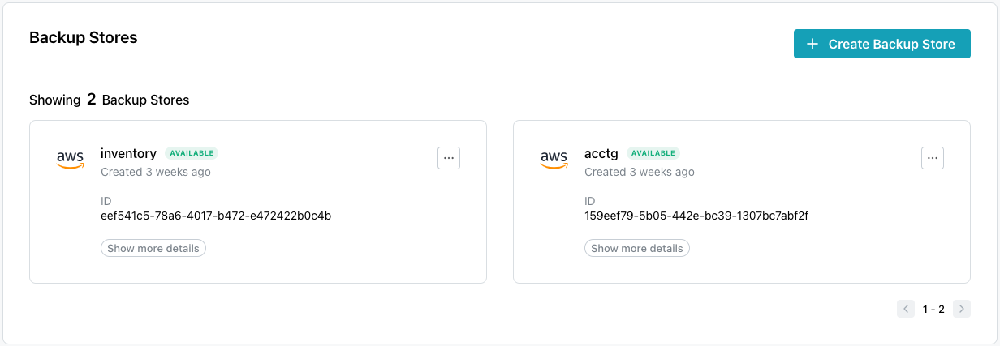
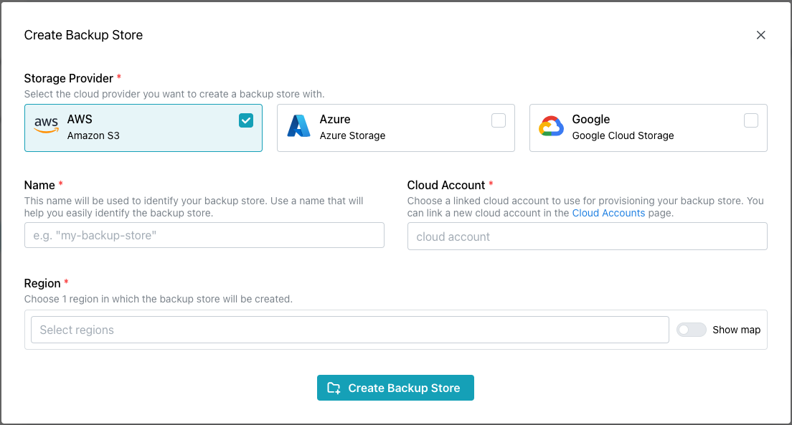
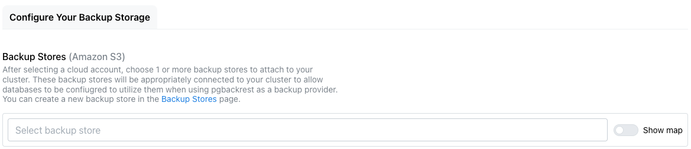
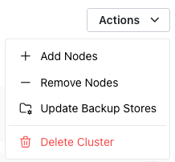
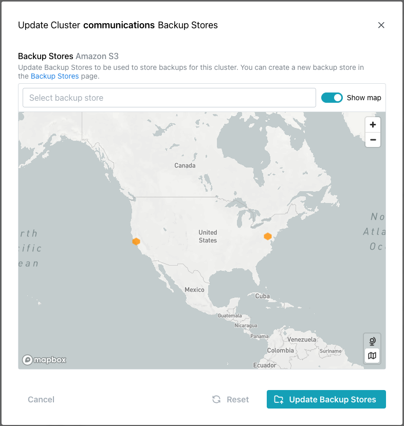
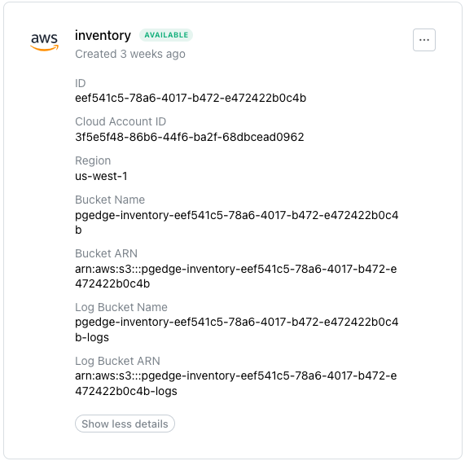
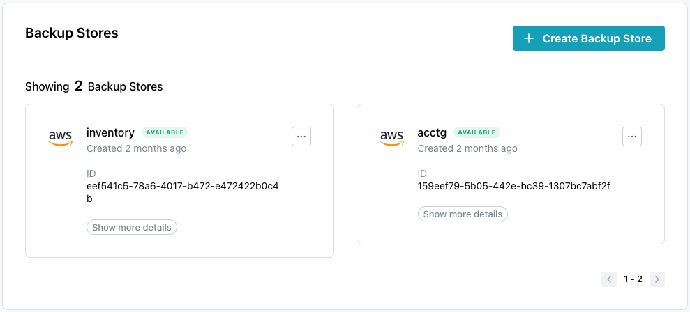
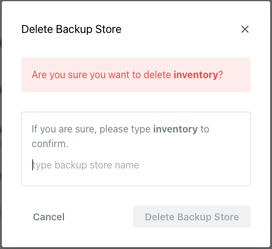

# Defining a Backup Store

Use options accessed via the `Backup Stores` link in the navigation pane to
define storage on your cloud provider. Then, when you deploy a cluster, you
can select a backup store to attach to the pgEdge Starfleet BYOC cluster
for use when backing up cluster nodes or log files.

A cloud provider backup store acts as a connection between your BYOC
cluster and your provider's object store. The provider account that is
used for your backup store must be the same account used when
deploying the cluster. You can attach more than one backup store to a
single cluster, and each backup store can be used for multiple BYOC
nodes and/or databases.

When you create the backup store, two storage buckets are deployed in the
store; one bucket is used for backups, and one is used to store provider
access logs for the primary bucket.

To reduce network latency, you should backup each node to a backup store
located geographically close to the node's region (ideally within the same
region). You can optionally create a backup store in another region, but
archiving will take longer if the store is geographically distanced.

## Creating a Backup Store

The `Backup Stores` dialog displays the backup storage defined on your cloud
provider; select the `Create Backup Store` icon (located in the upper-right
corner of the dialog) to provide details and define a backup store.

To define a backup store, start by selecting the `Storage Provider` on which
you wish to create a backup store. Then, when the dialog expands:

1. Provide a user-friendly `Name` to identify the backup store.
2. Select the `Cloud Account` that will be used to provision the store.
3. Select a `Region` in which the backup store will be created.

When you've specified your preferences, click the `Create Backup Store` icon
to create the store.

## Attaching a Backup Store to a Cluster

You can attach multiple backup stores to each cluster [during cluster
creation](../cluster/create_cluster.md#creating-a-cluster); before creating a
cluster, define any available [backup stores](#defining-a-backup-store) you
wish to use. Once defined, a store will be included in the list of available
stores on the `Backup Stores` drop-down.

Then, to attach the store during cluster creation, select the backup store
from the `Backup Stores` field or toggle the `Show map` option to `enabled`
to select from stores on the map image.

To attach a store to a cluster, highlight the cluster name in the
navigation panel and select `Update Backup Stores` from the `Actions` menu.

The `Update Cluster Backup Stores` dialog opens as shown below:

When the dialog opens, click in the `Backup Stores` field or select from the
icons on the map to choose the backup stores you wish to make available to
your cluster.  When you've identified the clusters backup stores, select the
`Update Backup Stores` button to update the cluster.

!!! hint

    To add a backup store after cluster creation, use the 
    `Update Cluster Backup Stores` menu option, selected from the `Actions`
    dialog. 

## The Backup Stores Dialog

After you define a backup store, the new store will be added to the Backup
Stores dialog; select `Show more details` to expand the information
dialog to view details about the store:

Backup store details include:

* the provider identity, backup store name, and creation date.
* the volume identifier (the `ID`).
* the `Cloud Account ID`.
* the `Region` in which the backup store resides.
* the `Bucket Name`.
* the `Bucket ARN`.
* the `Log Bucket Name`; the log bucket stores the access logs to the
  bucket.
* the `Log Bucket ARN`.

Note that the security policy associated with the ARN uses the least
permissions required to create and use backup stores.  You can use your
provider's console to modify the security policy if needed.

## Deleting a Backup Store

Before you can delete a Backup Store, you must remove all data from the store
in your cloud provider account.  Then, to remove a store, highlight the
`Backup Stores` node in the navigation panel.  When the `Backup Stores`
dialog opens, you'll see details about the currently defined backup stores:

To delete a backup store, open the context menu in the upper-right corner of
a backup store information pane and select `Delete Store`.  The `Delete
Backup Store` popup opens:

To delete the store, type the name of the store in the confirmation field,
and click the `Delete Backup Store` button.
