# Getting Started with pgEdge Starfleet BYOC

Getting started with pgEdge Starfleet BYOC is easy; simply navigate to [the
pgEdge sign-in
page](https://app.pgedge.com/login?plan=developer&screen_hint=signup) and
follow the provided link to create an account, or log in with your Google or
GitHub account.

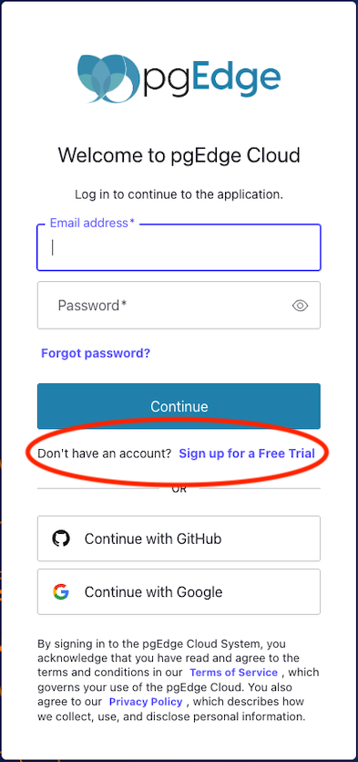

If this is your first time logging in, you are welcomed to the free
trial of pgEdge Starfleet BYOC.

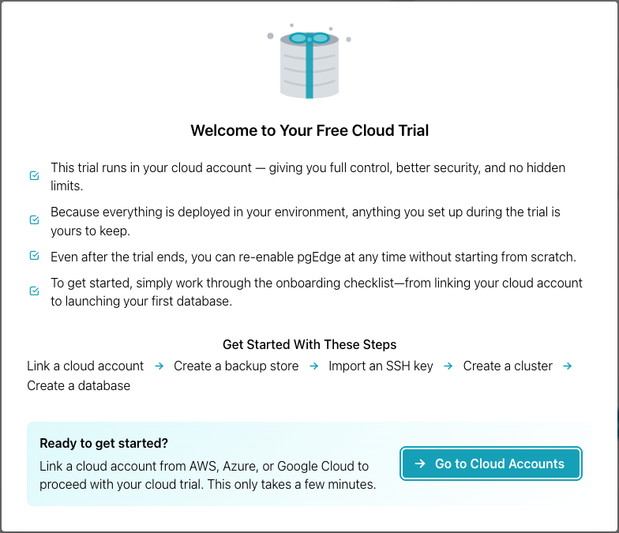

pgEdge Starfleet BYOC uses resources provisioned on your choice of cloud
provider; with BYOC, you can create and manage clusters on the following
providers:

- The AWS cloud platform provides scalable infrastructure services.
- The Azure cloud platform provides Microsoft cloud services.
- The Google Cloud platform provides Google infrastructure services.

When you create a cluster, pgEdge Starfleet BYOC provisions your cluster's
supporting resources on that provider as well; those resources include the
following:

- A backup store provides storage for database backups and recovery.
- An SSH key provides secure authentication to cluster resources.

Before creating your first cluster, you need to link your cloud
provider account with BYOC. Select the `Go to Cloud Accounts` button to
get started.

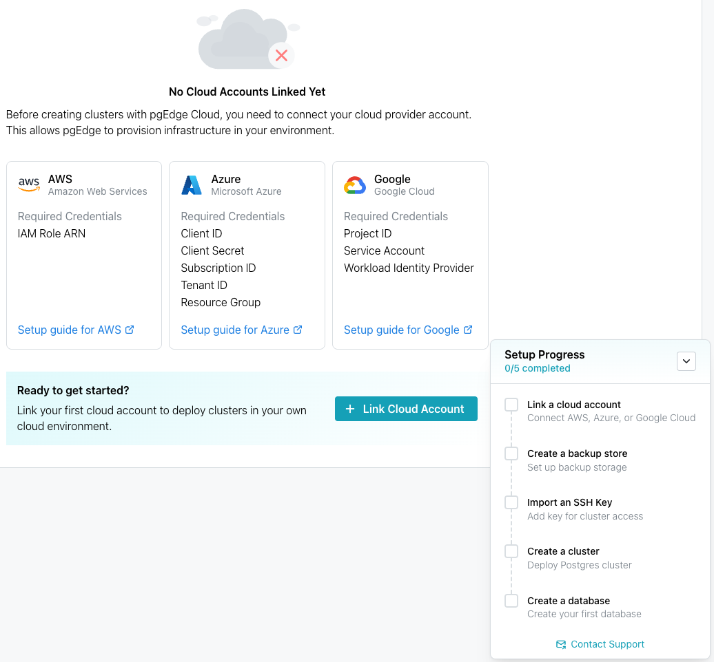

Information panes in the center of the page list the credentials and artifacts
you will need to create an account with each provider, as well as a link to the
provider-specific `Setup guide` for detailed information about linking your
account.

When you're ready to get started, select the `Link Cloud Account`
button to choose your provider.

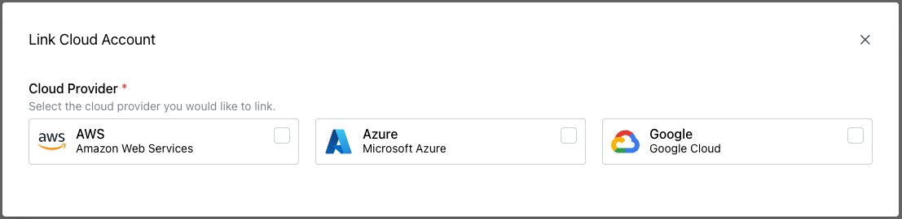

Choose your provider to open the account details dialog and provide the
information required by each provider to deploy on BYOC.

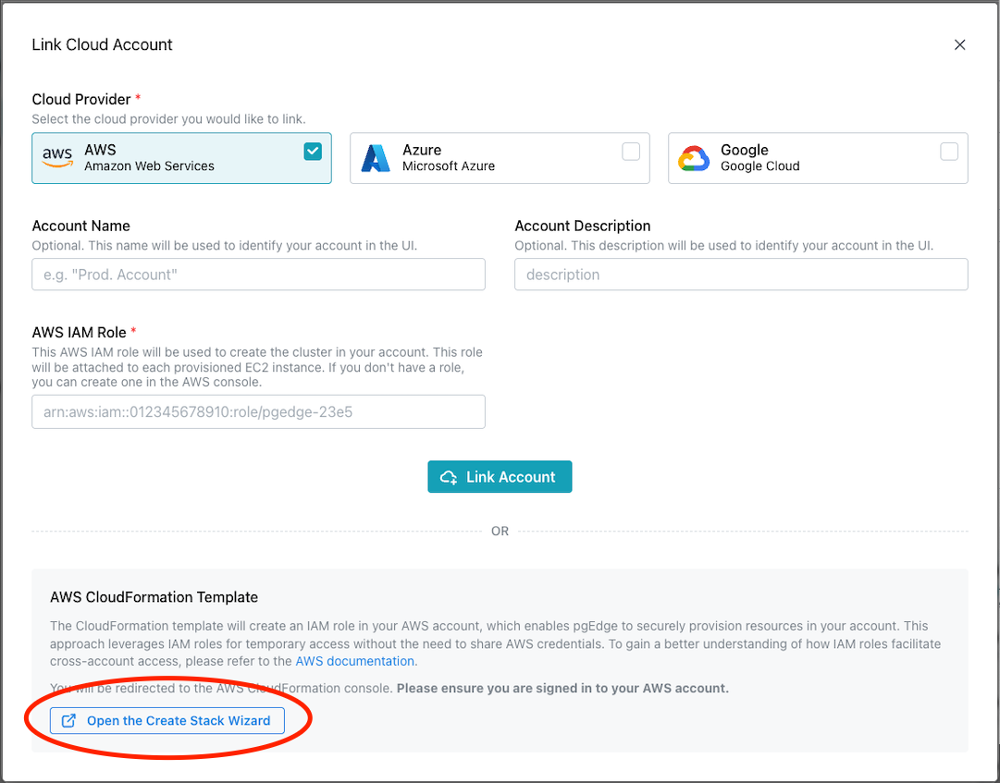

If you're
[deploying on AWS](../prerequisites/cloud_accounts/byoc_link_to_AWS.md),
you can use the `Create Stack Wizard` to use a completed AWS CloudFormation
template to create an AWS role with the required permissions; use the link
circled in red above to navigate to the wizard and retrieve your ARN.

When you've finished adding a provider account, the new account is displayed on
the `Cloud Accounts` page, and the progress dialog is updated.

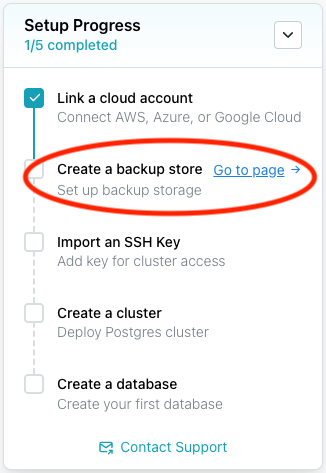

Next, you'll create a backup store. You can use the link on the progress
tracker shown above to navigate to a screen that displays information about
backup stores, with a link to a page where you can define a backup store on
your preferred provider.

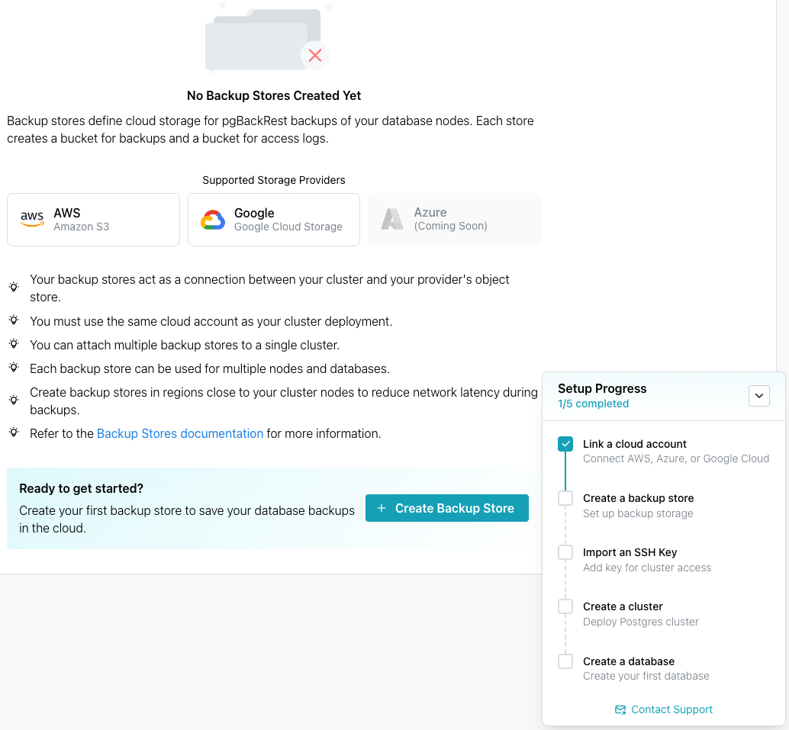

Select [Create Backup Store](../cluster/byoc_backup_store.md) to navigate to
the `Create Backup Store` dialog; complete the dialog and click `Create
Backup Store` to continue.

When you've finished defining the backup store, the store is displayed on the
`Backup Stores` dialog, and the progress tracker advances, prompting you to
import an SSH key.

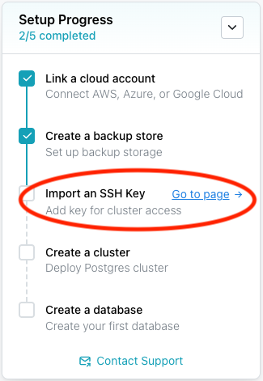

Next, you'll [import an SSH key](../prerequisites/byoc_ssh_key.md). You
can use the link on the progress tracker to navigate to an
informational page with links to more information about importing
keys.

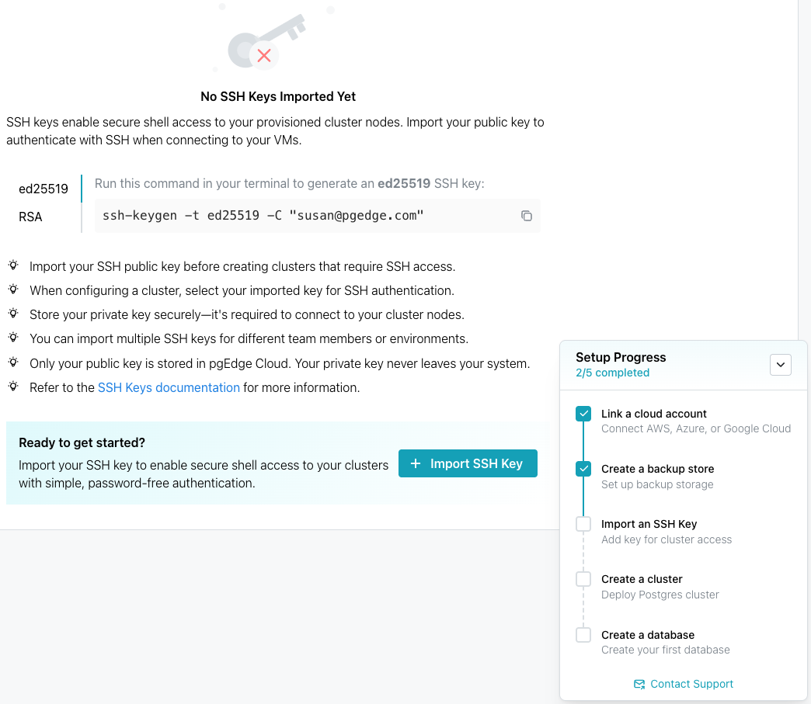

When you're ready, select the `Import SSH Key` button to advance to the
import page. When you've finished importing an SSH key, the progress
tracker advances and you can see the imported SSH key on the `SSH Keys`
dialog.

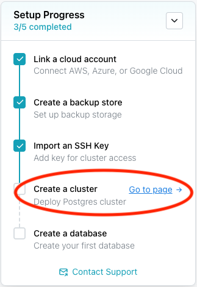

Next, you'll [create a cluster](../cluster/byoc_create_cluster.md). A
cluster is a database container that can house one or more databases
in one or more regions. Single-region clusters are not distributed;
distributed clusters have databases
in multiple regions.

Use the link on the progress tracker to navigate to a page with more
information about cluster creation and handy links.

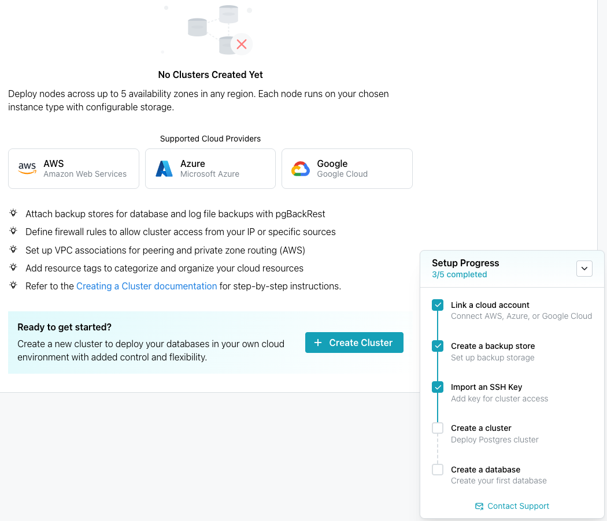

To create a cluster, click the `Create Cluster` button; when you've finished
creating a cluster, the progress tracker advances, and you can see the imported
cluster definition on the `Clusters` page.

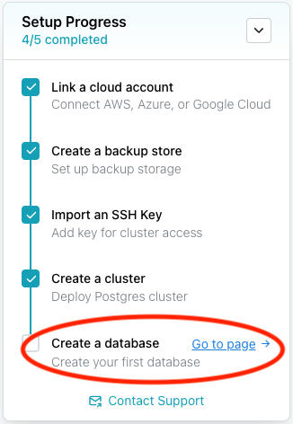

Next, you'll create a database. You can use the link on the progress
tracker to navigate to the database creation page.

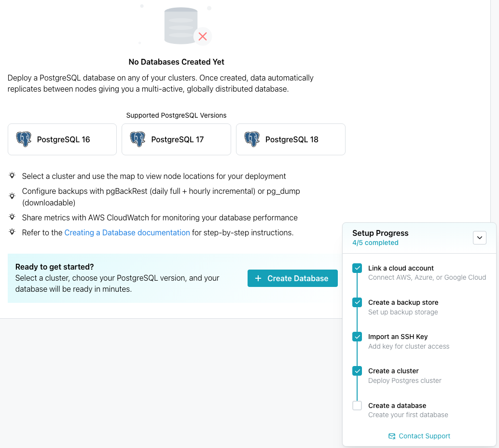

When you're ready, select `Create Database` to create your new database
and exit the progress tracker.

## pgEdge Resources

Use the links in the lower-left corner of the console to access the
following pgEdge resources:

- The `Community` link provides an invitation to the pgEdge Discord server.
- The `Docs` link opens the pgEdge documentation website.
- The `Settings` link allows you to review or modify account settings,
  including API Clients.
- The `Team Management` link allows you to review and manage team settings.
