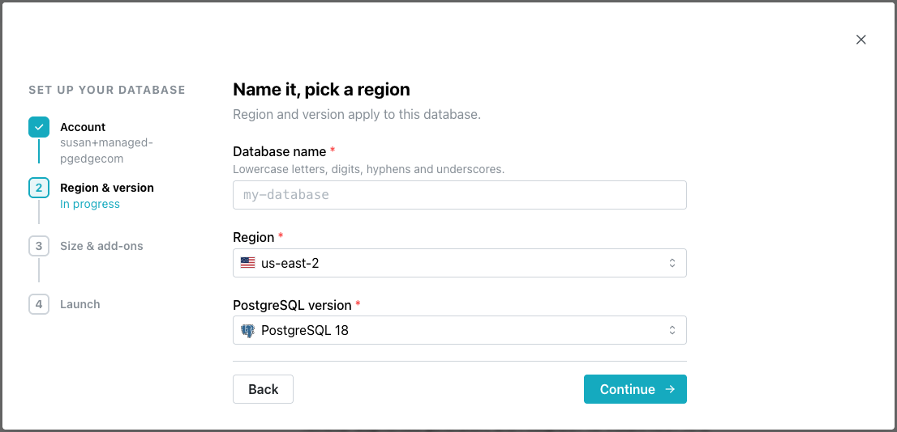
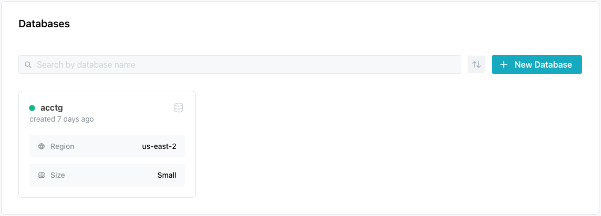

# Creating a pgEdge Managed Cluster

After authenticating with pgEdge Starfleet BYOC, you're welcomed and
presented with an easy-to-follow dialog that will walk you through
creating your first database:

 

Select the `Create your first database` button to continue.

 

In the first step, you'll provide details about the database:

- Provide a name for the database in the `Database name` field.
- Use the Region drop-down to select the region in which the database will
  deploy; note that you'll be able to add nodes in additional regions later.
- Choose the Postgres version that your hosted database will use.

After completing the dialog, click `Continue`.

 

Next, you'll select deployment features:

- In the `SIZE` section, select the size of your resource bundle:

    | Size | vCPU | RAM | Storage | Connections | Price |
    |------|------|-----|---------|-------------|-------|
    | Small | 1 vCPU | 2 GB RAM | 25 GB storage | 20 conns | Free trial, then $25/mo |
    | Large | 2 vCPU | 8 GB RAM | 50 GB storage | 50 conns | $99/mo |
    | XL | 4 vCPU | 16 GB RAM | 150 GB storage | 100 conns | $249/mo |

- The `ADD-ONS` section features a list of optional features for your database:

    | Feature | Description | Price |
    |---------|--------------|-------|
    | Point-in-time recovery | Restores your database to any second within the past 7 days. | +$15/mo |
    | Priority support | Provides a 1-hour response time through a dedicated support channel. | +$49/mo |
    | Guaranteed resources | Reserves dedicated CPU and RAM for your database, so performance isn't affected by bursting contention from other workloads. | +$40/mo |
    | Extended retention | Retains backups and metrics for 30 days. | +$10/mo |

Select the features that will be accessible to your database, and select
`Create Database`.

 

When your database is ready, the BYOC console opens to an information
page showing your database features, and connection details. The
database name is selected in the navigation pane (on the left side of
the console).

The new database is also shown on a pane on the Databases page:

 
