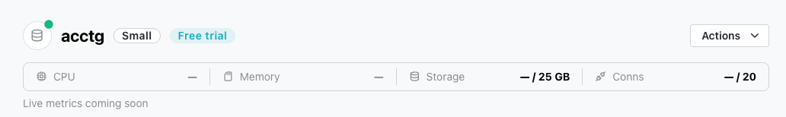
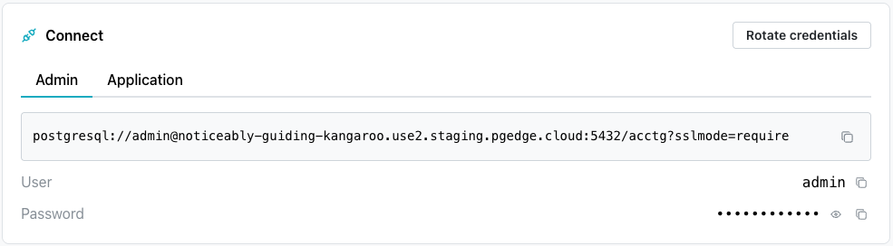
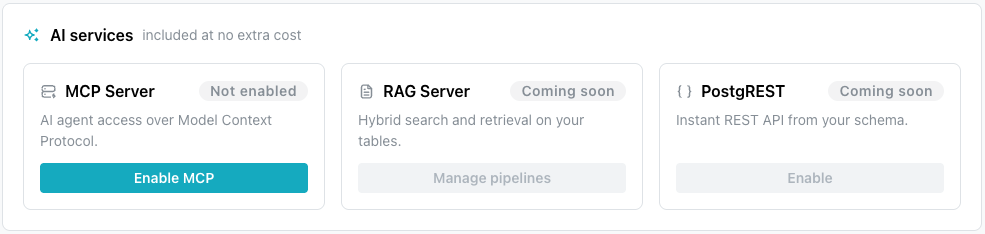
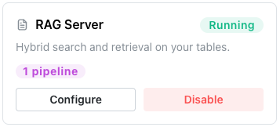
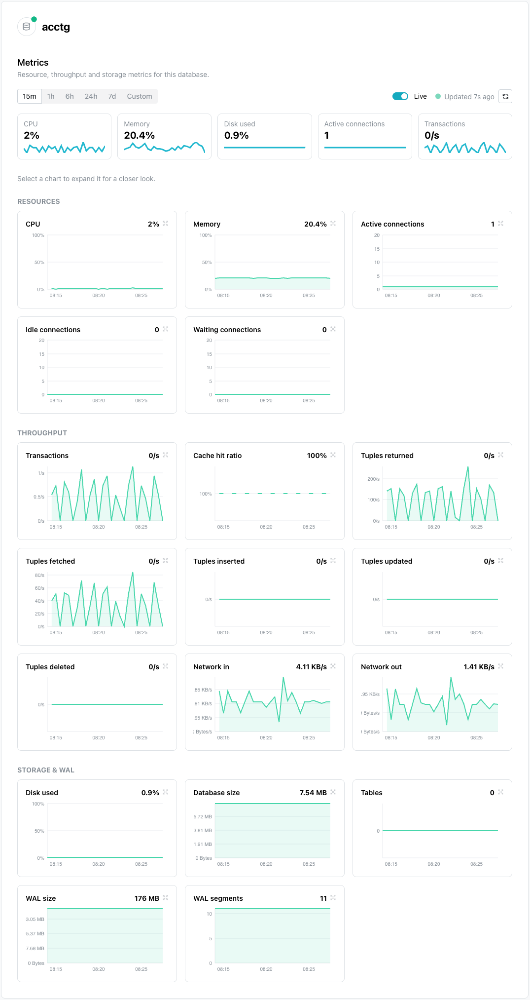
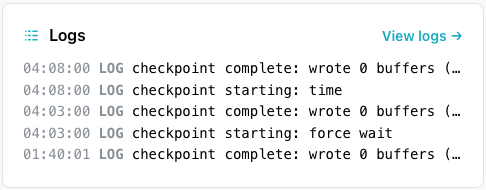
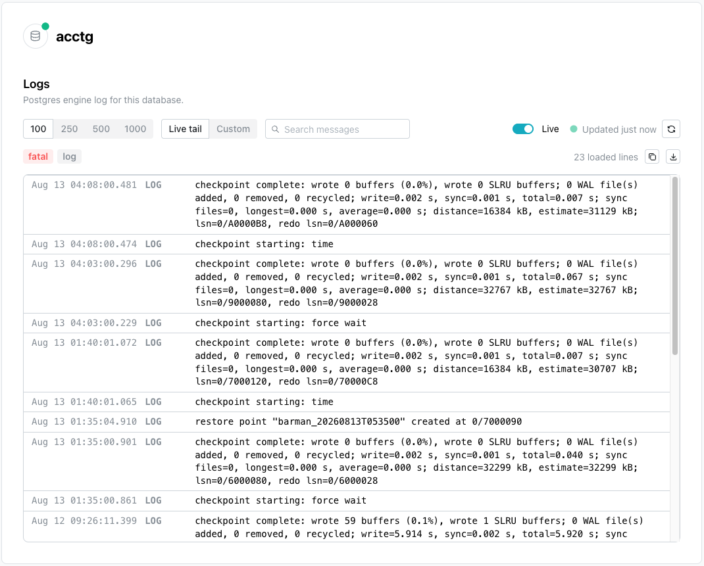

# Using a pgEdge Managed PostgreSQL Database

When you create a pgEdge managed PostgreSQL database, the database name is
displayed in the tree control on the left side of the pgEdge Starfleet
BYOC console when the deployment completes.

Select the database name to navigate to the database management page of
the BYOC console.

!!! hint

    If you're using a free trial, you can use the link at the top of the
    console to provide billing information for your database.

## The Database Header

The database header displays:

* The name of the database; next to the name, a dot indicates the
  status of the database:
    * A green dot indicates that the database is available for connections.
    * A blue dot indicates that the database is being created.
    * A red dot indicates that the database is not available.

* The CPU size of the database.
* The Memory used by the database.
* The amount of storage allocated to the database.
* The number of connections allocated for the database.

The `Actions` drop-down (on the right-hand side of the header) offers
management options for your database.

To change the name of your database, select `Edit Display Name` from the
`Actions` menu. When the `Change Display Name` popup opens, enter the new
database name in the `Display Name` field and select `Apply`.

The `Enable deletion protection` option in the `Actions` drop-down works like a
toggle; select it once to enable protection, and a confirmation popup in the
lower-right corner of the window confirms that protection is enabled. To
disable deletion protection, select `Disable deletion protection` from the
menu.

## Connecting to your Database

Below the header, the console displays the `Connect` pane; the pane includes
an `Admin` tab with credentials that you can use to connect to the database
as the `admin` user (a database superuser), and an `Application` tab with 
credentials that you can use to connect a client application to your
database.

For detailed information about:

* installing the psql client and connecting to the database, see
  [Connecting](../connecting/index.md).
* Postgres SQL commands, see the 
  [Postgres documentation](https://www.postgresql.org/docs/18/sql-commands.html).

## The AI Services Pane

The `AI Services` pane displays icons you can use to deploy available services
on your database. 

### Enabling the MCP Server

The [pgEdge Postgres MCP server](https://docs.pgedge.com/pgedge-postgres-mcp-server/v1-0-0/) 
acts as a gateway to your Postgres database; the server translates requests
into actual operations against your database.

!!! warning

    The MCP server provides LLMs with read access to your entire database
    schema and data. It should only be used for internal tools, developer
    workflows, or environments where all users are trusted.

To enable an MCP server, select `Enable MCP`.

When the `Enable MCP server` popup opens, select the features you wish to enable: 

— Enable `Generate embeddings` to expose a tool that lets the connected LLM
request vector embeddings for text (e.g., to support semantic search over your
database, via pgvector). It's optional, and requires you to configure
embedding-provider credentials.

- Enable `Allow writes` to control whether the query_database tool can execute
mutating SQL (INSERT/UPDATE/DELETE) in addition to read-only queries.
Leaving it off keeps the LLM strictly read-only against your database (a much
safer default); turning it on lets the LLM actually modify or delete rows, a
higher-risk, explicit option.

When you're finished, select the `Enable MCP server` button to deploy the MCP
server.

Once enabled, the MCP Server pane updates to display:

- A green `Running` indicator to let you know the server is enabled.
- A `Details` button that takes you to the Services window where you'll find information about connecting to MCP Clients.
- A `Disable` button that you can use to stop the MCP server.

Select the `Disable MCP Server` button to stop the MCP server.

### Enabling the RAG Server

The [pgEdge Postgres RAG server](https://docs.pgedge.com/pgedge-rag-server/v1-0-0/)
is a simple API server used to perform Retrieval-Augmented Generation (RAG) of
text based on content from a Postgres database using pgvector. Consider using
a RAG server when you have a well-defined use case with predictable query
patterns.

To enable a RAG server, select the `Enable RAG` icon in the RAG Server pane.

When the `Enable RAG server` popup opens, provide details about the RAG server
deployment: 

* The `Default Token Budget` field sets the maximum number of context tokens
  allowed for the LLM (500 - 128,000); the default value is `1000`.
* The `Default Top N` field sets the maximum number of results to retrieve
  before token-budget trimming; the default value is `10`.
* The `Default Embedding LLM Provider` field selects the provider used for
  query and document embeddings during retrieval; supported providers are
  `OpenAI`, `Voyage AI`, and `Ollama`. (Anthropic does not provide an
  embedding model, so it isn't available here.)
* The `Default Embedding LLM Model` field selects the embedding model to use;
  available models depend on the selected provider (for example,
  `text-embedding-3-small` for OpenAI). This must match the model used to
  generate any pre-existing embeddings.
* The `Default Embedding LLM API Key` field provides the API key required for
  the selected embedding provider.
* The `Default Completion LLM Provider` field selects the provider used for
  answer generation; supported providers are `OpenAI`, `Anthropic`, and
  `Ollama`.
* The `Default Completion LLM Model` field selects the completion model to
  use; select a suggested model, or enter your own.
* The `Default Completion LLM API Key` field provides the API key required
  for the selected completion LLM provider.
* The `Add Pipelines` field defines one or more pipelines; each pipeline has
  its own tables and can override the default values, and maps to
  `/v1/pipelines/<name>/search`.

Select `+Add Pipeline` to expand the dialog and define one or more pipelines
   that will be used by the RAG server.

   
For each pipeline, provide:

* A unique name in the `Name` field; only lowercase letters, digits, hyphens,
  and underscores are allowed.
* The name of the table or view to use for the pipeline, in the
  `Table Name` field.
* The name of the column containing the text content to be indexed and
  searched, in the `Text Column` field.
* The name of the column containing the vector embeddings (using pgvector)
  for that content, in the `Vector Column` field.

When you set default values for the RAG server, individual pipelines can
omit the corresponding fields and inherit those defaults; a pipeline can also
override specific fields while still inheriting the others. Use the
`Override Default Values` toggle to expand the dialog and provide the
pipeline-specific values you want to override:

Provide the following details:

* The `Token Budget` field overrides the maximum number of context tokens
  allowed for the LLM for this pipeline.
* The `Top N` field overrides the maximum number of results to retrieve
  before token-budget trimming for this pipeline.
* The `Embedding LLM Provider` field overrides the provider used for query
  and document embeddings during retrieval for this pipeline (`OpenAI`,
  `Voyage AI`, or `Ollama`).
* The `Embedding LLM Model` field overrides the embedding model to use for
  this pipeline.
* The `Embedding LLM API Key` field overrides the API key used for the
  selected embedding provider for this pipeline.
* The `Completion LLM Provider` field overrides the provider used for answer
  generation for this pipeline (`OpenAI`, `Anthropic`, or `Ollama`).
* The `Completion LLM Model` field overrides the completion model to use for
  this pipeline.
* The `Completion LLM API Key` field overrides the API key used for the
  selected completion LLM provider for this pipeline.

Use the `Advanced Settings` toggle to expand the dialog and configure hybrid
search, vector weighting, and a custom system prompt for the pipeline:

Provide the following details:

* The `Hybrid Search` toggle combines vector similarity with BM25 full-text
  search; when disabled, search uses pure vector similarity. Hybrid search
  is enabled by default.
* The `Vector Weight` slider sets the balance between keyword and vector
  relevance, from `0.0` (pure keyword relevance) to `1.0` (pure vector
  similarity); the default value is `0.5`.
* The `System Prompt` field provides custom instructions for answer
  generation; leave it empty to use the server's built-in default prompt,
  which instructs the model to answer questions based on the provided
  context.

When you're finished, select the `Enable RAG server` button to deploy the RAG
server.

Once enabled, the RAG Server pane updates to display:

- A green `Running` indicator to let you know the server is enabled.
- A `Configure` button that opens the Configure RAG server dialog where you
  can modify the RAG server deployment.
- A `Disable` button that you can use to stop the RAG server.

!!! hint

    Detailed information about the RAG server is also added to the `Services`
    page; use the link to `Services` located under the database name in the navigation pane to acess the page.

You can disable the RAG server from either the Services page or the RAG Server
pane by selecting the `Disable` button.

Select the `Disable RAG Server` button to stop the MCP server.

## The Backups Pane

The `Backups` pane displays a list of the backups taken of your database; each
backup is either a `hot` backup (fast, short-term storage) or a `durable`
backup (longer-term, resilient storage).

Each backup entry displays:

* The backup ID.
* A tag indicating whether the backup is a `hot` or `durable` backup.
* The backup status (for example, `completed`).
* How long ago the backup was taken.

Select the `Restore` button, to the right of a backup to restore the selected
backup; select `View all` (in the upper-right corner of the pane) to see the
complete list of backups.

## The Metrics Pane

The `Metrics` pane displays live graphs of current database activity,
including `Transactions` (transactions per second) and `Tuples returned`
(rows returned per second).

Select `Open metrics` (in the upper-right corner of the pane) to see detailed
metrics for your database.

The `Metrics` page displays detailed charts of your database's resource,
throughput, and storage activity. Use the time-range buttons (`15m`, `1h`,
`6h`, `24h`, `7d`, or `Custom`) at the top of the page to change the period
displayed; toggle `Live` to enable or disable automatic updates. Select any
chart to expand it for a closer look.

### Resources

The `Resources` section displays charts that track the compute and connection
resources used by your database.

| Chart | Description |
|-------|--------------|
| CPU | The percentage of CPU used by the database. |
| Memory | The percentage of memory used by the database. |
| Active connections | The number of active client connections to the database. |
| Idle connections | The number of idle (inactive) client connections to the database. |
| Waiting connections | The number of connections waiting for a lock or other resource to become available. |

### Throughput

The `Throughput` section displays charts that track the volume of database
activity, including transactions and row-level operations.

| Chart | Description |
|-------|--------------|
| Transactions | The number of transactions processed per second. |
| Cache hit ratio | The percentage of reads served from the cache instead of disk. |
| Tuples returned | The number of rows returned by queries per second. |
| Tuples fetched | The number of rows fetched from the database per second. |
| Tuples inserted | The number of rows inserted per second. |
| Tuples updated | The number of rows updated per second. |
| Tuples deleted | The number of rows deleted per second. |
| Network in | The amount of network traffic received by the database per second. |
| Network out | The amount of network traffic sent by the database per second. |

### Storage and WAL

The `Storage and WAL` section displays charts that track disk usage and
write-ahead log (WAL) activity for your database.

| Chart | Description |
|-------|--------------|
| Disk used | The percentage of allocated disk storage currently used. |
| Database size | The total size of the database. |
| Tables | The number of tables in the database. |
| WAL size | The size of the write-ahead log (WAL). |
| WAL segments | The number of WAL segments currently retained. |

## The Logs Pane

The `Logs` pane displays the most recent entries from your database's log
file; each entry shows the timestamp, log level (for example, `LOG`), and
message.

Select `View logs` (in the upper-right corner of the pane) to see the
complete, searchable log for your database.

The `Logs` page displays the complete Postgres engine log for your database,
live-updated as new entries are written.

* Select `100`, `250`, `500`, or `1000` to control how many log lines are
  loaded.
* Select `Live tail` to continuously stream new log entries as they're
  written, or select `Custom` to specify a fixed time range.
* Use the `Search messages` field to filter entries by keyword.
* Toggle `Live` to enable or disable automatic updates.
* Select `fatal` or `log` to filter entries by severity level.
* Use the copy and download icons (in the upper-right corner of the log
  table) to copy or download the loaded log lines.

## Read Replicas and Branching

The `Primary` badge identifies the current database as the primary node in
its cluster.

The `Read replicas & branching` pane previews upcoming functionality for
scaling read traffic with read replicas and spinning up copy-on-write
branches of your database. This functionality is still in development, and
will remain disabled until it becomes available.

## Summary Panes

The `Plan & billing` and `Details` panes display the size tier, billing
status, and configuration of your database.

### Plan and Billing

The `Plan & billing` pane displays the current size tier of your database and
the price you'll be billed after any free trial ends. Select `Upgrade size`
to change the size of your database.

### Details

The `Details` pane displays identifying and configuration information for
your database.

| Field | Description |
|-------|--------------|
| Database ID | The unique identifier for the database. |
| Region | The cloud region in which the database is deployed. |
| Postgres | The Postgres version running on the database. |
| Storage | The amount of storage allocated to the database. |
| Network | Whether the database is publicly or privately accessible, and whether TLS is enabled. |
| Created | How long ago the database was created. |

