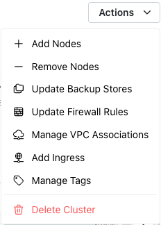

# Using the Actions Menu to Modify a Cluster or Database

The `Actions` menu is a context-sensitive menu that provides a shortcut to
frequently-used behaviors related to the object displayed when you open the
menu. Use options accessed via the `Actions` drop-down menu in the upper-right
corner of the dialog to manage your cluster or database.

For example, when opened from a cluster node the `Actions` menu might show:

Select from the options listed to:

* [Add a node](byoc_add.md) to the cluster.
* [Remove a node](byoc_drop.md#dropping-a-node-from-a-cluster) from
  the cluster.
* Update [Backup Stores](../cluster/byoc_backup_store.md).
* Update [Firewall Rules](../cluster/byoc_firewall.md).
* Manage [VPC Associations](../cluster/byoc_vpc_assoc.md).
* [Add an Ingress](../cluster/byoc_ingress.md) to a private cluster.
* [Manage Tags](../cluster/byoc_resource_tag.md).
* [Delete a cluster](byoc_drop.md#deleting-a-cluster).

When opened from a database menu, the `Actions` menu may include:

Select from the options listed to:

* [Backup the Database](../backup/byoc_backups.md).
* [Restore the Database](../backup/byoc_restore.md) from backup.
* [Add the database](byoc_add.md#adding-a-database-to-a-cluster-node)
  to another node.
* [Remove the database](byoc_drop.md#removing-a-database-from-a-node)
  from a node.
* [Edit the Display
  Name](../database/byoc_manage_db.md#changing-the-display-name-of-a-database)
  of the database.
* [Delete the database](byoc_drop.md#deleting-a-database).
