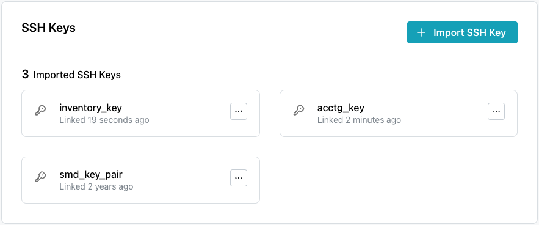
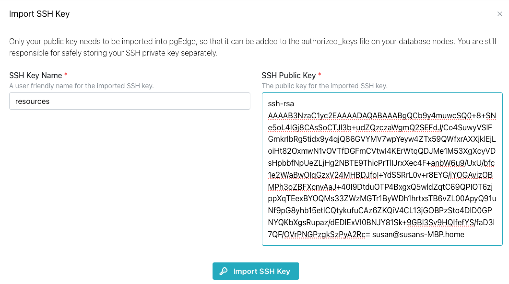

# Managing SSH Keys

pgEdge Starfleet BYOC supports
[SSH authentication](https://en.wikipedia.org/wiki/Secure_Shell) for
connections to provisioned clusters. When you configure a cluster in the pgEdge
console, you have the option of specifying an imported SSH public key. To
authenticate with your cluster, you then provide the corresponding private key
when connecting.

The `SSH Keys` dialog displays the SSH public keys that have been imported to
your pgEdge Starfleet BYOC account.

## Importing an SSH Key

To import an SSH Key, select the `SSH Keys` node in the navigation pane; when
the `SSH Keys` dialog opens, select the `Import SSH Key` button.

Provide information about your key:

* Provide a user-friendly name for the key in the `SSH Key Name` field.
* Provide the public half of your key pair (`key_pair_name.pub`) in the
  `SSH Public Key` field.

If you do not have an SSH key pair, you can use the Linux
[ssh-keygen](https://en.wikipedia.org/wiki/Ssh-keygen) program to generate a
key. Be sure that you store the private half of your key in a safe place, away
from the public key.

### Deleting an SSH Key

To delete a previously uploaded key, open the context menu in the key pane, and
select `Delete Key`. A popup opens, asking you to confirm that you wish to
delete the key; enter the key name in the field on the popup, and press
`Delete SSH Key` to remove the key.
