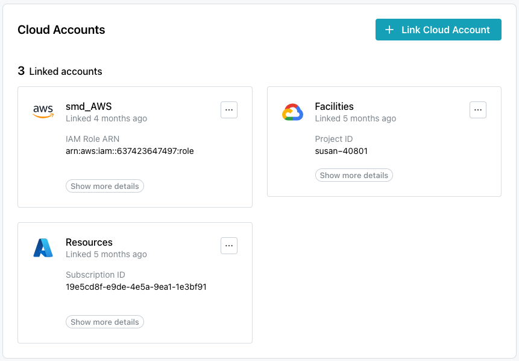
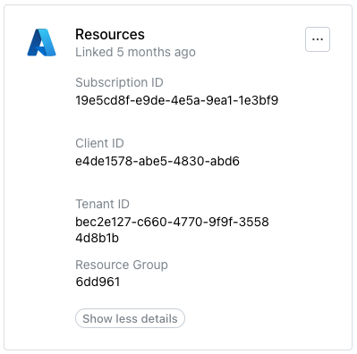

# Managing Cloud Provider Accounts

Before creating a cluster on pgEdge Starfleet BYOC, you must create an
account with a cloud provider and link that account with your BYOC
account. Select the `Cloud Accounts` node in the navigation pane to
open the `Cloud Accounts` page.

Use options accessed from the `Cloud Accounts` page to manage the
accounts used to provision databases with pgEdge Starfleet BYOC; to get
started, select the `+ Link Cloud Account` button to link an account
with pgEdge Starfleet BYOC.

Then, visit the vendor-specific page for information about linking an account
with:

    * [AWS](byoc_link_to_AWS.md)
    * [Azure](byoc_link_to_Azure.md)
    * [Google](byoc_link_to_Google.md)

After linking a provider account, that account is displayed on the
`Linked accounts` pane. Use the `Show more details` button to display details
about the provider account.

Use the menu icon (...) in the upper-right corner of an account pane to
access the account management options and edit account details or
[unlink an account](#deleting-an-account-link).

## Deleting an Account Link

Before deleting an account link, ensure that any resources deployed
with BYOC have been backed up to your satisfaction and destroyed. Then,
to delete the link to a cloud vendor account, select the menu icon
(...) in the top-right corner of the pane of a linked account.

When the menu opens, select `Unlink Account`.

To confirm that you wish to unlink the account, enter the account name in
the `Unlink Cloud Account` popup, and press the `Unlink Account` button.

