# Linking an AWS Account

To link an AWS provider account with your pgEdge Starfleet BYOC account, select
the `Cloud Accounts` heading in the left navigation pane and then the
`+ Link Cloud Account` button. The `Link Cloud Account` popup opens:

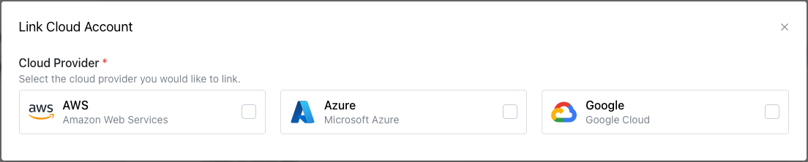

On the `Link Cloud Account` popup, select the `AWS` icon to expand the dialog.

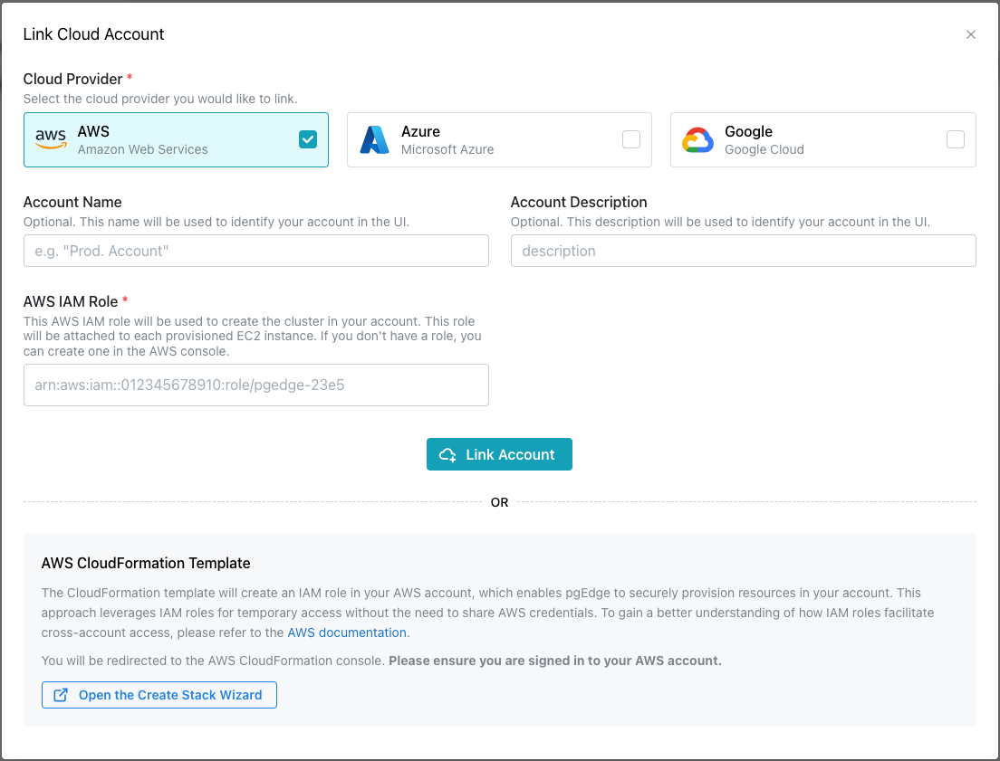

If you have an `AWS IAM Role` you wish to use, you can use the fields in the
top portion of the dialog to create the link:

* Provide a user-friendly name in the `Account Name` field.
* Provide an account description in the `Account Description` field.
* Provide your AWS IAM role identifier in the `AWS IAM Role` field.

When you're finished, press the `Link Account` button to link the account and
add it to the `Cloud Accounts` page.

## Creating an AWS IAM Role for use with pgEdge Starfleet BYOC

The console provides an AWS CloudFormation Template to simplify creation of an
IAM role. Template settings create a role that allows BYOC to securely
provision resources in your account (using IAM cross-account trust policies to
assume the role). This is the AWS-recommended approach.

Before using the wizard to create an IAM role, open a browser tab and log in to
your AWS account. Then, return to the console window and select the
`Open the Create Stack Wizard` button. When the AWS `Quick create stack` window
opens, the template is displayed, complete with the details you need to create
an IAM role for replication management.

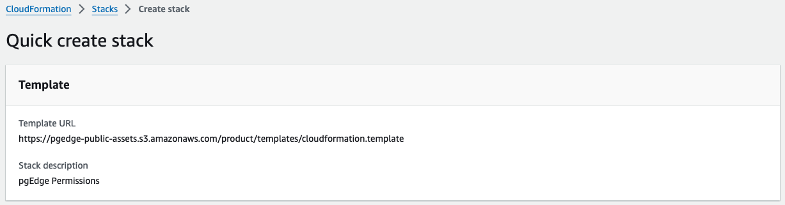

The URL of the BYOC `AWS CloudFormation Template` is:
`https://pgedge-public-assets.s3.amazonaws.com/product/templates/cloudformation.template`

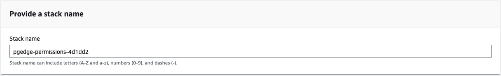

CloudFormation prompts you to provide a name for the stack in the `Stack name`
field; you can accept the default and scroll down.

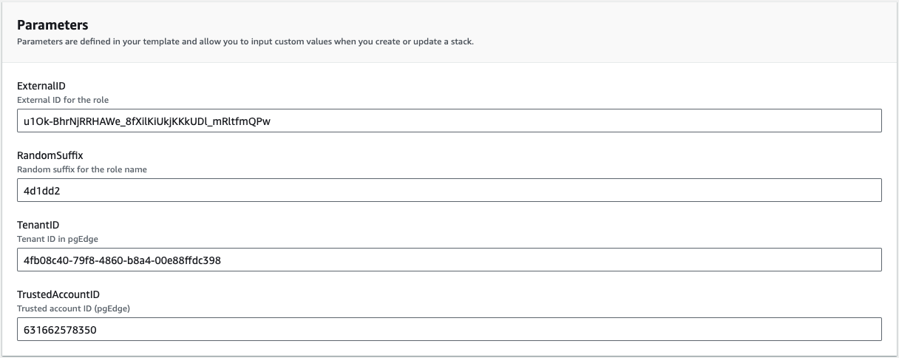

The `CloudFormation Stack Parameters` are completed as required, allowing BYOC
to securely provision resources with your AWS account.

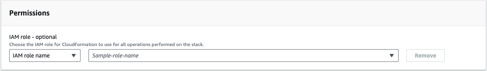

No changes are required in the `CloudFormation Stack Permissions` section.

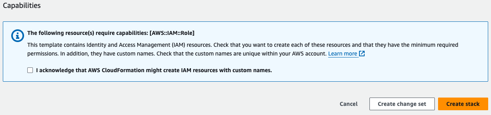

Review the message in the `Capabilities` section, and check the box next to
`I acknowledge that AWS CloudFormation might create IAM resources with custom names`.
Then, select `Create stack`.

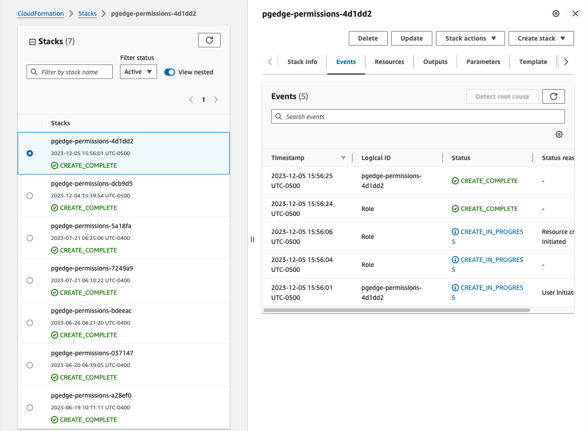

AWS CloudFormation navigates to a page listing the stack creations that are in
progress; when your stack completes, select the `Resources` tab in the right
pane.

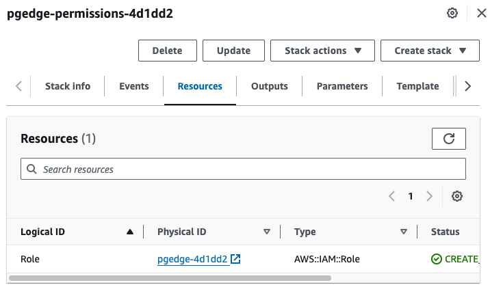

Select the link in the `Physical ID` column to open a details page in the AWS
`Identity and Access Management (IAM)` service console. The ARN is displayed in
the page `Summary`.

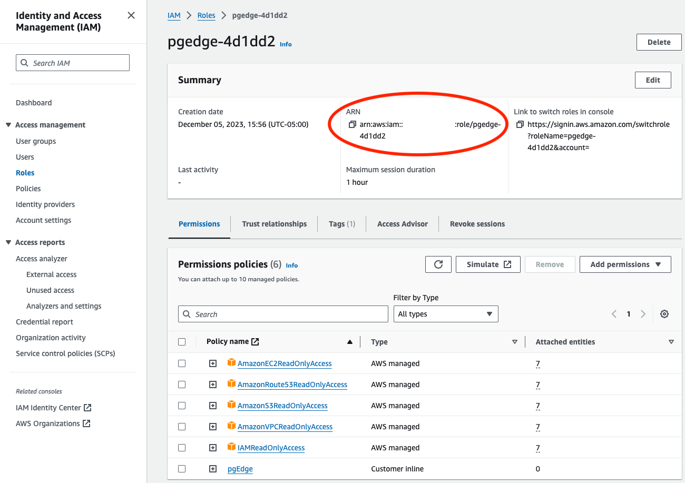

Copy the role ARN, and return to the console. Add the role ARN to the
`AWS IAM Role` field, specify a name for the account in the `Account Name`
field, and a description of the account in the `Account Description` field.
Select the `Link Account` button to finish linking your account.

With a linked account in place, you're ready to
[create an Enterprise Edition cluster](../../cluster/byoc_create_cluster.md).

## Creating an AWS Key Pair

To create a new AWS key pair:

1. Sign in to the AWS management console.
2. Navigate to the EC2 service.
3. Select `Key Pairs` from the `Network & Security` menu.
4. Select the `Create key pair` button located in the upper-right corner of the
   `Key Pairs` window to specify the key pair details.

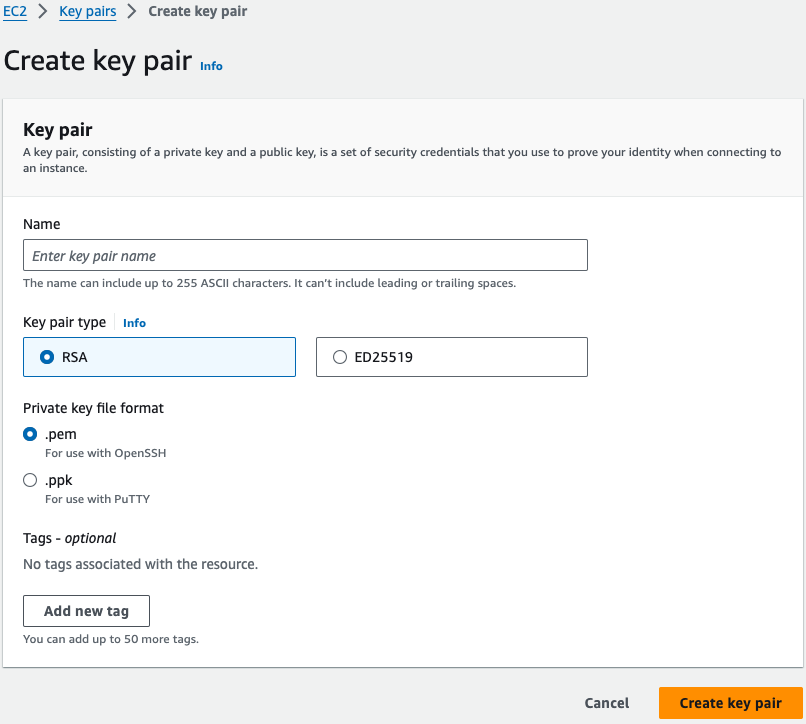

On the AWS `Create key pair` window, provide a name for the key pair in the
`Name` field; the other fields can be left to their defaults. Select
`Create key pair` to create the key pair and return to the main `Key pairs`
window.

You can now use the AWS key pair when defining a cluster that is provisioned on
AWS.

## Enabling a Region in the AWS Console

While you can access all regions in the BYOC console, not all regions may be
enabled for use in your AWS account. To enable a region, log in to the AWS
management console; then, use the arrow to the right of your user name (in the
upper-right corner) to access the account information menu.

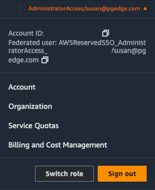

Select the `Account` menu option to navigate to the `Account` information page;
scroll down to the `AWS Regions` table.

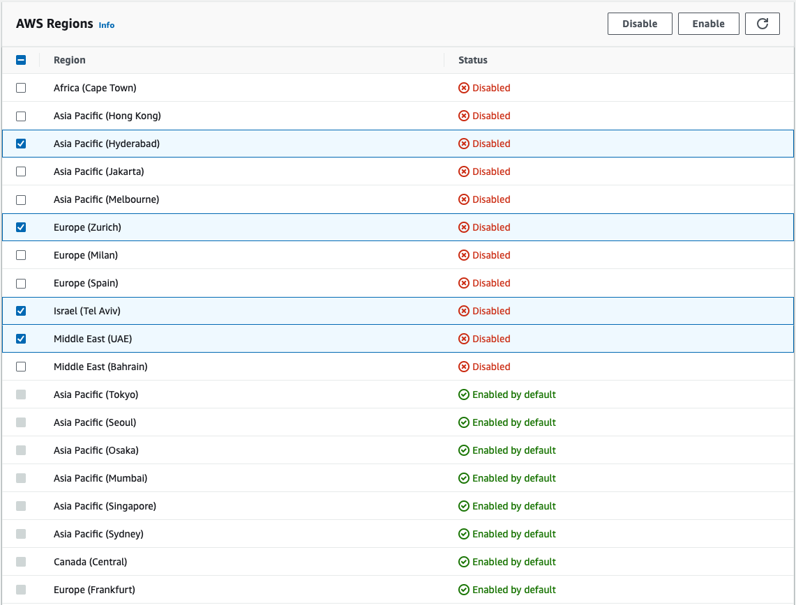

To enable a region for use with pgEdge Starfleet BYOC, check the box to the
left of the region name, and select the `Enable` button. A popup will open,
asking you to confirm that you wish to enable the region(s); select the
`Enable regions` button to continue. Use the `refresh` button in the
upper-right corner to update table to check the `Status` column.

## Deleting an Account Link

Before deleting an account link, ensure that any resources deployed with BYOC
have been backed up to your satisfaction and destroyed. Then, to delete the
link to a vendor account, select the menu icon (...) in the top-right corner of
the pane of a linked account.

When the menu opens, select `Unlink Account`.

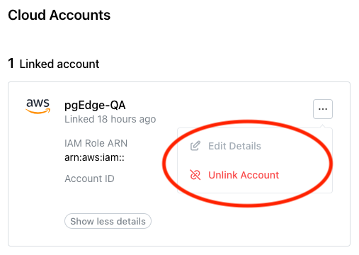

To confirm that you wish to unlink the account, enter the account name in the
`Unlink Cloud Account` popup, and press the `Unlink Account` button.

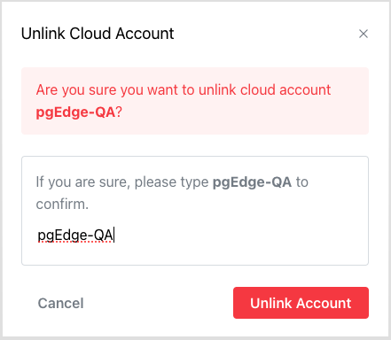
