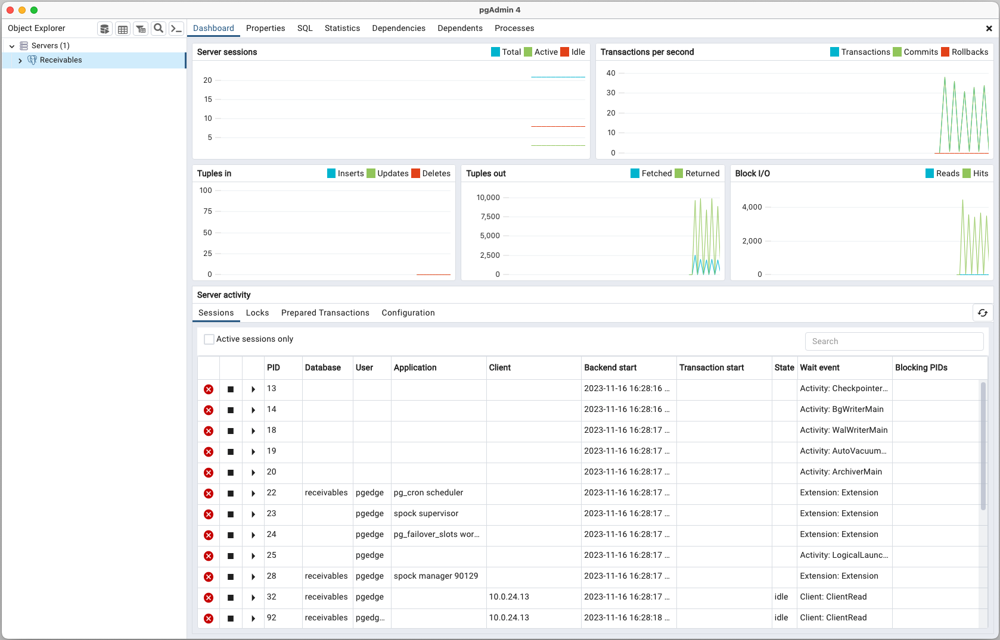

# Connecting with pgAdmin

To use the pgAdmin client to manage your pgEdge Starfleet database and the
objects that reside on it, right-click on the `Servers` node in the pgAdmin
client, and select `Register`, then `Server` from the context menu.

The `Register - Server` dialog opens:

When prompted, provide authentication details on the pgAdmin `Connection` tab.
To find connection information for your database, highlight the database name
in the navigation panel, and review the `Connect to your database` pane shown
on the `Database` dialog:

* Provide the name shown in the `Domain` field that ends with `.pgedge.io` in
  the `Host name/address` field.

* Provide the name of your database in the `Maintenance database` field.

* Replace the default `Username` with `app` when connecting for the first
  time; the `app` user owns the database and can create tables and other
  objects. Use the `admin` user instead if you only need read/write access to
  existing data.

* Enter the password associated with the user in the `Password` field.

Provide the following information on the `Parameters` tab:

* Use the drop-down to the right of `SSL mode` to select `require`.

* Use the `+` at the top of the parameter table to open a new row, and use the
  drop-down list in the `Name` field to select `GSS encmode`. Set the `Value`
  to `disable`.

Complete the other tabs in the `Register - Server` dialog specifying your
connection preferences, and select `Save`. The connection to your database is
added to the `Servers` node in the `Object Explorer` pane, and the pgAdmin
`Dashboard` displays current database activities.

For detailed information about using pgAdmin, you can review the pgAdmin
documentation at:
[https://www.pgadmin.org/docs/](https://www.pgadmin.org/docs/).
