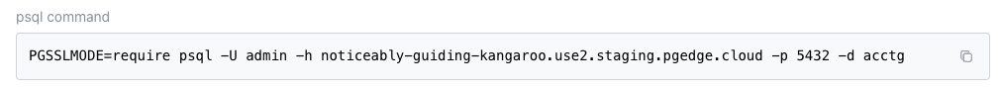

# Connecting with psql

To locate database-specific psql connection properties for your pgEdge
Starfleet PostgreSQL database, double-click a database name in the console
navigation panel or navigate to the database's main page in the console. Below
the header of the database page, the console displays the `Connect` pane. The
pane displays one tab per built-in role:

* an `Admin` tab with credentials for the `admin` user
* an `Application` tab with credentials for the `app` user

Each tab displays a `Connection string`, a ready-to-use `psql command`, the
`Database name`, `Domain`, `User`, and `Password` values used to build them,
and a `Rotate credentials` button. The `Password` is masked until you select
the reveal control beside it.

The `Connection string` and `psql command` blocks are shown on screen without
the password. The copy button beside each block copies the same value
with the password included, so the clipboard holds a live credential even
though the screen does not display it.

For details about each role's capabilities and which role to use, see
[Database Roles](../roles.md). 

!!! hint

    Connect as `app` to create tables and load data. 
    
    Connect as `admin` to install an allowlisted extension or
    perform server-wide administration, such as monitoring sessions or
    creating roles.

## Using the psql Client

The psql client is distributed with PostgreSQL, and is available for download
at the Postgres website. For more information about psql, see the Postgres
documentation at: [psql](https://www.postgresql.org/docs/18/app-psql.html)

If you have already installed a copy of psql, connection is simple. Each tab
of the `Connect` pane (`Admin` or `Application`) displays a ready-to-use psql
connection string. For example:

`PGSSLMODE=require PGPASSWORD=<your-password> psql -U admin -h <your-domain> -p <your-port> -d <your-database>`

Select the copy icon next to the psql connection string to copy it, paste
it directly into a terminal window, and press `Return` to connect.

!!! hint

    The `PGSSLMODE=require` environment variable is the shell-variable
    spelling of the `sslmode=require` setting the `Connection string` block
    carries in its URI. Both enforce the required TLS connection.

If you start psql with a graphical prompt or icon (rather than the command
line) you can use the individual values from the psql connection string to
authenticate:

* When prompted for a `Server [localhost]`, provide the host name from the
  connection string (the value shown in the `Domain` field) and press
  `Return`.
* When prompted for a `Database [postgres]`, provide the database name from the
  connection string (the value shown in the `Database name` field) and press
  `Return`.
* When prompted for a `Port [5432]`, enter the port shown in the connection
  string and press `Return`. Use the port from the connection string rather than
  assuming the Postgres default.
* When prompted for a `Username [postgres]`, provide the `User` value from the
  `Connect` pane, and press `Return`. In our example, the user is `admin`.
* When prompted for the `Password`, provide the `Password` value from the
  `Connect` pane.

## Using Special Characters in URI Encoding

In URI syntax, reserved characters are used as structural delimiters:

  - `@` separates the user (user:password) from the host.
  - `:` separates the user from the password, and the host
    from the port.
  - `/` separates the host/port from the path (database name).
  - `?` starts the query-string parameters.

When Cloud encounters a password that contains special characters that are not
encoded properly, the characters will cause a loop of round-trips instead of
parsing into the correct connection string.

Cloud expects percent-encoding, like that used in the `Connection string`
URI; the `psql command` block is formatted to connect with the correct values.

If you read the password out of the `Password` field and assemble a URI
yourself, you must encode it yourself, using the correct grammar as noted in
[RFC 3986](https://www.rfc-editor.org/rfc/rfc3986).

!!! hint

    Make sure you copy the whole string: a URI trimmed back to its host and
    database could omit `sslmode=require`, preventing a connection.

### Managing a Password Safely

The connection string on your clipboard, connection strings built from your
password, and the `Password` field itself (when revealed) all contain a
working database password in clear text. Observe password-handling best
practices when using the password:

* Do not echo the connection string in a terminal. Scrollback outlives the
  session, and shell history files outlive the terminal.
* Do not pass the password as a command-line argument. Argument lists are
  visible in `ps` on a shared host.
* Ensure that your password is not written to application/CI log files. A job
  running under a shell trace writes the password into build output may be retained in an unsafe location.

!!! hint

    Feed the string to your application through a secrets mechanism rather
    than a shell variable. To retire a password, see
    [Rotating Database Credentials](../managed/using/rotate_credentials.md).

## Installing psql and Connecting

To install psql on your local system, follow the platform-specific installation
and connection details for your server.

### On a Mac

On a Mac, you can use `brew` to install psql at the command line. To install
psql, open a `Terminal` window and enter:

`brew install libpq`

When `brew` completes, use the following command to ensure that the version of
psql that you've just installed is the first version in your PATH:

`echo 'export PATH="/usr/local/opt/libpq/bin:$PATH"' >> ~/.zshrc`

Then, to connect to a pgEdge Starfleet database, use the copy button to
the right of the connection string in the `Connect` section to copy the
psql connection string of your database, and paste the string into the
`Terminal`.

Press `Return` to connect to the server with the psql client.

### On Linux

On a Linux system, install the `postgresql` package with your platform-specific
package manager; for example, on a Rocky Linux host, use `yum`:

`yum install postgresql`

This command installs psql in `/usr/bin/psql`. After installing, you can
connect to the database with the connection string provided by the pgEdge
console.

For detailed information about installing PostgreSQL packages on Linux, visit
the [PostgreSQL Downloads page](https://www.postgresql.org/download/).

### On Windows

For detailed information about installing PostgreSQL on Windows, visit the
[PostgreSQL downloads page](https://www.postgresql.org/download/windows/).
After installing PostgreSQL, you can navigate through the Windows menu to open
the psql client.
