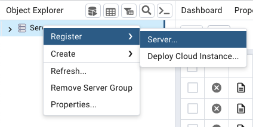
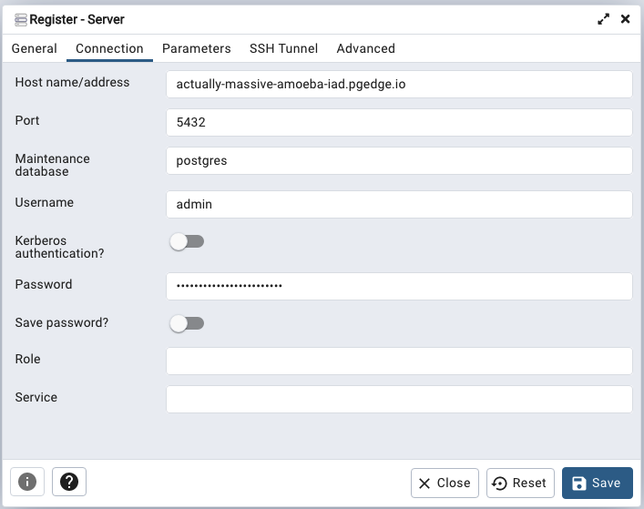
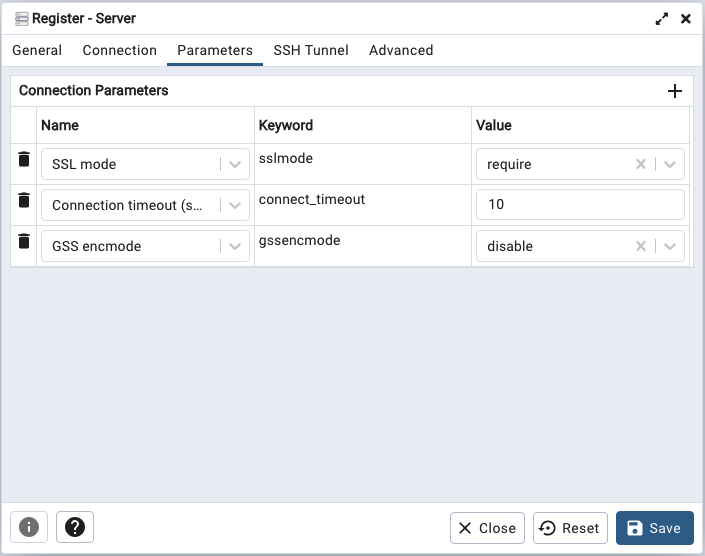

# Connecting with pgAdmin

To manage your pgEdge Starfleet database and its objects with the pgAdmin
client, right-click the `Servers` node, then select `Register`, then
`Server` from the context menu.

The `Register - Server` dialog opens:

When prompted, provide authentication details on the pgAdmin `Connection` tab.
To find connection information for your database, highlight the database name
in the navigation panel, and review the `Connect` pane shown on the `Database`
page:

* Provide the value shown in the `Domain` field in the `Host name/address`
  field.

* Provide the port from the `Connection string` in the `Port` field.

* Provide the name of your database in the `Maintenance database` field.

* Replace the default `Username` with `app` when connecting for the first
  time.

* Enter the password associated with the user in the `Password` field.

The `app` user owns the database, so the tables and other objects it
creates belong to `app`. Use the `admin` user instead to install an
allowlisted extension, or for the server-wide work described in
[Managing Database Roles](../using_database/managed_roles.md).

Provide the following information on the `Parameters` tab:

* Use the drop-down to the right of `SSL mode` to select `require`.

* Use the `+` at the top of the parameter table to open a new row, and choose
  `GSS encmode` from the `Name` field's drop-down list. Set the `Value` field
  to `disable`.

Complete the other tabs in the `Register - Server` dialog, specifying your
connection preferences, and select `Save`. The connection to your database is
added to the `Servers` node in the `Object Explorer` pane, and the pgAdmin
`Dashboard` displays current database activities.

For detailed information about using pgAdmin, see the
[pgAdmin documentation](https://www.pgadmin.org/docs/).
