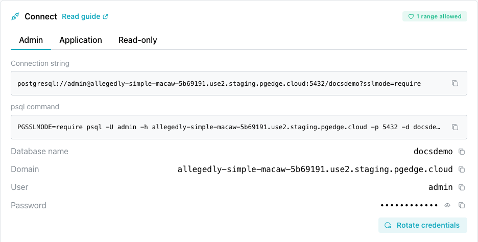

# Connecting with psql

To locate database-specific psql connection properties for your pgEdge
Starfleet PostgreSQL database, double-click a database name in the console
navigation panel or navigate to the database's main page in the console. Below
the header of the database page, the console displays the `Connect` pane. The
pane displays one tab per built-in role:

- an `Admin` tab with credentials for the `admin` user.
- an `Application` tab with credentials for the `app` user.
- a `Read-only` tab with credentials for the `app_read_only` user.

Each tab displays a `Connection string`, a ready-to-use `psql command`, and
a `Rotate credentials` button, built from that tab's `Database name`,
`Domain`, `User`, and `Password` values. The console masks the `Password`
until you select the reveal control beside it.

The `Connect` pane displays the `Connection string` and `psql command` blocks
on screen without the password. The copy button beside each block copies
the same value with the password included, so the clipboard contains a
live credential even though the screen does not display it.

For details about each role's capabilities and which role to use, see
[Managing Database Roles](../using_database/managed_roles.md).

psql can connect only from an address on the database allowlist. Check that
the `ALLOWED IP RANGES` list on the `Connect` pane has a range for the address
you connect from. For more information, see
[Controlling Network Access](../using_database/managed_network_access.md).

!!! hint

    Connect as `app` to create tables and load data. Connect as `admin` to
    install a supported extension `app` cannot install, such as `vector`,
    or perform server-wide administration,
    such as monitoring sessions or creating roles.



## Using the psql Client

The psql client is distributed with PostgreSQL, and is available for download
at the Postgres website. For more information about psql, see the
[Postgres documentation](https://www.postgresql.org/docs/18/app-psql.html).

If you have already installed a copy of psql, connection is simple. Each tab
of the `Connect` pane (`Admin`, `Application` or `Read-only`) displays a
ready-to-use psql connection string. For example:

```bash
PGSSLMODE=require PGPASSWORD=<your-password> psql -U admin -h <your-domain> -p <your-port> -d <your-database>
```

Select the copy icon next to the psql connection string to copy it, paste
it directly into a terminal window, and press `Return` to connect.

!!! hint

    The `PGSSLMODE=require` environment variable is the shell-variable
    spelling of the `sslmode=require` setting the `Connection string` block
    includes in its URI. Both enforce the required TLS connection.

If you start psql with a graphical prompt or icon (rather than the command
line), respond to each prompt with the matching connection-string value,
then press `Return`:

- `Server [localhost]` takes the host name from the connection string,
  the value displayed in the `Domain` field.
- `Database [postgres]` takes the database name from the connection
  string, the value displayed in the `Database name` field.
- `Port [5432]` takes the port from the connection string, not the
  Postgres default.
- `Username [postgres]` takes the `User` value from the `Connect` pane;
  in this example, the user is `admin`.
- `Password` takes the `Password` value from the `Connect` pane.

## Installing psql and Connecting

To install psql on your local system, follow the platform-specific
instructions below.

### On a Mac

On a Mac, you can use `brew` to install psql at the command line. Open a
`Terminal` window and enter:

`brew install libpq`

When `brew` completes, use the following command to ensure the newly
installed version of psql is first in your PATH:

`echo 'export PATH="/usr/local/opt/libpq/bin:$PATH"' >> ~/.zshrc`

Then, to connect to a pgEdge Starfleet database, use the copy button to
the right of the connection string in the `Connect` pane to copy the
psql connection string of your database, and paste it into the
`Terminal`.


Press `Return` to connect to the server with the psql client.

### On Linux

On a Linux system, install the `postgresql` package with your platform-specific
package manager; for example, on a Rocky Linux host, use `yum`:

`yum install postgresql`

This command installs psql in `/usr/bin/psql`. After installing, you can
connect to the database with the connection string provided by the pgEdge
console.

For detailed information about installing PostgreSQL packages on Linux, visit
the [PostgreSQL Downloads page](https://www.postgresql.org/download/).

### On Windows

For detailed information about installing PostgreSQL on Windows, visit the
[PostgreSQL downloads page](https://www.postgresql.org/download/windows/).
After installing PostgreSQL, you can navigate through the Windows menu to open
the psql client.
