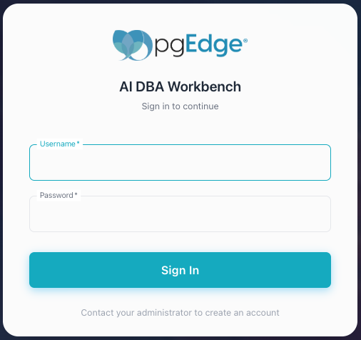
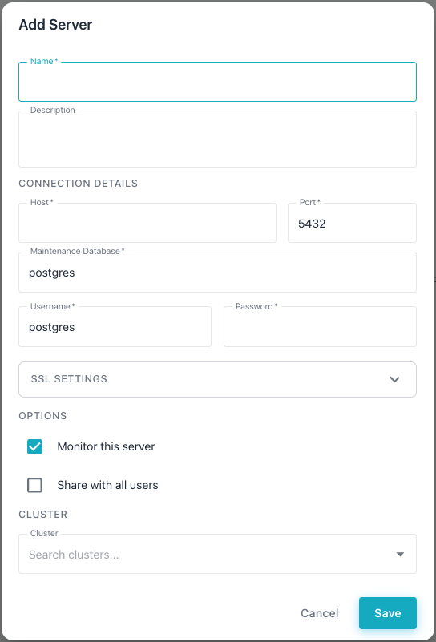
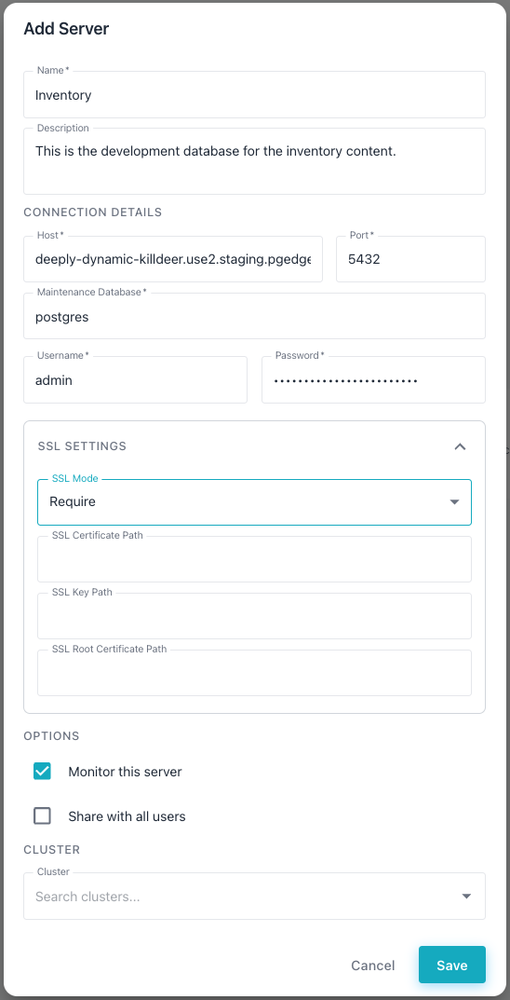
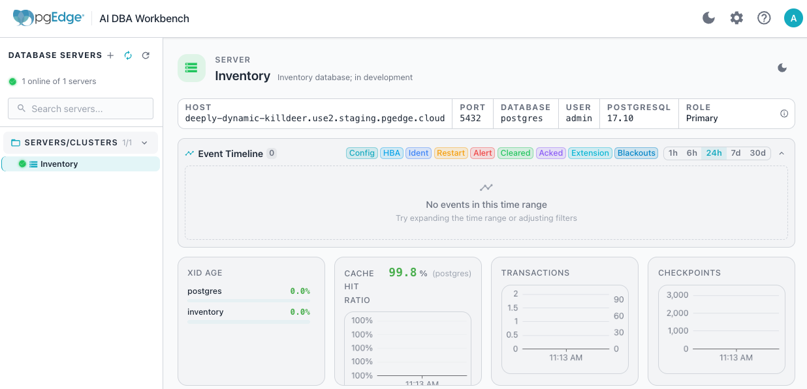

# Connecting with the AI DBA Workbench

The [pgEdge AI DBA Workbench](https://github.com/pgEdge/ai-dba-workbench) is
a monitoring, alerting, and AI-assisted diagnostics dashboard for PostgreSQL.
Install AI DBA Workbench on your localhost, and connect it to your pgEdge
Starfleet database to monitor performance, receive alerts, and get
AI-generated insights about your cluster.

## Installing the Workbench

The Workbench consists of four services: a collector, a server, an alerter,
and a web client. Docker Compose is the quickest way to deploy all four;
make sure Docker is running before you begin (on macOS or Windows, start
the Docker Desktop application). For other installation methods, see the
[Supported Installation Methods](https://github.com/pgEdge/ai-dba-workbench/blob/main/docs/getting-started/installation_overview.md)
guide.

1.  Clone the repository, and enter the project directory:

    ```bash
    git clone https://github.com/pgEdge/ai-dba-workbench.git
    cd ai-dba-workbench
    ```

2.  Generate the shared secret file, and set a password for the
    Workbench's own PostgreSQL datastore. Replace the placeholder
    (`1safepassword!`) with a password of your own choosing;
    `POSTGRES_PASSWORD` is an environment variable name and should be
    left as-is:

    ```bash
    mkdir -p docker/secret
    openssl rand -base64 32 > docker/secret/ai-dba.secret
    export POSTGRES_PASSWORD=1safepassword!
    echo "${POSTGRES_PASSWORD}" > docker/secret/pg-password
    sed -i.bak "s/password: postgres/password: ${POSTGRES_PASSWORD}/" \
      docker/config/ai-dba-server.yaml
    rm docker/config/ai-dba-server.yaml.bak
    ```

    !!! hint

        `sed -i.bak` (rather than a bare `-i`) keeps this command portable
        between macOS/BSD `sed`. The trailing `rm` then removes the backup
        file `sed -i.bak` creates.

3.  Choose host ports that are unlikely to already be in use (`5432`,
    `8080`, and `3000` are common defaults for other local services),
    then start the stack. Running `down -v` first guarantees a clean
    start, so PostgreSQL always initializes fresh with the password
    from step 2 instead of reusing a stale volume from an earlier
    attempt. This command is a no-op the first time you run it:

    ```bash
    export POSTGRES_PORT=15432
    export SERVER_PORT=18080
    export CLIENT_PORT=13000
    docker compose -f examples/docker-compose.production.yml down -v
    docker compose -f examples/docker-compose.production.yml up -d
    ```

4.  Verify that all services are running:

    ```bash
    docker compose -f examples/docker-compose.production.yml ps
    ```

    If any service is not `healthy`, review its log entries with the
    command:

    `docker compose -f examples/docker-compose.production.yml logs <service>`

    !!! warning

        The default Compose configuration publishes the client on plain
        HTTP for first-run convenience. Any deployment reachable from
        outside the host must terminate TLS in front of the client
        container before you connect a production database to it; see
        [TLS and reverse proxy requirements](https://github.com/pgEdge/ai-dba-workbench/blob/main/docs/admin-guide/tls-and-reverse-proxy.md).

5.  Create a user account for the Workbench; the password must be at
    least 12 characters long. Replace `1safepassword!` with a password
    of your own choosing:

    ```bash
    echo '1safepassword!' > /tmp/pw.txt
    docker compose -f examples/docker-compose.production.yml exec \
      -T server sh -c 'cat > /tmp/pw.txt' < /tmp/pw.txt
    docker compose -f examples/docker-compose.production.yml exec \
      server /usr/local/bin/ai-dba-server \
      -config /etc/pgedge/ai-dba-server.yaml \
      -add-user -username admin \
      -password-file /tmp/pw.txt \
      -full-name "Admin User" \
      -email "admin@example.com"
    docker compose -f examples/docker-compose.production.yml exec \
      server /usr/local/bin/ai-dba-server \
      -config /etc/pgedge/ai-dba-server.yaml \
      -set-superuser -username admin
    docker compose -f examples/docker-compose.production.yml exec \
      server rm /tmp/pw.txt
    rm /tmp/pw.txt
    ```

    !!! note

        The `-add-user` command prompts for optional notes about the
        user; press `Return` to skip it. This account's username
        (`admin`) and password are the Workbench login credentials,
        separate from the `POSTGRES_PASSWORD` set in step 2, which
        only protects the Workbench's internal datastore.

6.  Open a browser to the client's address (`http://localhost:13000`,
    using the `CLIENT_PORT` set in step 3), and log in with the
    credentials you configured in the previous step.

    

## Connecting the Workbench to Your Database

When you are logged in, add your pgEdge Starfleet database as a monitored
connection.

1.  Select the `+` next to the `DATABASE SERVERS` heading in the left
    navigation panel. The Workbench adds a new server definition entry.

    

2.  In the console, navigate to the
    [`Connect`](../using_console/managed_console_overview.md#the-connect-pane)
    pane to find the values you will need to connect to your database.

3.  Complete the server definition using the values from the
    [`Connect`](../using_console/managed_console_overview.md#the-connect-pane) pane:

    * `Name` is a display name for this connection; when connected,
      Workbench displays it in the left navigation pane.
    * `Host` is the `Domain` name from the `Connect` pane.
    * `Port` is the PostgreSQL listener port; enter `5432`.
    * `Username` is either `admin` or `app`; use the name that provides
      the permissions required (see
      [Managing Database Roles](../using_database/managed_roles.md)).
    * `Password` is the corresponding `Password` value from the `Connect`
      pane.
    * `SSL Mode` must be set to `require`.

    

4.  Save the server definition. The Workbench adds the database to the
    cluster navigator and begins collecting metrics. To view statistical
    metrics and manage your pgEdge Starfleet database, select the
    database name in the left navigation pane:

    

For more information about configuring and using
[AI DBA Workbench](https://docs.pgedge.com/ai-dba-workbench/v1-0-0/)
and other pgEdge projects and tools, visit the
[pgEdge documentation site](https://docs.pgedge.com/).
