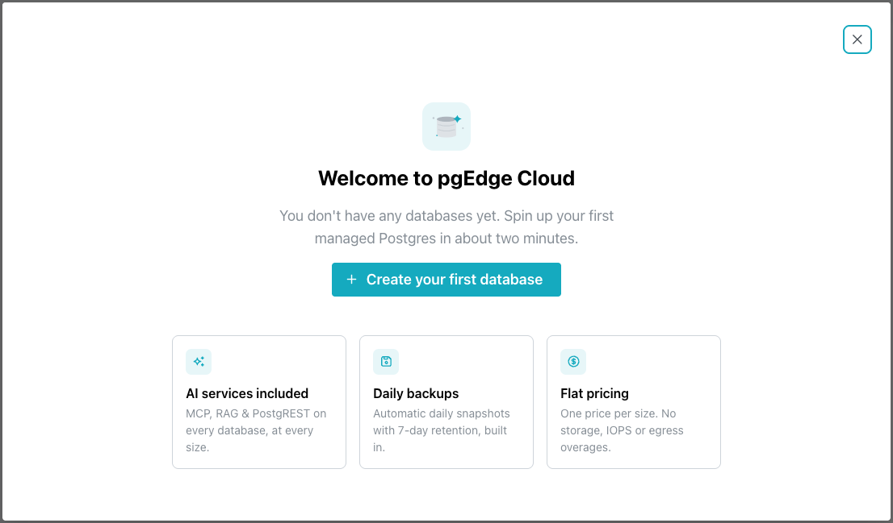
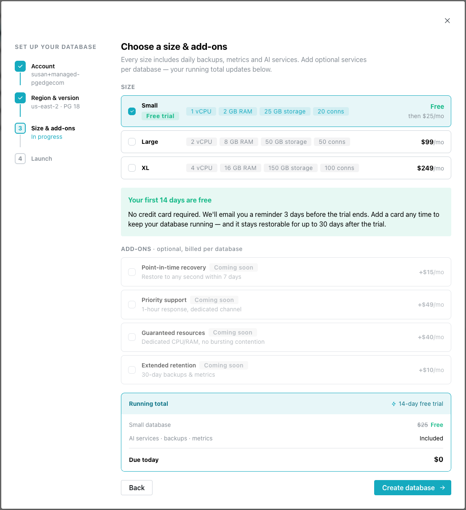
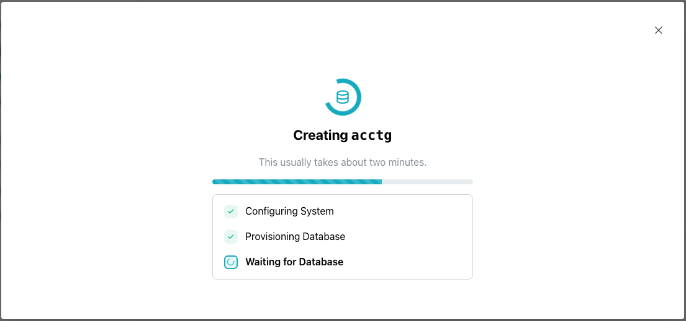

# Deploying a Managed Database

After authenticating with pgEdge Starfleet, you're welcomed and presented with
an easy-to-follow dialog that will walk you through creating your first
database:

Select the `Create your first database` button to continue.

In the first step, you'll provide details about the database:

- Provide a name for the database in the `Database name` field.
- Use the `Region` drop-down to select the region in which the database will
  deploy; note that you'll be able to add nodes in additional regions later.
- Choose the Postgres version that your hosted database will use.

After completing the dialog, click `Continue`.

Next, you'll select deployment features:

- In the `SIZE` section, select the size of your resource bundle:

 | Size | vCPU | RAM | Storage | Connections | Price |
 |------|------|-----|---------|-------------|-------|
 | Small | 1 vCPU | 2 GB RAM | 25 GB storage | 20 conns | Free trial, then $25/mo |
 | Large | 2 vCPU | 8 GB RAM | 50 GB storage | 50 conns | $99/mo |
 | XL | 4 vCPU | 16 GB RAM | 150 GB storage | 100 conns | $249/mo |

    For what each size gives you, see [Database Sizes](sizes.md).

- The `ADD-ONS` section features a list of optional features for your database:

 | Feature | Description | Price |
 |---------|--------------|-------|
 | Point-in-time recovery | Restores your database to any second within the past 7 days. | +$15/mo |
 | Priority support | Provides a 1-hour response time through a dedicated support channel. | +$49/mo |
 | Guaranteed resources | Reserves dedicated CPU and RAM for your database, so performance isn't affected by bursting contention from other workloads. | +$40/mo |
 | Extended retention | Retains backups and metrics for 30 days. | +$10/mo |

Select the features that will be accessible to your database, and select
`Create Database`.

When your database is ready, the console opens to an information page showing
your database features, and connection details. The database name is selected
in the navigation pane (on the left side of the console).

The new database is also shown on a pane on the Databases page:

## When the Wizard Cannot Continue

The wizard shows one of these messages when a step fails:

* `Couldn't check billing status` is a yellow warning on the size step, with
  the body `We couldn't confirm your billing status. Please retry before
  continuing.` and a `Retry` button. Retry before continuing. A payment
  method on the account is required before a database can be created, so
  continuing past an unconfirmed billing status risks a refusal at the end of
  the wizard.

* `Unable to start checkout. Please try again.` is the body of a red panel
  titled `Something went wrong`, with a `Back` button, meaning the payment
  step could not open a checkout session. Where the API sends a message of
  its own, that replaces the body text.

* `Confirmation failed` means the payment step could not confirm the card.
  The panel adds `We couldn't confirm your payment method.` and notes that the
  card may still have been saved, so check again in a moment before entering
  the card a second time.

* `Couldn't create your database` means the create request itself failed.
  The panel carries the reason underneath, plus `Try again` and `Back`.

