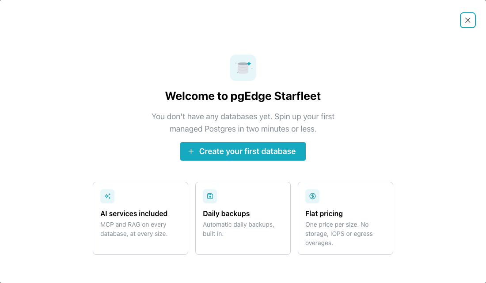
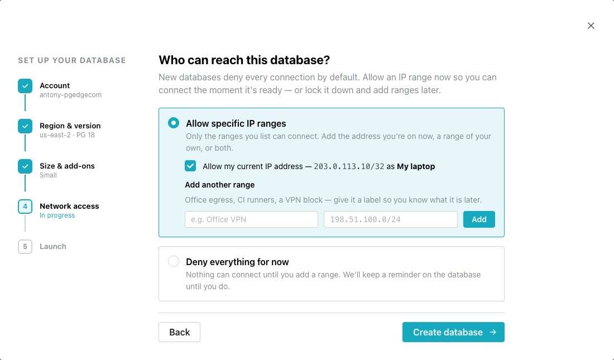
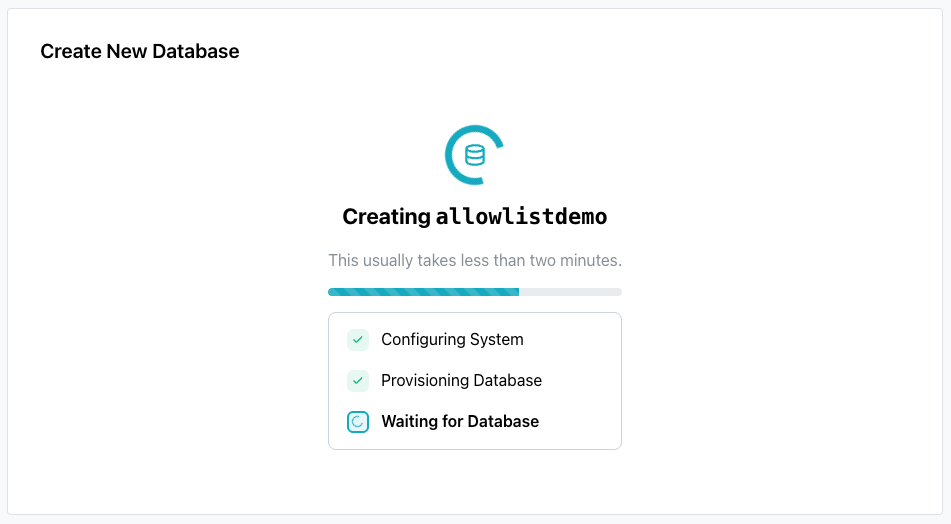

# Deploying a Managed Database

The create wizard sets up a pgEdge Starfleet Managed database in a series
of wizard steps. When the account has no database yet, the console opens
a welcome dialog:

Select `Create your first database` to open the wizard. To create
another database later, select `New Database` in the navigation pane.

The wizard lists its steps on the left. The `Account` step is complete
when the wizard opens, and displays the account the database is
created in.

## Choosing the Name, Region and Version

The `Region & version` wizard step sets the values that cannot be
changed after the database is created:

1. In the `Database name` field, enter the name of the database.

    The name appears in the connection string and cannot be changed
    later. The name uses lowercase letters and digits only, starts with
    a letter, and has up to 50 characters.

2. Optionally, in the `Display name` field, enter a label for the
   console.

    The console displays the display name only; you can edit the
    display name later, providing a name with a maximum length of 25
    characters. If you leave the field blank the console displays the
    database name.

3. From the `Region` drop-down, select the region the database runs in.

4. From the `PostgreSQL version` drop-down, select the Postgres version.

5. Select `Continue`.

## Selecting a Size

The `Size & add-ons` wizard step sets the resources for the database:

Each size has these resources:

| Size | vCPU | RAM | Storage | Connections |
|------|------|-----|---------|-------------|
| Small | 1 vCPU | 2 GB | 25 GB | 20 |
| Large | 2 vCPU | 8 GB | 50 GB | 50 |
| XL | 4 vCPU | 16 GB | 150 GB | 100 |

Every size includes daily backups, metrics, and the MCP and RAG servers.
A database can move to a larger size later, but cannot downsize.
For details about each size, see
[Managing Database Details](using_database/managed_database_details.md).

1. In the `SIZE` section, select a size.

2. Select `Continue`.

## Specifying Who Can Connect

The `Network access` wizard step sets which IP ranges can connect to
Postgres. A new database refuses every connection until its allowlist
has a range:

1. Select one of the two options:

    - `Allow specific IP ranges` admits only the ranges you add. When
      the console can read the IPv4 address you connect from, it
      selects `Allow my current IP address`, which adds that address,
      labeled `My laptop`.
    - `Deny everything for now` creates the database with no ranges, so
      nothing can connect until you add a connection range.

2. To admit another address or network, enter a label and an IP address
   or CIDR block under `Add another range`, then select `Add`.

    Add a range for each server, CI runner, or network that connects to
    the database.

3. Select `Create database`.

    When the account needs a payment method, the button reads
    `Continue to payment`, and a `Payment` wizard step follows.

This wizard step sets the database allowlist only. A new MCP server or
RAG server starts with no ranges of its own. For how allowlists work,
and how to change one later, see
[Controlling Network Access](using_database/managed_network_access.md).

## Waiting for the Database

The `Launch` wizard step displays a progress bar and a step list while
the database is created:

When the database is ready, the console opens to the database's page,
displaying database configuration and connection details.

For ease of navigation, the database name is displayed in the
left-pane's navigation tree, and on the `Databases` page.

## Troubleshooting

The wizard displays a message when a step fails:

- **`Couldn't check billing status`**, with the body text `We
  couldn't confirm your billing status. Please retry before
  continuing.`, and a `Retry` button.

    The account requires a payment method before you can create a
    database; continuing past an unconfirmed billing status risks a
    refusal at the end of the wizard.

- **`Something went wrong`**, with the body text `Unable to start
  checkout. Please try again.`, and a `Back` button.

    The payment step could not open a checkout session. If the API
    sends a message of its own, it replaces the body text.

- **`Confirmation failed`**, with the body text `We couldn't confirm
  your payment method.`

    The panel also notes that the card may still have been saved, so
    check again in a moment before entering the card a second time.

- **`Couldn't create your database`**, when the create request itself
  fails. The panel displays the reason, as well as `Try again` and
  `Back` buttons.
