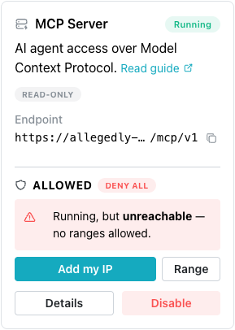
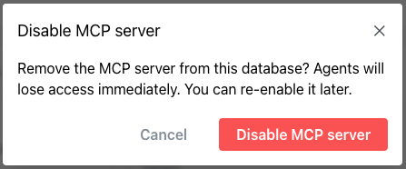
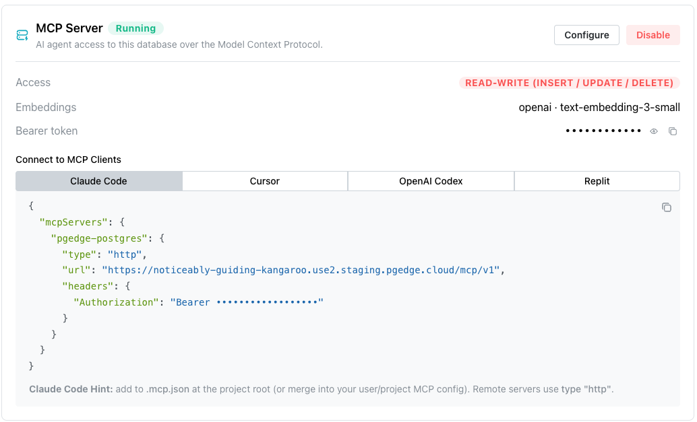
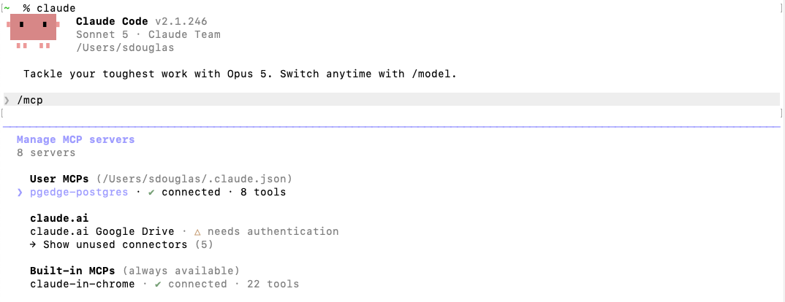
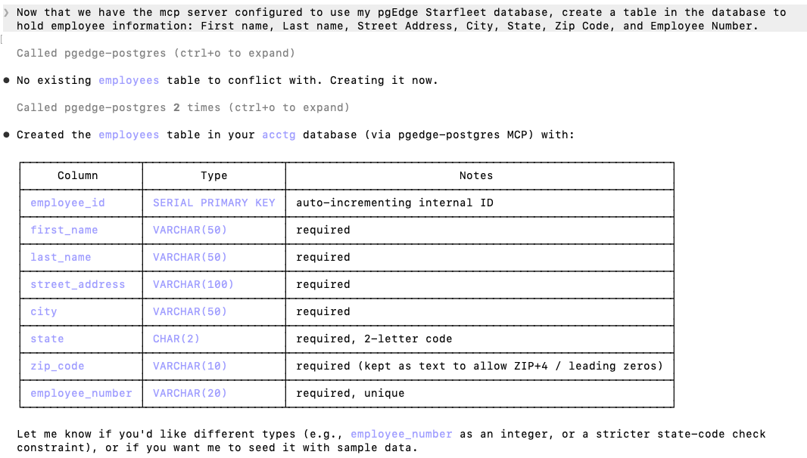
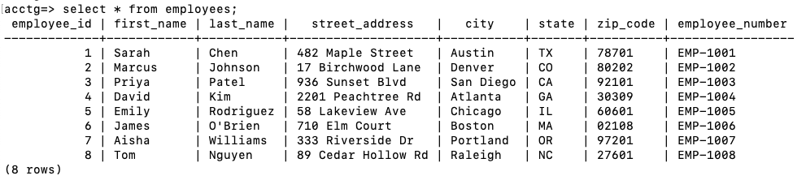

# Enabling and Using the MCP Server

The `AI Services` pane on your database's management page displays icons you
can use to deploy available services on your database.


Select `Enable MCP` to deploy the server. Once the service is deployed, select
the `Details` button to manage the server.

The
[pgEdge Postgres MCP Server](https://docs.pgedge.com/pgedge-postgres-mcp-server/v1-0-0/)
acts as a gateway to your Postgres database. The server translates requests
into operations against your database.

The server connects to the database as the `app` role, so even a read-only
server has read access to every table `app` can read.

!!! warning

    The MCP Server provides LLMs with read access to your entire database
    schema and data. The MCP Server should only be used for internal tools,
    developer workflows, or environments where all users are trusted.

## Enabling the MCP Server

To enable an MCP Server, select `Enable MCP` on the `AI Services` pane of
your database's management page. The button is active only while the database
status is `Available`; on a database in any other status, hovering over the
button displays `Database not available`.


When the `Enable MCP Server` popup opens, select the features you wish to
enable. Both settings are optional and off by default; submitting the
form unchanged creates a read-only server with a platform-generated
bearer token. The popup offers two settings:

- Enable `Generate embeddings` to expose the `generate_embedding` tool, which
  allows the connected LLM to request vector embeddings for text (for
  example, to support semantic search of your database using pgvector).
  Enabling this feature requires you to select a provider and model, and to
  supply an API key for that provider.

- Enable `Allow writes` to permit the `query_database` tool to
  execute mutating SQL (INSERT/UPDATE/DELETE) as well as read-only
  queries. Leave `Allow writes` disabled to restrict the LLM to read-only
  access, the safer default.

pgEdge Starfleet supports two embedding providers, `OpenAI` and `Voyage`; it
does not provide infrastructure for self-hosted model serving.

pgEdge Starfleet stores the embedding API key encrypted on the server. If
you edit the configuration later, the stored key remains functional only if
you keep the same provider you originally selected. Selecting a different
provider requires you to supply a new API key.

When you are finished, select the `Enable MCP Server` button to deploy the
MCP Server.



Enabling, configuring, or disabling any service requires the database to
be `Available`, and appears in the Activity Log as an `update-managed`
task. Each service change shares that one task name, so the Activity Log
cannot tell an MCP change from a RAG change.

Once enabled, the MCP Server pane updates to display:

- A color-coded status badge. A `running` server displays a status of
  `Running`. Every other state is shown as the raw value the API sent, in
  lower case, such as `failed` or `pending`.
- A `Details` button that takes you to the `Services` page, where you will
  find information about connecting to MCP clients.
- A `Disable` button that you can use to stop the MCP Server.



Select the `Disable MCP Server` button to stop the MCP Server. Disabling the
server does not change your client configuration, and every request from that
client fails once the server stops. A disabled endpoint may keep answering
for a few seconds before it stops; you can enable the server again later.

## Understanding the Server State

The `state` indicator on the `Services` page is not a readiness signal. The
state changes to `running` when a deployment completes, regardless of what
the server is doing. The indicator can show:

* `Running` means the deployment completed, not that the server answers.
  The endpoint returns `503` for roughly fifteen to twenty seconds after
  the deployment completes.

* `Failed` is a reliable state that requires attention; consult the
  Activity Log to review the reason.

To test server readiness, connect a client to the endpoint. If the client
reports the server as unavailable, wait a few seconds and reconnect.

## Reviewing MCP Server Details

Select the `Details` button on a running MCP Server to open the `Services`
page, which displays the server's status and configuration:



* `Access` shows whether the server is read-only or
  `READ-WRITE (INSERT / UPDATE / DELETE)`, based on the `Allow writes` setting
  chosen when the server was enabled.
* `Embeddings` shows the configured embedding provider and model (for
  example, `openai · text-embedding-3-small`), or `Disabled` if
  `Generate embeddings` was not enabled.
* `Bearer token` is the token used to authenticate MCP clients. Select the eye
  icon to reveal it, or the copy icon to copy it. The token is the MCP
  Server's own credential and is not the database password.

Select `Configure` to modify these settings, or `Disable` to stop the server.
The `Configure` button reopens the same form, and a change to one field leaves
the others as they are.

The connection endpoint appears in the `Connect to MCP Clients` panel only when
the server reports `Running`. The endpoint is the database's own domain with
`/mcp/v1` appended to it, and includes no port in the ordinary case; a pgEdge
Starfleet service is reached over HTTPS on port 443.

## Connecting a Client to the MCP Server

The steps for connecting a client to the MCP Server vary by client and
platform. The `Connect to MCP Clients` section (below the server details on
the `Services` page) displays ready-to-use connection details for four
clients:

- [Claude Code](https://code.claude.com/docs/en/overview) shows a JSON block
  with `"type": "http"`, the endpoint as its URL, and an `Authorization`
  header carrying the bearer token. Add it to `.mcp.json` at your project
  root, or merge it into your user or project MCP config.
- [Cursor](https://cursor.com/en-US/docs) shows the same JSON without the
  `type` field. Add it to `.cursor/mcp.json` in the repository for one
  project, or to `~/.cursor/mcp.json` to make the server available
  everywhere.
- [OpenAI Codex](https://openai.com/codex/) shows a TOML block declaring an
  `mcp_servers.pgedge_postgres` table with the endpoint as its URL, and an
  `mcp_servers.pgedge_postgres.http_headers` sub-table carrying the
  `Authorization` header. Append it to `~/.codex/config.toml`. The header
  block embeds the token directly, so it works however Codex is launched.
- [Replit](https://docs.replit.com/getting-started/intro-replit) has no file
  to edit. The panel shows four values to copy one at a time: a display name
  of `pgEdge Postgres`, the MCP Server URL, a custom header name of
  `Authorization`, and its value, which is the word `Bearer` followed by the
  token. In Replit, add these values under `Integrations`, then
  `MCP Servers`, then `Add MCP Server`, then `Test and Save`.

Select a client button to view the client-specific configuration. In the
displayed block the token is masked until you reveal it with the eye icon, but
the copy icon always includes the real token regardless of whether it is
revealed. For example, the `Claude Code` button displays JSON to add to
`.mcp.json`:

```json
{
  "mcpServers": {
    "pgedge-postgres": {
      "type": "http",
      "url": "https://<your-domain>/mcp/v1",
      "headers": {
        "Authorization": "Bearer <your-bearer-token>"
      }
    }
  }
}
```

Select the copy icon (in the upper-right corner of the code block) to copy
the configuration. A hint below the code block provides client-specific setup
guidance.

Remote servers, such as your pgEdge Starfleet MCP Server, use
`"type": "http"`.

### Connecting Another Client

The server communicates using streamable HTTP at the endpoint, and
authenticates requests using a bearer token in the `Authorization` header.
Any client that accepts a URL and a header can use the same two values
shown in the panel.

## Example - Connecting the MCP Server to Claude Code

The `Services` page provides the information needed to connect the MCP
Server to Claude Code. Follow these steps to connect a deployed MCP Server
to Claude Code:

1.  In the console, navigate to the `AI Services` pane, then select
    `Details` on your running MCP Server, or select `Services` in the
    navigation panel.

2.  Decide where to store the configuration:

    * At your project root, in a `.mcp.json` file scoped to that
      project (shareable with teammates via version control if
      desired). If you plan to commit this file, do not hardcode your
      bearer token in it; Claude Code supports `${VAR}`
      environment-variable expansion in `.mcp.json` values, so you can
      reference an environment variable instead (for example,
      `"Authorization": "Bearer ${PGEDGE_MCP_TOKEN}"`) and set the
      real token outside the file.
    * In your user-level Claude Code configuration, to make the server
      available across all your projects.

3.  Open the `.mcp.json` file (project or user-level) if it already
    exists, or create a new one. If you are creating a new file, you
    need only include the snippet provided on the `Claude Code` tab of
    the `Services` page.

    If you already have an `mcp.json` file that lists other MCP
    Servers under `mcpServers`, take care not to overwrite them.

4.  Add the `pgedge-postgres` entry. If the file is new, paste the
    whole block:

    ```json
    {
      "mcpServers": {
        "pgedge-postgres": {
          "type": "http",
          "url": "https://<your-domain>/mcp/v1",
          "headers": {
            "Authorization": "Bearer <your-bearer-token>"
          }
        }
      }
    }
    ```

    If `mcpServers` already has other entries, add the
    `"pgedge-postgres": { ... }` key alongside them, inside the
    existing object.

5.  Replace `<your-domain>/mcp/v1` and `<your-bearer-token>` in the
    `.mcp.json` file with the real values.

6.  Save the file.

7.  Restart Claude Code, or start a new session in that project.
    Claude Code reads `.mcp.json` on startup and prompts you to
    approve or trust the new MCP Server on the first connection.

8.  Verify the connection: run `/mcp` in Claude Code to confirm that
    `pgedge-postgres` appears in the list of active MCP Servers, then
    submit a natural-language query against your database to confirm
    the tool functions correctly.

    If the client reports the server as unavailable, the deployment
    may have finished moments earlier. Wait a few seconds and
    reconnect.

    The `/mcp` output shows `pgedge-postgres` as `connected`, along
    with the number of tools it exposes:

    

    Now you can ask Claude Code to invoke SQL queries against your
    pgEdge Starfleet database:

    

    Connecting directly to the database with `psql` as `app` (the
    owner of the table) confirms that the changes made through the
    MCP Server were applied to the underlying database:

    

## Best Practices to Avoid Prompt Injection

An agent that reads your data can be manipulated by actors using the text in
your data.
Anything the agent reads becomes text within its context window, and text
in a table row can be interpreted as an instruction rather than as data. A
support ticket, a user profile, a product description, or a comment field
can carry wording directed at the agent rather than at a person. The agent
has no reliable way to distinguish between the two.

When using the MCP Server:

- Ensure that `Allow writes` remains off unless it is required. An agent
  that cannot write cannot damage your data.
- Disable `Allow writes` again once the task that required write or
  delete access is complete.
- Treat a write-enabled agent as a user holding the `app` role's
  privileges, not as a tool. Only enable write access on a database whose
  data you would be willing to expose to an untrusted client.
- In a client that shows tool calls before executing them, review what
  the agent proposes before approving it.
- Exercise particular caution when accessing tables that hold text
  written by other users. Data you wrote yourself poses less risk than
  data submitted by other users.

## How Password Changes Affect the MCP Server

!!! hint

    The MCP Server reads the database's `app` password once, at startup.
    Changing the `app` role's password therefore restarts the database's
    MCP and RAG servers so they pick up the new password, causing a short
    gap in service. Your client configuration does not change.

    The updated password authenticates only when the database status
    returns to `Available`; the old password may still work until then.

## Troubleshooting - When the Services Page Shows an Error

The `Services` page displays a message when something goes wrong:

* `Unable to load services` is displayed with the body
  text: `We could not load this database. Refresh the page to try
  again.`

    The MCP and RAG Servers keep running while the console cannot read
    them, so this indicates a console read failure rather than an outage of
    the services themselves.

* `Failed to update MCP Server.` is displayed when a service change is
  refused. This is the fallback text, shown when the API sends no message
  of its own.

    A service change needs the database in an `Available` state, and each
    service change writes one `update-managed` task, so the Activity
    Log records both failed and successful modification attempts.
