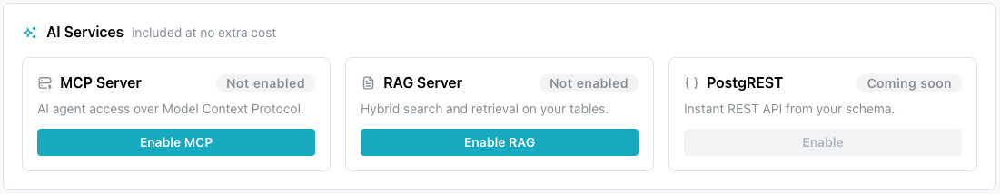
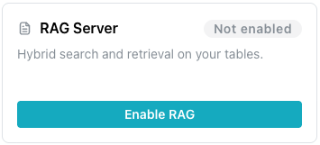
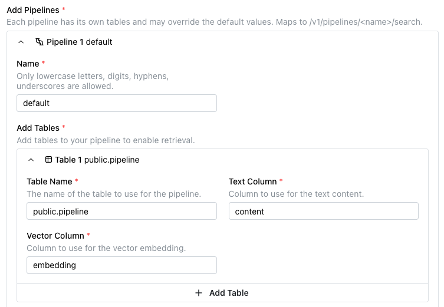
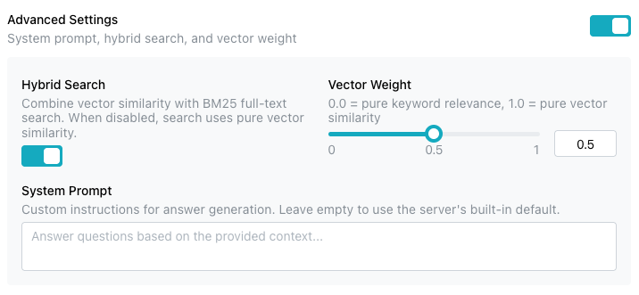
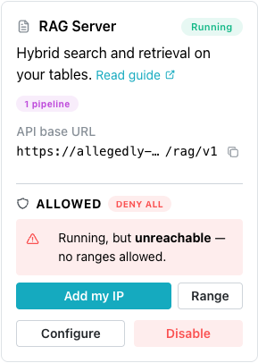
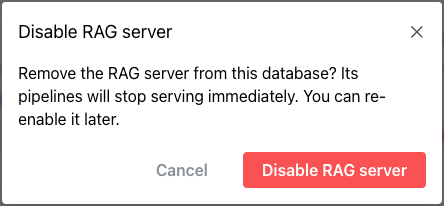

# Enabling and Using the RAG Server

The `AI Services` pane on your database's management page displays icons you
can use to deploy available services on your database.



Select `Enable RAG` to deploy the server. When the service is deployed, select
the `Details` button to manage the server.

The
[pgEdge RAG Server](https://docs.pgedge.com/pgedge-rag-server/v1-0-0/)
is an API server that performs Retrieval-Augmented Generation (RAG) over
content stored in a Postgres database using pgvector. Consider using a RAG
Server when you have a well-defined use case with predictable query patterns.

## Enabling the RAG Server

Select the `AI Services` pane, then select `Enable RAG` to begin.



To enable a RAG Server, select the `Enable RAG` icon in the RAG Server pane.
The button is active only while the database status is `Available` or
`Degraded`. On a database in any other status, hovering over the button
displays `Database not available`.


When the `Enable RAG Server` popup opens, provide details about the RAG Server
deployment:

- The `Default Token Budget` field sets the maximum number of context tokens
  allowed for the LLM (500 - 128,000). The default value is `1000`.
- The `Default Top N` field sets the maximum number of results to retrieve
  before token-budget trimming. The default value is `10`.
- The `Default Embedding LLM Provider` field selects the provider used for
  query and document embeddings during retrieval.
- The `Default Embedding LLM Model` field selects the embedding model to use.
  Available models depend on the selected provider (for example,
  `text-embedding-3-small` for OpenAI). This must match the model used to
  generate any pre-existing embeddings.
- The `Default Embedding LLM API Key` field provides the API key required for
  the selected embedding provider.
- The `Default Completion LLM Provider` field selects the provider used for
  answer generation.
- The `Default Completion LLM Model` field selects the completion model to use.
  Select a suggested model, or enter your own.
- The `Default Completion LLM API Key` field provides the API key required for
  the selected completion LLM provider.
- The `Add Pipelines` field defines one or more pipelines. Each pipeline has
  its own tables, can override the default values, and is queried at
  `/rag/v1/pipelines/<name>`.

pgEdge Starfleet supports two embedding providers: `OpenAI` and `Voyage`.
pgEdge Starfleet does not provide infrastructure for self-hosted model
serving, so Ollama is not offered; Anthropic does not provide an embedding
model, so it is not available either.

pgEdge Starfleet supports two completion providers: `Anthropic (Claude)`
and `OpenAI`.

When you select `OpenAI` for both the embedding provider and the completion
provider, the two API key fields collapse into a single
`Default OpenAI API Key` field. The value you enter in that field is used
for both providers.

!!! note

    Neither the console nor the platform checks an API key when you enable
    the server. A server configured with a bad key still reaches `Running`,
    and the bad key surfaces only when a pipeline query fails. Check the
    key before enabling the server rather than relying on the status badge.

Select `+Add Pipeline` to expand the dialog and define one or more pipelines
used by the RAG Server.



For each pipeline, provide:

- A unique name in the `Name` field. Only lowercase letters, digits, hyphens,
  and underscores are allowed. The console strips any other character as you
  type.
- At least one table, under `Add Tables`. A pipeline retrieves across every
  table you add to it, and the `Add Table` button appends another. Each table
  is its own collapsible block, and a block can be removed as long as more
  than one remains.

For each table in a pipeline, provide:

- The name of the table or view to use, in the `Table Name` field. Qualify
  the name with its schema, for example `public.documents`.
- The name of the column containing the text content to be indexed and
  searched, in the `Text Column` field. A new table block defaults to
  `content`.
- The name of the column containing the vector embeddings (using pgvector) for
  that content, in the `Vector Column` field. A new table block defaults to
  `embedding`.

When you set default values for the RAG Server, individual pipelines can omit
the corresponding fields and inherit those defaults. A pipeline can also
override specific fields while still inheriting the others. Use the `Override
Default Values` toggle to expand the dialog and provide the pipeline-specific
values you want to override:


Optionally, provide the following details:

- The `Token Budget` field overrides the maximum number of context tokens
  allowed for the LLM for this pipeline.
- The `Top N` field overrides the maximum number of results to retrieve before
  token-budget trimming for this pipeline.
- The `Embedding LLM Provider` field overrides the provider used for query
  and document embeddings during retrieval for this pipeline (`OpenAI` or
  `Voyage`).

- The `Embedding LLM Model` field overrides the embedding model to use for this
  pipeline.
- The `Embedding LLM API Key` field overrides the API key used for the selected
  embedding provider for this pipeline.
- The `Completion LLM Provider` field overrides the provider used for answer
  generation for this pipeline (`Anthropic (Claude)` or `OpenAI`).

- The `Completion LLM Model` field overrides the completion model to use for
  this pipeline.
- The `Completion LLM API Key` field overrides the API key used for the
  selected completion LLM provider for this pipeline.

Use the `Advanced Settings` toggle to expand the dialog and configure hybrid
search, vector weighting, and a custom system prompt for the pipeline:



Provide the following details:

- The `Hybrid Search` toggle combines vector similarity with BM25 full-text
  search. When disabled, search uses pure vector similarity. Hybrid search is
  enabled by default.
- The `Vector Weight` slider sets the balance between keyword and vector
  relevance, from `0.0` (pure keyword relevance) to `1.0` (pure vector
  similarity). The default value is `0.5`.
- The `System Prompt` field provides custom instructions for answer
  generation. Leave the field empty to use the server's built-in default
  prompt, which instructs the model to answer questions based on the
  provided context.

When you are finished, select the `Enable RAG Server` button to deploy the
RAG Server.



Enabling, configuring, or disabling the RAG Server requires the database to
be `Available` or `Degraded`, and appears in the Activity Log as an
`update-managed` task. Every service change shares that one task name, so the
Activity Log cannot tell a RAG change from an MCP change.

When enabled, the RAG Server pane updates to display:

- A status badge indicates the server's state: a `running` server
  displays `Running`, and every other state displays as the raw API
  value, in lower case, such as `failed` or `pending`.
- The server's `API base URL` appears with a copy icon when the server
  is `Running`.
- A `Configure` button opens the `Configure RAG Server` dialog, where
  you can modify the RAG Server deployment.
- A `Disable` button allows you to stop the RAG Server.
- The server's allowlist appears under `ALLOWED`. A new RAG Server
  allows no ranges, and when the server is running, the pane reads
  `Running, but unreachable — no ranges allowed.`

The database allowlist does not apply to the RAG Server; the RAG Server
will refuse client connections until a range is provided. Select
`Add my IP` to add the address the console sees you connecting from, or
select `Range` to add another range. For more information, see
[Controlling Network Access](../using_database/managed_network_access.md).

!!! hint

    The `Services` page also displays detailed information about the RAG
    Server; to open it, select `Services` under the database name in the
    navigation pane.


### Disabling the RAG Server

You can disable the RAG Server from either the `Services` page or the RAG
Server pane by selecting the `Disable` button.



When the popup opens, select the `Disable RAG Server` button to stop the
RAG Server.

## RAG Server State

The `state` badge on the RAG Server pane is not a readiness signal. The
state changes to `running` when the deployment completes, regardless of
what the server is doing.

- `Running` means the deployment completed, not that the server answers.
- `Failed` is a reliable state that requires attention; a `Running` badge
  proves nothing on its own.

The RAG Server exposes no handshake; query a pipeline to determine whether
it is ready.

## Reviewing RAG Server Details

When the RAG Server is running, its pane displays the server's status and
configuration:


- `Pipelines` displays how many pipelines are configured, and their names.
- `Embedding model` displays the configured embedding provider and model
  (for example, `openai · text-embedding-3-small`).
- `Completion model` displays the configured completion provider and model
  (for example, `anthropic · claude-sonnet-4-6`).
- `Retrieval` displays the token budget and the Top N result count used
  during search.
- The `Connect` section provides the API base URL and a ready-to-use
  `curl` command for querying a pipeline.

Select `Configure` to change these settings, or `Disable` to stop the server.

## Using the RAG Server

The API base URL is your database's own domain with `/rag/v1` appended to it,
and a pipeline is one segment below it; a query is a `POST` to
`https://<your-domain>/rag/v1/pipelines/<pipeline-name>` with a JSON body.
A pipeline name that the server does not recognize answers `404`.

After adding a RAG Server to your database, you can use the
[pgEdge Docloader](https://docs.pgedge.com/pgedge-docloader/v1-0-0/)
to load your documents into your database. The Docloader converts HTML,
Markdown, and reStructuredText into a searchable table form:

```bash
pgedge-docloader --config docloader.yml
```

After loading the table, you can query your pipeline via the REST API. For
example:

```bash
curl -X POST https://<your-domain>/rag/v1/pipelines/my-docs \
  -H "Content-Type: application/json" \
  -d '{"query": "How do I configure replication?"}'
```

The RAG Server retrieves the most relevant document chunks using hybrid
search (vector similarity and BM25 keyword matching), then passes them to
the LLM to generate a grounded answer.

!!! note

    The full API docs and an interactive demo are available at
    [docs.pgedge.com/pgedge-rag-server](https://docs.pgedge.com/pgedge-rag-server).

## Example - Building a Custom Knowledgebase with the RAG Server

This example demonstrates loading a set of Markdown documentation into
your pgEdge Starfleet database and querying that content through the RAG
Server. The RAG Server only generates embeddings for incoming queries;
the `embedding` column on your table must be populated separately before
the server can retrieve results from it.

1. Connect with `psql` as the `app` user, using the connection string
    from the `Application` tab of your database's `Connect` pane (see
    [Connecting with psql](../connecting/managed_psql.md)). The `app` user owns
    the database, so the tables it creates belong to `app`.
    For example:

    ```bash
    PGSSLMODE=require PGPASSWORD=<your-app-password> psql -U app \
      -h <your-domain> -p <your-port> -d <your-database>
    ```

2. Create a table to store the documentation content, with a
    `pgvector` column sized for your embedding model. `app` cannot
    install the `vector` extension, so install `vector` first with the
    `Admin` tab's connection string, as
    [Installing Supported Extensions on a pgEdge Starfleet Managed Database](../using_database/managed_extensions.md)
    describes. Then run the following as `app`:

    ```sql
    CREATE TABLE documents (
        id SERIAL PRIMARY KEY,
        title TEXT,
        content TEXT NOT NULL,
        filename TEXT UNIQUE NOT NULL,
        embedding vector(1536),
        created_at TIMESTAMP DEFAULT CURRENT_TIMESTAMP
    );

    CREATE INDEX ON documents USING ivfflat (embedding vector_cosine_ops);
    ```

3. Use the
    [pgEdge Docloader](https://docs.pgedge.com/pgedge-docloader/v1-0-0/)
    to load your documentation's Markdown files into the `documents`
    table. Point `--source` at the folder containing your docs. Reuse
    the `Host`, `Database name`, and `User` values from the
    `Application` tab:

    ```bash
    export PGPASSWORD=<your-app-password>
    pgedge-docloader \
      --source ./docs \
      --db-host <your-db-host> \
      --db-name <your-db-name> \
      --db-user app \
      --db-sslmode require \
      --db-table documents \
      --col-doc-title title \
      --col-doc-content content \
      --col-file-name filename
    ```

    !!! note

        `pgedge-docloader` is an open-source command-line tool; install
        it by cloning and building the
        [pgEdge Docloader](https://github.com/pgEdge/pgedge-docloader)
        repository:

        ```bash
        git clone https://github.com/pgEdge/pgedge-docloader.git
        cd pgedge-docloader
        make build
        make install
        ```

4. Populate the `embedding` column for each row. Before populating the
    column,
    [enable the MCP Server](managed_mcp.md#enabling-the-mcp-server) with
    `Generate embeddings` and `Allow writes` turned on. If you connect an
    AI client (such as Claude Code), you can ask it to:

    - find the rows in `documents` where `embedding IS NULL`.
    - call `generate_embedding` on each row's `content` to compute a
      vector.
    - `UPDATE` that row, storing the vector in its `embedding` column.

5. Navigate to the RAG Server details page. In the console, open the
    `AI Services` pane and select `Details` on your running RAG
    Server, or select `Services` from the navigation pane. Under
    `Connect`, note the API base URL and the pipeline name.

6. If the RAG Server's pipeline is not already configured to use this
    table, select `Configure`, open the pipeline's table block under
    `Add Tables`, then set `Table Name` to `public.documents`,
    `Text Column` to `content`, and `Vector Column` to `embedding`.

7. Query the pipeline with a question that your documentation should
    answer:

    ```bash
    curl -X POST https://<your-domain>/rag/v1/pipelines/<pipeline-name> \
      -H "Content-Type: application/json" \
      -d '{"query": "How do I configure replication?"}'
    ```

The response is a JSON payload with a generated `answer` and the
`sources` the RAG Server retrieved, which should reference content
from the documentation you loaded in step 3.

## Troubleshooting

- **`Unable to load services`** appears in a red panel with the body text:
  `We could not load this database. Refresh the page to try again.`

    The RAG and MCP Servers keep running while the console cannot read
    them, so this indicates a console read failure rather than an
    outage of the services themselves.

- **`Failed to update RAG Server.`** appears when a service change is
  refused. This is the fallback text, displayed when the API sends no
  message of its own.

    A service change requires the database to be in an `Available`
    or `Degraded` state, and each service change writes one `update-managed`
    task, so the Activity Log records both failed and successful modification
    attempts.
