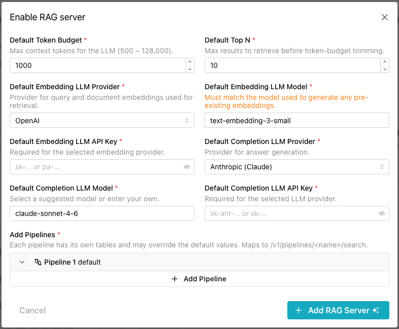

# Enabling and Using the RAG Server

The `AI Services` pane on your database's management page displays icons you
can use to deploy available services on your database.


Select `Enable RAG` to deploy the server. Once the service is deployed, select
the `Details` button to view details and manage it.

The
[pgEdge Postgres RAG server](https://docs.pgedge.com/pgedge-rag-server/v1-0-0/)
is a simple API server used to perform Retrieval-Augmented Generation (RAG) of
text based on content from a Postgres database using pgvector. Consider using
a RAG server when you have a well-defined use case with predictable query
patterns.

## Enabling the RAG Server


To enable a RAG server, select the `Enable RAG` icon in the RAG Server pane.
The button is active only while the database status is `Available`. On a
database in any other status, hovering it shows `Database not available`.



When the `Enable RAG server` popup opens, provide details about the RAG server
deployment:

* The `Default Token Budget` field sets the maximum number of context tokens
  allowed for the LLM (500 - 128,000). The default value is `1000`.
* The `Default Top N` field sets the maximum number of results to retrieve
  before token-budget trimming. The default value is `10`.
* The `Default Embedding LLM Provider` field selects the provider used for
  query and document embeddings during retrieval.
* The `Default Embedding LLM Model` field selects the embedding model to use.
  Available models depend on the selected provider (for example,
  `text-embedding-3-small` for OpenAI). This must match the model used to
  generate any pre-existing embeddings.
* The `Default Embedding LLM API Key` field provides the API key required for
  the selected embedding provider.
* The `Default Completion LLM Provider` field selects the provider used for
  answer generation.
* The `Default Completion LLM Model` field selects the completion model to use.
  Select a suggested model, or enter your own.
* The `Default Completion LLM API Key` field provides the API key required for
  the selected completion LLM provider.
* The `Add Pipelines` field defines one or more pipelines. Each pipeline has
  its own tables and can override the default values, and is queried at
  `/rag/v1/pipelines/<name>`.

pgEdge Starfleet supports two embedding providers: `OpenAI` and `Voyage`.
Starfleet does not provide infrastructure for self-hosted model serving,
so Ollama is not offered; Anthropic does not provide an embedding model,
so it isn't available either.

pgEdge Starfleet supports two completion providers: `Anthropic (Claude)`
and `OpenAI`.

When you select `OpenAI` for both the embedding provider and the completion
provider, the two API key fields collapse into a single
`Default OpenAI API Key` field, and the one value you enter is used for both.

!!! note

    Neither the console nor the platform checks an API key when you enable the
    server. A server carrying a bad key still reaches `Running`, and the bad
    key surfaces only when a pipeline query fails. Check the key before you
    enable rather than reading the badge.

Select `+Add Pipeline` to expand the dialog and define one or more pipelines
used by the RAG server.


For each pipeline, provide:

* A unique name in the `Name` field. Only lowercase letters, digits, hyphens,
  and underscores are allowed. The console strips any other character as you
  type.
* At least one table, under `Add Tables`. A pipeline retrieves across every
  table you add to it, and the `Add Table` button appends another. Each table
  is its own collapsible block, and a block can be removed while more than one
  remains.

For each table in a pipeline, provide:

* The name of the table or view to use, in the `Table Name` field. Qualify it
  with its schema, for example `public.documents`.
* The name of the column containing the text content to be indexed and
  searched, in the `Text Column` field. A new table block starts at `content`.
* The name of the column containing the vector embeddings (using pgvector) for
  that content, in the `Vector Column` field. A new table block starts at
  `embedding`.

When you set default values for the RAG server, individual pipelines can omit
the corresponding fields and inherit those defaults. A pipeline can also
override specific fields while still inheriting the others. Use the `Override
Default Values` toggle to expand the dialog and provide the pipeline-specific
values you want to override:


Optionally, provide the following details:

* The `Token Budget` field overrides the maximum number of context tokens
  allowed for the LLM for this pipeline.
* The `Top N` field overrides the maximum number of results to retrieve before
  token-budget trimming for this pipeline.
* The `Embedding LLM Provider` field overrides the provider used for query
  and document embeddings during retrieval for this pipeline (`OpenAI` or
  `Voyage`).

* The `Embedding LLM Model` field overrides the embedding model to use for this
  pipeline.
* The `Embedding LLM API Key` field overrides the API key used for the selected
  embedding provider for this pipeline.
* The `Completion LLM Provider` field overrides the provider used for answer
  generation for this pipeline (`Anthropic (Claude)` or `OpenAI`).

* The `Completion LLM Model` field overrides the completion model to use for
  this pipeline.
* The `Completion LLM API Key` field overrides the API key used for the
  selected completion LLM provider for this pipeline.

Use the `Advanced Settings` toggle to expand the dialog and configure hybrid
search, vector weighting, and a custom system prompt for the pipeline:


Provide the following details:

* The `Hybrid Search` toggle combines vector similarity with BM25 full-text
  search. When disabled, search uses pure vector similarity. Hybrid search is
  enabled by default.
* The `Vector Weight` slider sets the balance between keyword and vector
  relevance, from `0.0` (pure keyword relevance) to `1.0` (pure vector
  similarity). The default value is `0.5`.
* The `System Prompt` field provides custom instructions for answer
  generation. Leave it empty to use the server's built-in default prompt,
  which instructs the model to answer questions based on the provided
  context.

When you're finished, select the `Enable RAG server` button to deploy the RAG
server.


Enabling, configuring or disabling the RAG server is a services write, so it
requires the database to be `Available`, and it appears in the Activity Log as
an `update-managed` task. Every services change shares that one task name, so
the Activity Log cannot tell a RAG change from an MCP change.

Once enabled, the RAG Server pane updates to display:

- A status badge. A `running` state reads `Running`. Every other state is
  shown as the raw value the API sent, in lower case, such as `failed` or
  `pending`.
- A `Configure` button that opens the Configure RAG server dialog where you can
  modify the RAG server deployment.
- A `Disable` button that you can use to stop the RAG server.

!!! hint

    Detailed information about the RAG server is also added to the `Services`
    page. Use the link to `Services` located under the database name in the
    navigation pane to access the page.


You can disable the RAG server from either the Services page or the RAG Server
pane by selecting the `Disable` button.


Select the `Disable RAG Server` button to stop the RAG server.

## Understanding the Server State

The `state` badge on the RAG Server pane is not a readiness signal. The
state changes to `running` the moment the deployment completes, whatever
the server itself is doing.

* `Running` means the deploy finished, not that the server answers.
* `Failed` is a reliable state that calls for action; a `Running` badge
  proves nothing on its own.

The RAG server exposes no handshake, so query a pipeline to find out
whether it is ready.

## Reviewing RAG Server Details

Once the RAG server is running, its pane displays the server's status and
configuration:


* `Pipelines` shows how many pipelines are configured, and their names.
* `Embedding model` shows the configured embedding provider and model
  (for example, `openai · text-embedding-3-small`).
* `Completion model` shows the configured completion provider and model
  (for example, `anthropic · claude-sonnet-4-6`).
* `Retrieval` shows the token budget and the Top N result count used
  during search.
* The `Connect` section provides the API base URL and a ready-to-use
  `curl` command for querying a pipeline.

Select `Configure` to change these settings, or `Disable` to stop the server.

## Using the RAG Server

The API base URL is your database's own domain with `/rag/v1` on the end, and
a pipeline is one segment below it: a query is a `POST` to
`https://<your-domain>/rag/v1/pipelines/<pipeline-name>` carrying a JSON body.
A name the server does not know answers `404`.

After adding a RAG Server to your database, you can use the
[pgEdge Docloader](https://docs.pgedge.com/pgedge-docloader/v1-0-0/)
to load your documents into your database. The Docloader converts HTML,
Markdown, and reStructuredText into a searchable table form:

```bash
pgedge-docloader --config docloader.yml
```

After loading the table, you can query your pipeline via the REST API. For
example:

```bash
curl -X POST https://<your-domain>/rag/v1/pipelines/my-docs \
  -H "Content-Type: application/json" \
  -d '{"query": "How do I configure replication?"}'
```

The RAG server retrieves the most relevant document chunks using hybrid
search (vector similarity + BM25 keyword matching), then passes them to
the LLM to generate a grounded answer.

!!! note

    The full API docs and an interactive demo are available at
    [docs.pgedge.com/pgedge-rag-server](https://docs.pgedge.com/pgedge-rag-server).

## Example - Building a Custom Knowledgebase with the RAG Server

This example walks through loading a set of Markdown documentation into
your pgEdge Starfleet database and querying it through the RAG server.
The RAG server only generates embeddings for incoming queries. The
`embedding` column on your table must be populated separately before the
server can retrieve against it.

1.  Connect with `psql` as the `app` user, using the connection string
    from the `Application` tab of your database's `Connect` pane (see
    [Connecting with psql](../connecting/psql.md)): the `app` user owns
    the database and can create tables, while the `admin` user cannot.
    For example:

    ```bash
    PGSSLMODE=require PGPASSWORD=<your-app-password> psql -U app \
      -h <your-domain> -p <your-port> -d <your-database>
    ```

2.  Create a table to hold the documentation content, with a
    `pgvector` column sized for your embedding model:

    ```sql
    CREATE EXTENSION IF NOT EXISTS vector;

    CREATE TABLE documents (
        id SERIAL PRIMARY KEY,
        title TEXT,
        content TEXT NOT NULL,
        filename TEXT UNIQUE NOT NULL,
        embedding vector(1536),
        created_at TIMESTAMP DEFAULT CURRENT_TIMESTAMP
    );

    CREATE INDEX ON documents USING ivfflat (embedding vector_cosine_ops);
    ```

3.  Use the
    [pgEdge Docloader](https://docs.pgedge.com/pgedge-docloader/v1-0-0/)
    to load your documentation's Markdown files into the `documents`
    table. Point `--source` at the folder containing your docs. Reuse
    the `Host`, `Database name`, and `User` values from the
    `Application` tab:

    ```bash
    export PGPASSWORD=<your-app-password>
    pgedge-docloader \
      --source ./docs \
      --db-host <your-db-host> \
      --db-name <your-db-name> \
      --db-user app \
      --db-sslmode require \
      --db-table documents \
      --col-doc-title title \
      --col-doc-content content \
      --col-file-name filename
    ```

    !!! note

        `pgedge-docloader` is an open-source command-line tool. Install
        it by cloning and building the
        [pgEdge Docloader](https://github.com/pgEdge/pgedge-docloader)
        repository. You can download and install it with the following
        steps:

        ```bash
        git clone https://github.com/pgEdge/pgedge-docloader.git
        cd pgedge-docloader
        make build
        make install
        ```

4.  Populate the `embedding` column for each row. Before populating
    the column, enable the MCP server with `Generate embeddings` and
    `Allow writes` enabled (see
    [Enabling the MCP Server](mcp.md#enabling-the-mcp-server)). If you
    enable an AI client (like Claude Code), you can ask the interface
    to:

    - find the rows in `documents` where `embedding IS NULL`.
    - call `generate_embedding` on each row's `content` to compute a
      vector.
    - `UPDATE` that row, storing the vector in its `embedding` column.

5.  Navigate to the RAG Server details page. In the console, go to the
    `AI Services` pane and select `Details` on your running RAG
    Server, or select `Services` from the navigation pane. Under
    `Connect`, note the API base URL and the pipeline name.

6.  If the RAG Server's pipeline isn't already configured to use this
    table, select `Configure`, open the pipeline's table block under
    `Add Tables`, then set `Table Name` to `public.documents`,
    `Text Column` to `content`, and `Vector Column` to `embedding`.

7.  Query the pipeline with a question that your documentation should
    answer:

    ```bash
    curl -X POST https://<your-domain>/rag/v1/pipelines/<pipeline-name> \
      -H "Content-Type: application/json" \
      -d '{"query": "How do I configure replication?"}'
    ```

8.  Verify the response: the RAG server returns a JSON payload with a
    generated `answer` and the `sources` it retrieved, which should
    reference content from the documentation you loaded in step 3.

## Troubleshooting - When the Services Page Shows an Error

The `Services` page displays a message when something goes wrong:

* `Unable to load services` is displayed as a red panel with the body
  text: `We could not load this database. Refresh the page to try
  again.`

    The RAG and MCP servers keep running while the console cannot read
    them, so this indicates a console read failure rather than an
    outage of the services themselves.

* `Failed to update RAG server.` is displayed when a service change is
  refused. It is the fallback text, shown when the API sends no message
  of its own.

    A services change needs the database in an `Available` state, and
    each service change writes one `update-managed` task, so the
    Activity Log carries both failed and successful modification
    attempts.
