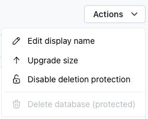
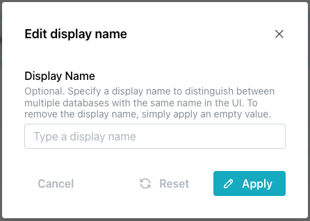
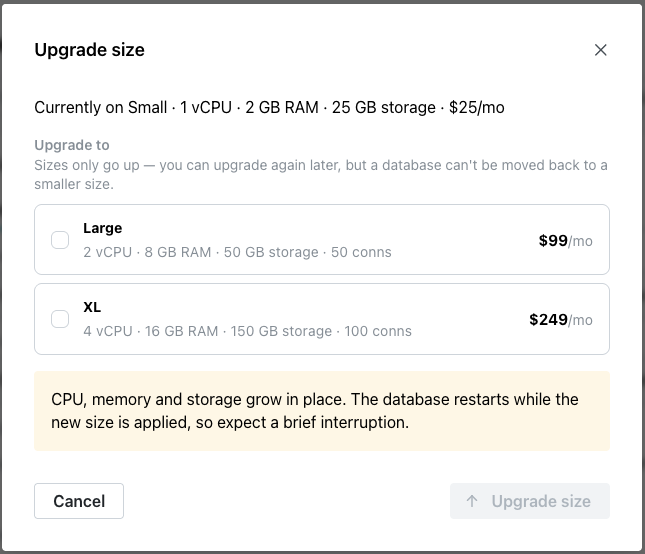

# Accessing Management Options with the Actions Menu

The `Actions` drop-down, on the right-hand side of your database's management
page header, offers management options for your database:

* `Edit display name` — set an optional display name for your database.
* `Upgrade size` — change the size tier of your database.
* `Enable deletion protection`/`Disable deletion protection` — toggle
  deletion protection for your database.
* `Delete database` — delete your database. This option is unavailable
  (protected) while deletion protection is enabled.

## Editing the Display Name

Select `Edit display name` from the `Actions` menu to open the
`Edit display name` popup.

The `Display Name` is optional, and is used to distinguish between multiple
databases that share the same database name in the console UI; it doesn't
change the database's actual name (shown in the `Database name` field of the
`Connect` pane). Enter a display name and select `Apply` to set it, or select
`Reset` to revert to the last applied value. To remove a display name, apply
an empty value; select `Cancel` to close the popup without making changes.

## Upgrading the Size Tier

Select `Upgrade size` from the `Actions` menu to change the size tier of your
database. The `Upgrade size` popup opens, showing your database's current
size and price, and the sizes you can upgrade to.

Select the size you want to upgrade to, then select `Upgrade size` to confirm,
or `Cancel` to close the popup without upgrading. Sizes only go up — you can
upgrade again later, but a database can't be moved back to a smaller size.
CPU, memory, and storage grow in place; the database restarts while the new
size is applied, so expect a brief interruption.

For details about the available sizes, see
[Plan and Billing](index.md#plan-and-billing).

## Enabling and Disabling Deletion Protection

The `Enable deletion protection` option in the `Actions` drop-down works like a
toggle; select it once to enable protection, and a confirmation popup in the
lower-right corner of the window confirms that protection is enabled. To
disable deletion protection, select `Disable deletion protection` from the
menu.

While deletion protection is enabled, `Delete database` is unavailable
(protected); disable deletion protection before deleting the database.

## Deleting the Database

Select `Delete database` from the `Actions` menu to permanently delete your
database. This option is unavailable while deletion protection is enabled; see
[Enabling and Disabling Deletion Protection](#enabling-and-disabling-deletion-protection).
