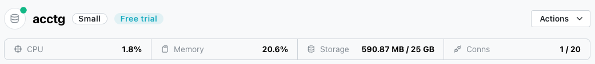
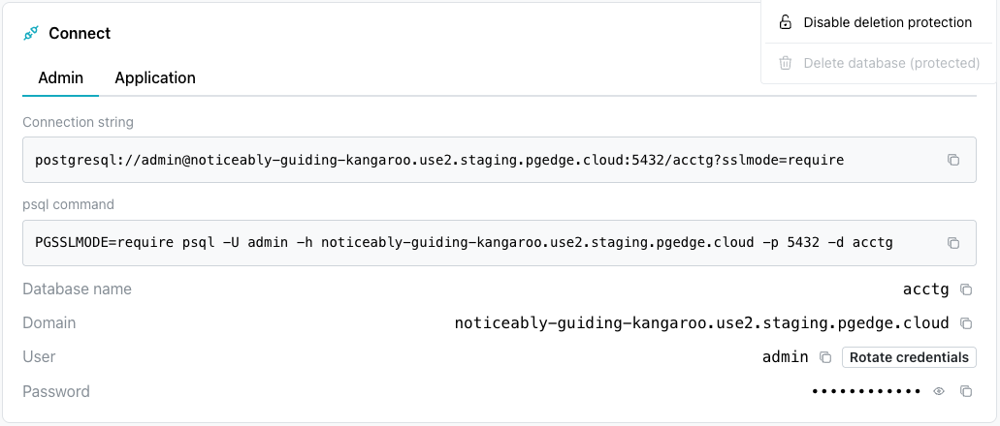
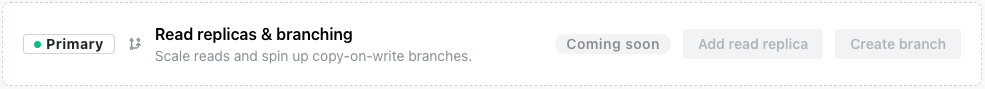
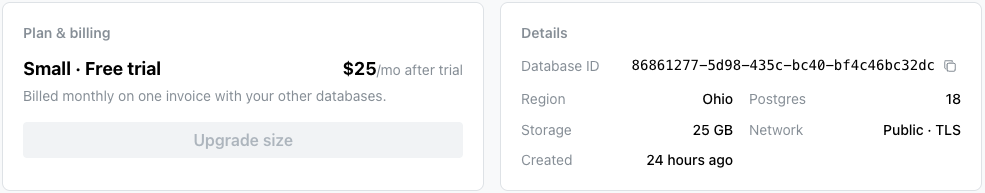

# Using the Database Console

When you create a pgEdge Starfleet PostgreSQL database, the database name is
displayed in the tree control on the left side of the console when the
deployment completes.

Select the database name to navigate to the database management page of the
console.

## The Database Header

The database header displays:

* The name of the database; next to the name, a dot indicates the status of the
  database:
    * A green dot indicates that the database is available for connections.
    * A blue dot indicates that the database is being created.
    * A red dot indicates that the database is not available.

* The CPU size of the database.
* The Memory used by the database.
* The amount of storage allocated to the database.
* The number of connections allocated for the database.

## The Actions Context Menu

The `Actions` drop-down (on the right-hand side of the header) offers
management options for your database, including editing the display name,
upgrading the size tier, and enabling deletion protection.

For detailed information about options available through the `Actions` menu,
see [Accessing Management Options with the Actions Menu](actions.md).

## The Connect Pane

Below the header, the console displays the `Connect` pane; the pane includes an
`Admin` tab with credentials for the `admin` user, and an `Application` tab
with credentials for the `app` user. Each tab displays:

* A ready-to-use `Connection string`.
* A ready-to-use `psql command`; the command opens a psql session for the
  selected `User` (`Admin` or `Application`) when invoked on the command line
  of a host with an installed psql client.
* The `Database name` and `Domain` (host name) of the database.
* The `User` connecting to the database; select `Rotate credentials` to
  generate a new password for the user.
* The `Password` for the user; select the eye icon to reveal it.

Select the copy icon next to any field to copy its value.

The two users have different permissions on the database:

| Capability | `admin` | `app` |
|------------|:-------:|:-----:|
| Create tables/objects in `public` | No | Yes |
| Read all data | Yes | Yes |
| Insert, update, delete data | Yes | Yes |
| Create databases | Yes | No |
| Create roles | Yes | No |
| View active sessions | Yes | No |
| Terminate backends | Yes | No |
| Run maintenance (vacuum, analyze) | Yes | No |
| Manage subscriptions | Yes | No |

To create tables or other schema objects, connect using the `Application`
tab credentials (the `app` user); the `admin` user can read and write existing
data, but cannot create new objects.

For detailed information about:

* installing the psql client and connecting to the database, see
  [Connecting](../../connecting.md).
* Postgres SQL commands, see the
  [Postgres documentation](https://www.postgresql.org/docs/18/sql-commands.html).

## The AI Services Pane

The `AI Services` pane displays icons you can use to deploy available services
on your Postgres database, including an MCP server and a RAG server. Select
`Enable MCP` or `Enable RAG` to add a service; once a service is deployed,
select its `Details` button to view connection details and manage it. 

For detailed information about enabling, configuring, and connecting to these
services, see [MCP Server](services/mcp.md) or [RAG Server](services/rag.md).

## The Backups Pane

The `Backups` pane displays a list of the backups taken of your database; each
backup is either a `hot` backup (fast, short-term storage) or a `durable`
backup (longer-term, resilient storage).

To review a complete list of available backups, select `View All` from the
right side of the console, across from the `Backups` label.

Each backup entry displays:

* The backup ID.
* A tag indicating whether the backup is a `hot` or `durable` backup.
* The backup status (for example, `completed`).
* How long ago the backup was taken.

Select the `Restore` button, to the right of a backup to restore the selected
backup; select `View all` (in the upper-right corner of the pane) to see the
complete list of backups. 

For detailed information about the `Backups` page, see
[Restoring from Backup](backups.md).

## The Metrics Pane

The `Metrics` pane displays live graphs of current database activity, including
`Transactions` (transactions per second) and `Tuples returned` (rows returned
per second).

Select `Open metrics` (in the upper-right corner of the `Metrics` pane) to see
detailed metrics for your database.

For detailed information about the `Metrics` page, see
[Monitoring System Metrics](metrics.md).

## The Logs Pane

The `Logs` pane displays the most recent entries from your database's log file;
each entry shows the timestamp, log level (for example, `LOG`), and message.

Select `View logs` (in the upper-right corner of the pane) to see the complete,
searchable log for your database.

For detailed information about the `Logs` page, see
[Reviewing the Log Files](logs.md).

## Read Replicas and Branching

The `Primary` badge identifies the current database as a primary node.

The `Read replicas & branching` pane previews upcoming functionality for
scaling read traffic with read replicas and spinning up copy-on-write branches
of your database. This functionality is still in development, and will remain
disabled until it becomes available.

## Summary Panes

The `Plan & billing` and `Details` panes display the size tier, billing status,
and configuration of your database.

### Plan and Billing

The `Plan & billing` pane displays the current size tier of your database and
the price you'll be billed after any free trial ends. Select `Upgrade size` to
change the size of your database.

### Details

The `Details` pane displays identifying and configuration information about your
database.

| Field | Description |
|-------|--------------|
| Database ID | The unique identifier for the database. |
| Region | The region in which the database is deployed. |
| Postgres | The Postgres version running on the database. |
| Storage | The amount of storage allocated to the database. |
| Network | Whether the database is publicly or privately accessible, and whether TLS is enabled. |
| Created | How long ago the database was created. |

