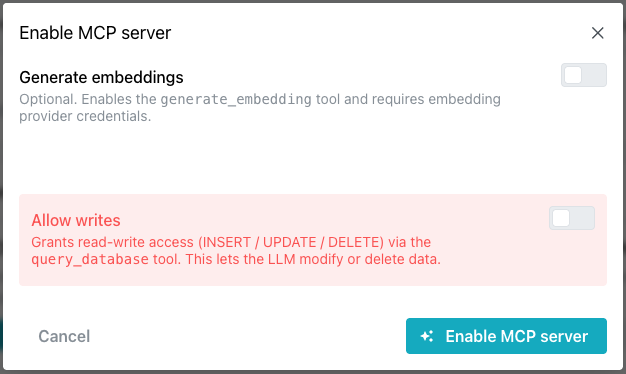
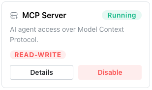

# MCP Server

The `AI Services` pane on your database's management page displays icons you
can use to deploy available services on your database.

Select `Enable MCP` to deploy the server; once the service is deployed, select
the `Details` button to view details and manage it.

The
[pgEdge Postgres MCP server](https://docs.pgedge.com/pgedge-postgres-mcp-server/v1-0-0/)
acts as a gateway to your Postgres database; the server translates requests
into actual operations against your database.

!!! warning

    The MCP server provides LLMs with read access to your entire database
    schema and data. It should only be used for internal tools, developer
    workflows, or environments where all users are trusted.

## Enabling the MCP Server

To enable an MCP server, select `Enable MCP` on the `AI Services` pane of
your database's management page.

When the `Enable MCP server` popup opens, select the features you wish to
enable:

— Enable `Generate embeddings` to expose a tool that lets the connected LLM
  request vector embeddings for text (e.g., to support semantic search over
  your database, via pgvector). It's optional, and requires you to configure
  embedding-provider credentials.

- Enable `Allow writes` to control whether the query_database tool can execute
  mutating SQL (INSERT/UPDATE/DELETE) in addition to read-only queries. Leaving
  it off keeps the LLM strictly read-only against your database (a much safer
  default); turning it on lets the LLM actually modify or delete rows, a
  higher-risk, explicit option.

When you're finished, select the `Enable MCP server` button to deploy the MCP
server.

Once enabled, the MCP Server pane updates to display:

- A green `Running` indicator to let you know the server is enabled.
- A `Details` button that takes you to the Services window where you'll find
  information about connecting to MCP Clients.
- A `Disable` button that you can use to stop the MCP server.

Select the `Disable MCP Server` button to stop the MCP server.

## Connecting a Client to the MCP Server

The steps for connecting a client to the MCP server vary by client and
platform. The `Services` page (opened by selecting the `Details` button on a
running MCP Server) displays connection details for several popular clients
under the `Connect to MCP Clients` label.

Select a tab to view and copy connection details for the selected client.
Choose from:

- [Claude Code](https://code.claude.com/docs/en/overview)
- [Cursor](https://cursor.com/en-US/docs)
- [OpenAI Codex](https://openai.com/codex/)
- [Replit](https://docs.replit.com/getting-started/intro-replit)

!!! note

    A screenshot of the `Connect to MCP Clients` tabs for the current
    console design is needed here.
