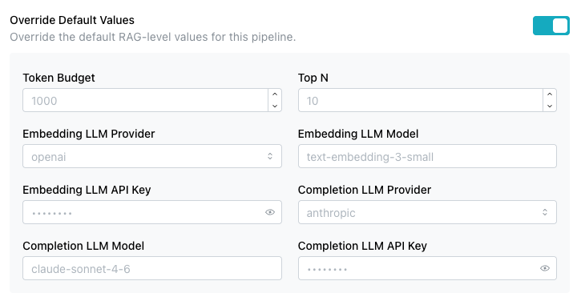
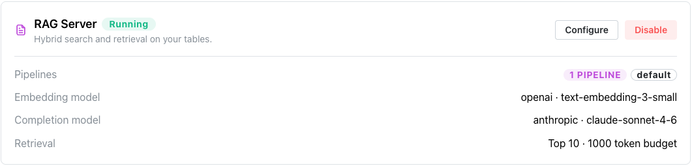
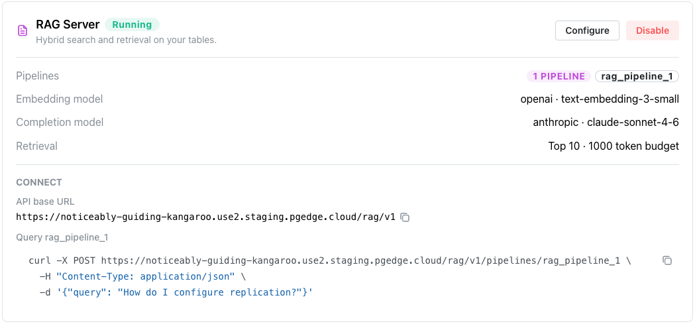

# RAG Server

The `AI Services` pane on your database's management page displays icons you
can use to deploy available services on your database.


Select `Enable RAG` to deploy the server; once the service is deployed, select
the `Details` button to view details and manage it.

The
[pgEdge Postgres RAG server](https://docs.pgedge.com/pgedge-rag-server/v1-0-0/)
is a simple API server used to perform Retrieval-Augmented Generation (RAG) of
text based on content from a Postgres database using pgvector. Consider using
a RAG server when you have a well-defined use case with predictable query
patterns.

## Enabling the RAG Server


To enable a RAG server, select the `Enable RAG` icon in the RAG Server pane.


When the `Enable RAG server` popup opens, provide details about the RAG server
deployment:

* The `Default Token Budget` field sets the maximum number of context tokens
  allowed for the LLM (500 - 128,000); the default value is `1000`.
* The `Default Top N` field sets the maximum number of results to retrieve
  before token-budget trimming; the default value is `10`.
* The `Default Embedding LLM Provider` field selects the provider used for
  query and document embeddings during retrieval; supported providers are
  `OpenAI`, `Voyage AI`, and `Ollama`. (Anthropic does not provide an embedding
  model, so it isn't available here.)
* The `Default Embedding LLM Model` field selects the embedding model to use;
  available models depend on the selected provider (for example,
  `text-embedding-3-small` for OpenAI). This must match the model used to
  generate any pre-existing embeddings.
* The `Default Embedding LLM API Key` field provides the API key required for
  the selected embedding provider.
* The `Default Completion LLM Provider` field selects the provider used for
  answer generation; supported providers are `OpenAI`, `Anthropic`, and
  `Ollama`.
* The `Default Completion LLM Model` field selects the completion model to use;
  select a suggested model, or enter your own.
* The `Default Completion LLM API Key` field provides the API key required for
  the selected completion LLM provider.
* The `Add Pipelines` field defines one or more pipelines; each pipeline has
  its own tables and can override the default values, and maps to
  `/v1/pipelines/<name>/search`.

Select `+Add Pipeline` to expand the dialog and define one or more pipelines
that will be used by the RAG server.


For each pipeline, provide:

* A unique name in the `Name` field; only lowercase letters, digits, hyphens,
  and underscores are allowed.
* The name of the table or view to use for the pipeline, in the `Table Name`
  field.
* The name of the column containing the text content to be indexed and
  searched, in the `Text Column` field.
* The name of the column containing the vector embeddings (using pgvector) for
  that content, in the `Vector Column` field.

When you set default values for the RAG server, individual pipelines can omit
the corresponding fields and inherit those defaults; a pipeline can also
override specific fields while still inheriting the others. Use the `Override
Default Values` toggle to expand the dialog and provide the pipeline-specific
values you want to override:



Provide the following details:

* The `Token Budget` field overrides the maximum number of context tokens
  allowed for the LLM for this pipeline.
* The `Top N` field overrides the maximum number of results to retrieve before
  token-budget trimming for this pipeline.
* The `Embedding LLM Provider` field overrides the provider used for query
  and document embeddings during retrieval for this pipeline (`OpenAI`,
  `Voyage AI`, or `Ollama`).
* The `Embedding LLM Model` field overrides the embedding model to use for this
  pipeline.
* The `Embedding LLM API Key` field overrides the API key used for the selected
  embedding provider for this pipeline.
* The `Completion LLM Provider` field overrides the provider used for answer
  generation for this pipeline (`OpenAI`, `Anthropic`, or `Ollama`).
* The `Completion LLM Model` field overrides the completion model to use for
  this pipeline.
* The `Completion LLM API Key` field overrides the API key used for the
  selected completion LLM provider for this pipeline.

Use the `Advanced Settings` toggle to expand the dialog and configure hybrid
search, vector weighting, and a custom system prompt for the pipeline:


Provide the following details:

* The `Hybrid Search` toggle combines vector similarity with BM25 full-text
  search; when disabled, search uses pure vector similarity. Hybrid search is
  enabled by default.
* The `Vector Weight` slider sets the balance between keyword and vector
  relevance, from `0.0` (pure keyword relevance) to `1.0` (pure vector
  similarity); the default value is `0.5`.
* The `System Prompt` field provides custom instructions for answer
  generation; leave it empty to use the server's built-in default prompt,
  which instructs the model to answer questions based on the provided
  context.

When you're finished, select the `Enable RAG server` button to deploy the RAG
server.


Once enabled, the RAG Server pane updates to display:

- A green `Running` indicator to let you know the server is enabled.
- A `Configure` button that opens the Configure RAG server dialog where you can
  modify the RAG server deployment.
- A `Disable` button that you can use to stop the RAG server.

!!! hint

    Detailed information about the RAG server is also added to the `Services`
    page; use the link to `Services` located under the database name in the
    navigation pane to access the page.



You can disable the RAG server from either the Services page or the RAG Server
pane by selecting the `Disable` button.


Select the `Disable RAG Server` button to stop the RAG server.

## Using the RAG Server

Once the RAG server is running, its pane displays the pipeline, embedding
and completion model, and retrieval settings, along with a `Connect`
section that provides the API base URL and a ready-to-use `curl` command
for querying a pipeline:



After adding a RAG Server to your database, you can use the
[pgEdge Docloader](https://docs.pgedge.com/pgedge-docloader/v1-0-0/)
to load your documents into your database. The Docloader converts HTML,
Markdown, and reStructuredText into a `documents` table:

```bash
pgedge-docloader --config docloader.yml
```

Once data is loaded, you can query your pipeline via the REST API. For
example:

```bash
curl -X POST https://<your-rag-server-url>/v1/pipelines/my-docs/search \
  -H "Content-Type: application/json" \
  -d '{"query": "How do I configure replication?"}'
```

The RAG server retrieves the most relevant document chunks using hybrid
search (vector similarity + BM25 keyword matching), then passes them to
the LLM to generate a grounded answer.

!!! note

    The full API docs and an interactive demo are available at
    [docs.pgedge.com/pgedge-rag-server](https://docs.pgedge.com/pgedge-rag-server).

## Example - Querying the RAG Server

This example walks through querying a pipeline once documents have been
loaded and the RAG server is running.

1. In the console, go to the `AI Services` pane, then select `Details` on
   your running RAG Server, or select `Services` in the navigation panel to
   navigate to `Services`.

2. Under the `Connect` section, note the API base URL and the pipeline
   name; together they form the endpoint
   `<api-base-url>/pipelines/<pipeline-name>/search`.

3. Build a `curl` request to that endpoint, passing the question you want
   answered in the `query` field:

    ```bash
    curl -X POST https://<your-rag-server-url>/v1/pipelines/<pipeline-name>/search \
      -H "Content-Type: application/json" \
      -d '{"query": "How do I configure replication?"}'
    ```

4. Replace `<your-rag-server-url>` and `<pipeline-name>` with the values
   from step 2.

5. Run the command. The RAG server returns a JSON response containing the
   generated answer along with the source chunks it retrieved:

    ```json
    {
      "answer": "To configure replication, ...",
      "sources": [
        {
          "content": "Replication is configured by ...",
          "score": 0.87
        }
      ]
    }
    ```

6. Verify the response: confirm `answer` addresses your query, and that
   `sources` references content you expect from your loaded documents.
