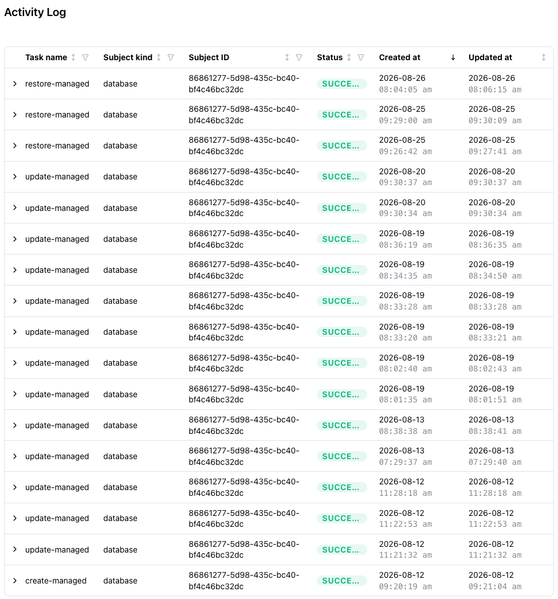

# Reviewing the Activity Log

When you start a task in the console (for example, deploying a database
or restoring from a backup), the console adds the task to the table on
the `Activity Log` page. The Activity Log page organizes console
activity into a table that you can sort and filter.

The console also displays a task progress bar on the main console page
for the related database.

Select `show details` on the progress bar to display additional
information about the task in progress. Each point on the task bar
corresponds to an event detail. To close the task bar, select the `X`
in its upper-right corner.

The Activity Log page displays the following columns:

* `Task name` identifies the type of task for the table entry (for
  example, `create-managed`, `restore-managed`, or
  `update-managed-size`). The console shows the raw name the API gives
  the task, with a tooltip that names it in plain language and says
  what it is.

* `Subject kind` is the kind of resource the task acted on, one of
  `database`, `cluster`, or `ingress`.
* `Subject ID` is the ID of that resource. For a Managed database,
  this is the database ID shown in the `Details` pane.
* `Status` indicates the state of the task. The values are `running`,
  `succeeded`, `queued`, and `failed`.
* `Created at` is the timestamp at which the task started.
* `Updated at` is the timestamp at which the console last updated the
  task.

Use the arrow to the left of a `Task name` to expand the task
information and view the task's own steps and their progress.

## Filtering and Sorting the Activity Log

The Activity Log table supports filtering and sorting by column value.
A drop-down filter icon located next to each column name lists the
available values for that column. Select a value from the filter
drop-down to restrict the table to matching rows. Select the arrow
between the column name and the filter drop-down to reverse the display
order based on that column.

The `Task name` filter offers a fixed list of names: `create`,
`update`, `delete`, `restore`, `backup`, `restore-from-pgdump`,
`restore-from-pgbackrest`, `update-backup-stores`, `add-nodes`,
`remove-node`, `replicate`, `apply`, and `destroy`. None of the Managed
task names below is in that list, so filter a Managed database's work
by pasting its database ID into `Subject ID` rather than by name.

## Managed Task Names

Every Managed operation writes a task. The following table describes
the task names currently in use:

| Task name | What it is |
|-----------|------------|
| `create-managed` | Provisioning a new database. |
| `delete-managed` | Deleting a database. |
| `suspend-managed` | Hibernating a database. |
| `resume-managed` | Bringing a database back from hibernation. |
| `update-managed-size` | The resize. The name has `size` as an infix rather than the suffix the others use. |
| `rotate-password-managed` | A role password rotation. |
| `update-managed` | Every services change. An MCP enable, an MCP configure, a RAG enable, and a service removal all write this one name, so the name alone does not say which service changed. |
| `restore-managed` | Restoring the database in place from a backup. |
| `backup-managed` | A backup. Read the caution below before trusting its status. |

### Task Names That Do Not Match the Console

#### `update-managed` Cannot Tell You Which Service Changed

Every services write shares it. To find out what changed, expand the
row and read the steps, or read the `AI Services` pane.

#### `update-managed-size` Is the Resize, Not a Generic Update

`update-managed-size` is not a generic size-related update. This task
is the task behind the `Upgrade size` action described in
[Accessing Management Options with the Actions Menu](managed_actions.md#upgrading-the-size-tier).

#### `backup-managed` Can Read `succeeded` While the Backup Is Still Pending

The task claims to have taken the backup, and its steps read
`Configuring System` then `Taking Backup` at 100 percent succeeded,
while the backup record it produced is still `pending`. Both reach a
terminal state, but not at the same time. Read the backup's own status
on the `Backups` pane rather than the task's.

### What a Succeeded Task Means

A task that reads `succeeded` means the status has been set. A
succeeded task never sits beside a status the operation had not yet
applied.

A succeeded task does not say which status resulted, or whether the
database is usable. Read the status badge for that.

Delete is the exception. A succeeded delete removes the database
record, so the database disappears from the list, and that
disappearance is the confirmation. A delete that leaves the database
behind is one whose task failed.

A services change is the other exception. A succeeded `update-managed`
means the API-side work finished. The deployed server lags behind by
roughly a minute or two for a configure, and around fifteen to twenty
seconds for a first MCP enable.

## Database Statuses

The status is the badge on the Databases list and on the database
header. The API publishes nine values. The following table describes
the meaning of each value and the writes each one admits:

| Status | What it means | Which writes it admits |
|--------|---------------|------------------------|
| `creating` | Being provisioned. Not yet usable. | None of the five writes below. Delete is admissible. |
| `available` | Ready. The only status every write is admissible from. | All of them. |
| `modifying` | A restore, resize, services change, or credential rotation is in flight. | None of the five. Delete is admissible unless a billing provision is unfinished, which a resize reopens. |
| `deleting` | Being torn down. | None, including delete. |
| `failed` | The last operation failed. That covers a create, a teardown, a suspend or resume, or a restore that reported success without a committed cutover. The database record is kept either way. | None of the five. Delete is admissible. |
| `degraded` | A resize failed after the database was already up. A failed credential rotation lands here too. | None of the five, whatever the console's buttons allow. See the note below. |
| `suspending` | Being hibernated. | None of the five. |
| `suspended` | Hibernated. | None of the five. |
| `resuming` | Coming back from hibernation. | None of the five. |

`available` is the one to wait for. Check against it rather than
against "not creating", because a database can reach `failed` or
`degraded` without passing through `creating` again.

Nothing in the console suspends or resumes a database. There is no
action for either on the Managed database pages, only a banner on a
database that is already suspended. The last three statuses are listed
because a database suspended by some other means still reports them.

### A `degraded` Database Shows Its Action Buttons Enabled

The console treats `available` and `degraded` alike for `Rotate
credentials`, the display-name edit, and deletion protection, and the
API admits the five writes below only from `available`, so an action
offered on a `degraded` database can still be refused. `Upgrade size`
is the exception the console already gates, being offered only from
`available`.

### The Five Writes That Need Available

Five operations are admissible only from `available`, including against
a database already `modifying` because of an earlier change:

* Restore from a backup
* Upgrade size
* Any services change, meaning enabling, configuring, or disabling the
  MCP Server or RAG Server
* Rotate credentials
* Take a backup

Everything else is looser. Editing the display name and switching
deletion protection take no hold on the database and succeed against a
busy one. Delete does not wait for a restore to finish.

A write attempted from any other status is refused, and the console shows
the API's message where it sends one. The message names the status the API
wanted rather than the one it found, so read the current status from the
status badge, wait for `available`, and try again.

## Other Statuses and Task Names You May See

A status or a task name outside the two lists above can appear.

* A tenant with older databases has task names that are not in the
  table above. Unsuffixed `create`, `update`, and `delete` appear
  beside the `-managed` ones, along with names such as `replicate` and
  `restore-from-pgdump`.

* A status you do not recognize is not automatically an error. Read it,
  and treat anything that is not `available` as a database that is not
  ready for the five writes.

## Related Pages

The following pages provide more detail on topics referenced above:

* [Restoring from Backup](managed_backups.md) describes the restore
  this glossary keeps pointing at.
* [Accessing Management Options with the Actions Menu](managed_actions.md)
  describes the resize, the display-name edit, and deletion protection.
