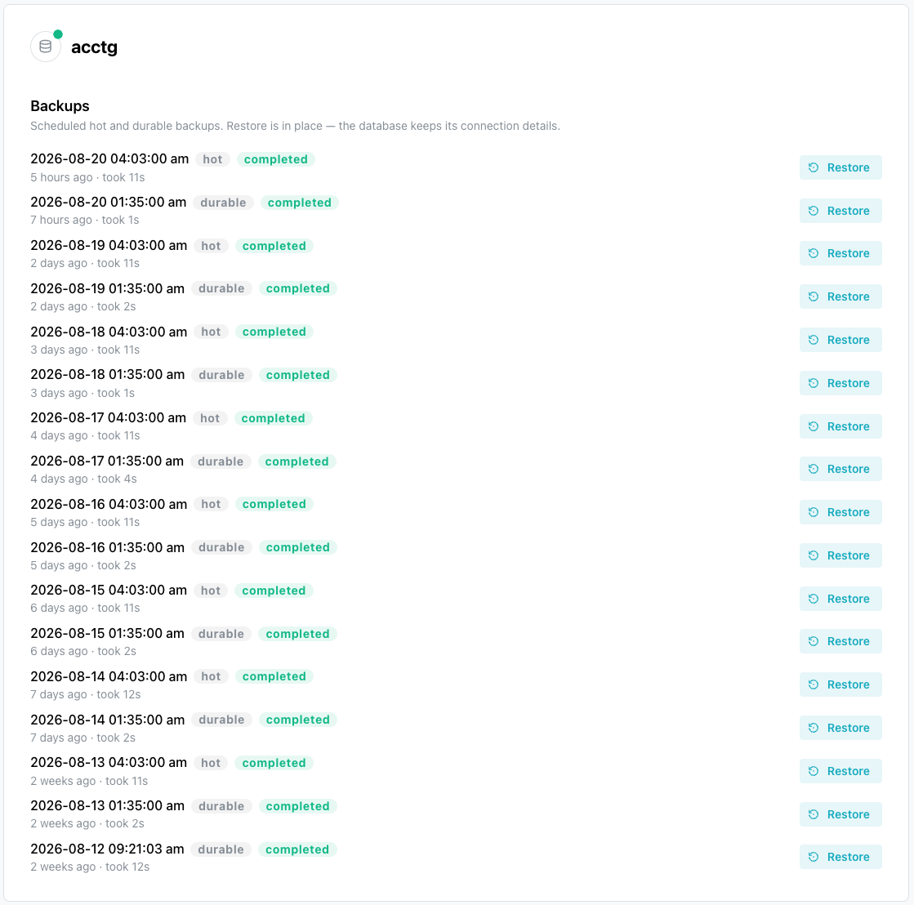
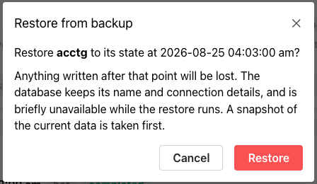
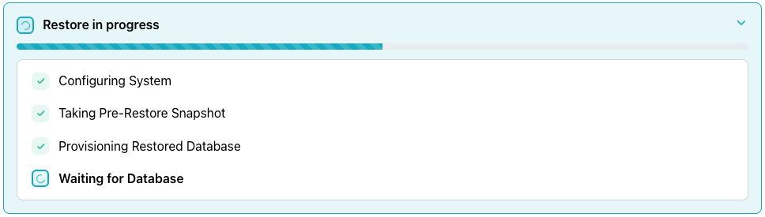

# Restoring from Backup

The `Backups` pane on your database's management page lists the backups
taken of your database. Each backup is either a `hot` backup (the
fastest to restore from) or a `durable` backup (kept apart from the
database's own storage and slower to restore).

A `hot` backup is taken daily on every database. A `durable` backup is
taken daily as well, but only on a database whose plan includes durable
backups.

Backups are taken on a schedule. The console has no button for taking
one, and you cannot delete a backup or change how long one is kept. Each
backup entry displays:

- the backup ID.
- a tag indicating whether the backup is a `hot` or `durable` backup.
- the backup status (for example, `completed`).
- how long ago the backup was taken, and how long it took to run.

The `Restore` button is disabled on any backup whose status is not
`completed`.

A backup that is still running is not a restore point yet; read its
status in this list rather than the outcome of its task in the Activity
Log, because a `backup-managed` task can read `succeeded` while the
backup record it produced is still `pending`.

The database itself must be `available`. A restore is refused against
a database that is `creating`, `modifying`, `degraded`, or already
busy with an earlier task.

## Restoring Your Database

Select the `Restore` button (located to the right of a backup) to restore
your database to the selected backup. The `Restore from backup` popup
opens, confirming the date and time of the backup you selected.

Select `Restore` to confirm, or `Cancel` to close the popup without
restoring the database. The database retains its name and connection
details, and is briefly unavailable while the restore runs. The restore
takes a `hot` backup of the current data before it begins.

The restore happens in place and runs asynchronously: the API returns
the database in `modifying` status immediately, the database recovers
in the background, and the console displays `Modifying` until the
restore finishes. The restore replaces the current data, so anything
written since the backup was taken no longer exists. Wait for the
status to reach `Available`.

When you confirm, a `Restore in progress` popup opens, showing a
progress bar and a checklist of restore steps:

- `Configuring System`
- `Taking Pre-Restore Snapshot`
- `Provisioning Restored Database`
- `Waiting for Database`

The console checks off each step as it completes:

The checklist displays the steps reported for the restore task, so a
restore can list more of them, including `Repointing Backups`,
`Cutting Over Connection`, and `Retiring Old Incarnation`.

In the Activity Log, the operation appears as `restore-managed`.

## The Backup Taken Before the Restore

Before replacing anything, the restore takes a `hot` backup of the database in
its current state, so a restore run by mistake can itself be undone. This step
is mandatory: if the backup cannot be taken, either because it fails outright
or because another backup is already running, the restore fails rather than
proceeding.

That failure never appears as an error on the original restore request,
because by the time the pre-restore backup runs, the API has already accepted
the request and the database is already `modifying`. Instead, the failure
surfaces on the restore's task in the Activity Log.

The pre-restore backup itself is easy to miss, because:

- it does not appear in the `Backups` pane until up to a minute after
  the restore starts.
- nothing labels it as the pre-restore backup; the `hot` backup
  created when the restore started is the one to look for.
- it is not an archive, only a way back from a mistake caught shortly
  afterward, not a restore point to rely on later.

## Troubleshooting

**`Could not start the restore.`** is a notification meaning the API refused
the restore request. This text is the fallback message; the console displays
the API's own message if it sends one. A restore requires the database to be
`available`. Wait for the database to return to an `available` status, then
try again.
