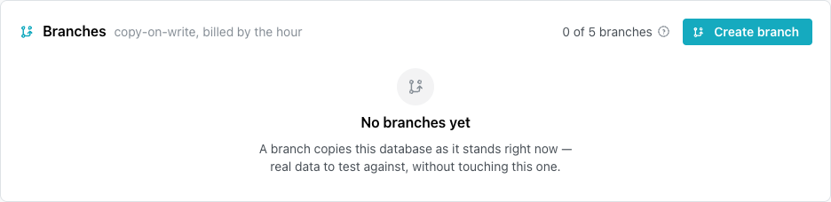
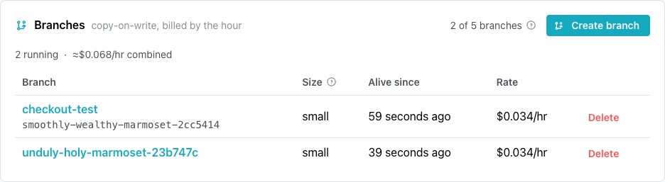
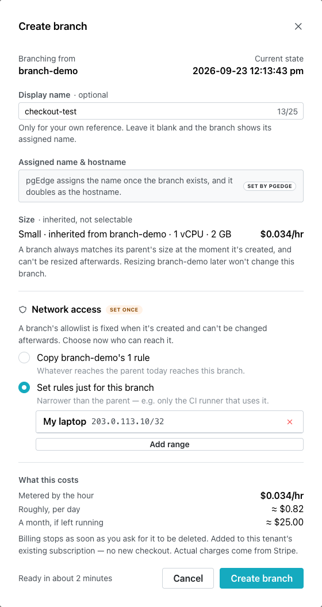
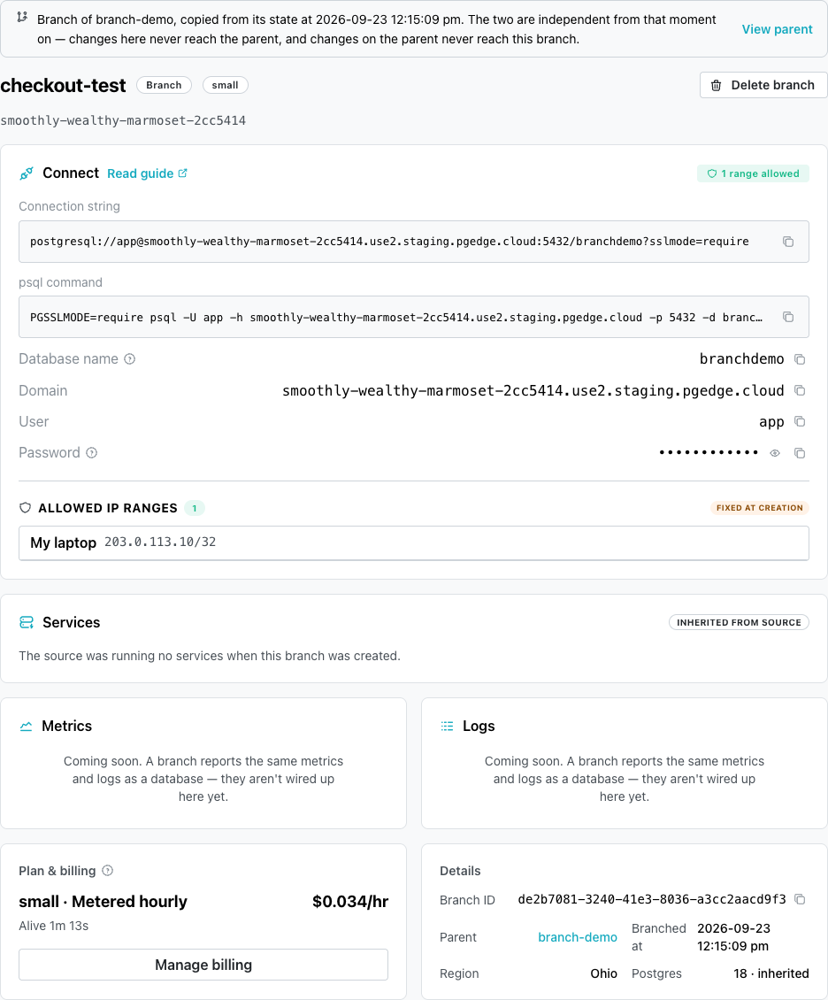
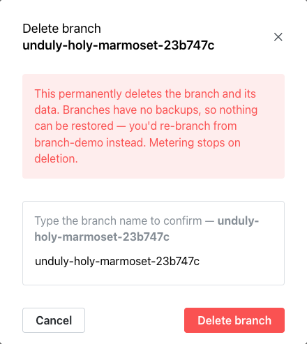
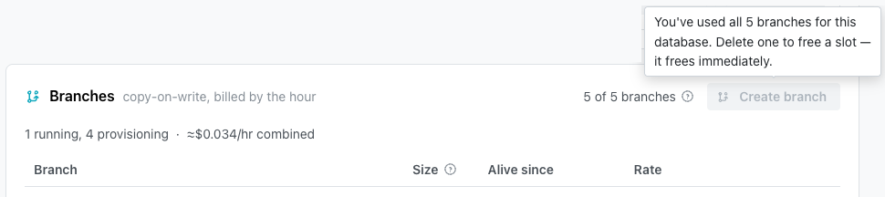
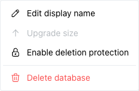

# Creating and Managing Branches

When you create a branch, you create a separate database that
contains the source database's data at the moment of creation. You
can modify data on the branch without changes cascading through to
the data on the source database.

You can manage branches from the database page of the source
database. Before you create a branch, ensure that the following
conditions are met:

- The source database's status must be `available` or `degraded`.
- A branch's network access is set once, when you create the branch,
  and cannot be changed afterward.

!!! hint

    Decide which addresses need to reach the branch before you open
    the `Create branch` dialog.

## Viewing Your Branches

The `Branches` pane on the database page lists the branches of the
database.

The pane header displays how many branches the database has, against the
limit for your plan, for example `2 of 5 branches`. Each row in the pane
includes the following details:

- `Branch` displays the branch's label. A branch with a display name also
  displays its assigned name below the label.
- `Size` displays the size the branch copied from the source database.
- `Alive since` displays how long ago the branch became available, or,
  while it is still `creating`, how long ago you created it.
- `Rate` displays the branch's price per hour.

Select a branch's label to open the branch's page. To review the
limits for each plan, see
[Understanding Branches](../using_database/managed_branches.md#billing-for-branches).

## Creating a Branch

A new branch includes the data from the source database at the moment you
select `Create branch`. To create a branch:

1. On the source database's page, select `Create branch` in the
   `Branches` pane.

    The `Create branch` dialog opens.

2. Optionally, enter a display name of up to 25 bytes in
   `Display name`. A letter such as `é` counts as two bytes.

    The display name appears only there. pgEdge assigns the
    branch's name, which is also its hostname, and the branch's page
    displays it when the branch is `available`.

3. Read the `Size` section, which displays the size the branch copies from
   the source.

    A branch cannot be resized later, and resizing the source database
    does not change the branch.

4. In the `Network access` section, choose which addresses can reach the
   branch's Postgres; this choice cannot be changed later:

    - The `Copy...` option gives the branch the source database's
      current allowlist rules. The console selects this option by
      default when the source has rules.
    - Select `Set rules just for this branch` to allow only the
      ranges you add. Select `Add my current IP`, which displays your
      address, or enter another range. After the first range, `Add
      range` adds another.

    The MCP server and RAG server on the branch keep the allowlists they
    had on the source, whichever option you choose.

    To modify network access afterward, create a new branch and delete
    this branch.

5. Review the `What this costs` section, which lists what the branch costs
   per hour.

    pgEdge bills the branch by the hour from when it becomes
    available, until you request its deletion.

6. Select `Create branch`.

    The branch's row displays `Creating` until the branch is ready, then the
    branch's status becomes `available`.

## Connecting to a Branch

The branch's page displays the branch's connection details when the branch
is `available`. Select the branch's label in the `Branches` pane to open
the branch's page.

The `Connect` pane on the branch's page has an `Admin` tab, an
`Application` tab, and a `Read-only` tab, one for each built-in role. Each
tab displays the following details:

- `Connection string` and `psql command` connect to the branch's own
  hostname, which is its assigned name.
- `Domain` displays the branch's hostname.
- `Database name` and `User` match the source database.
- `Password` is the role's own password on the branch, which is different
  from the source database's password.

The branch's `Connect` pane has no `Rotate credentials` button.

The `ALLOWED IP RANGES` list displays the branch's network access, marked
`FIXED AT CREATION`. The list is read-only.

The `Services` pane displays the MCP server and RAG server the branch copied
from the source database. Each server's card lists the ranges that can reach
it, after `Allowed:`, or warns that no range can reach it. A card displays its
server's address, and the controls that use the address, only while the
server's status is `Running`.

If the branch has an MCP server, that server has its own address and a
separate MCP token. The source's address and token do not work against the
branch. The MCP server's card displays the branch's own details:

- `Endpoint` displays the address of the branch's MCP server.
- `Bearer token` displays the branch's MCP token. Select the eye icon to
  reveal the token, or the copy icon to copy it.
- `Client setup` displays the configuration for the MCP client you choose,
  filled in with the branch's endpoint and token.

For the configuration each client needs, see
[Enabling and Using the MCP Server](../serving_ai_content/managed_mcp.md#connecting-a-client-to-the-mcp-server).

The RAG server's card displays `API base URL`, the address of the branch's RAG
server. Select `View pipelines` to display a `curl` command for each pipeline,
which queries that pipeline on the branch.

The `Metrics` and `Logs` panes display the branch's own metrics and
Postgres log, never the source database's. Select `Open metrics` or
`View logs` to open the full page for the branch.

For more information about client connections, see
[Connecting to a pgEdge Starfleet Database](../connecting/managed_index.md).

## Deleting a Branch

Deleting a branch removes the branch and its data. Branches have no
backups, so after being deleted, the branch cannot be restored. To
delete a branch:

1. In the `Branches` pane, select `Delete` on the branch's row, or select
   `Delete branch` on the branch's page.

    The `Delete branch` dialog opens.

2. Type the branch's label, as displayed.

3. Select `Delete branch`.

    The branch and its data are removed.

!!! hint

    The branch has no backups of its own, but the source database's
    backups still contain your data as of the moment you created the
    branch. Deleting the branch loses only the changes you made on
    the branch itself, which those backups never captured.

Billing for the branch stops when you select `Delete branch`, and the
branch stops counting toward your limit. The row displays `Deleting` until
the branch is removed.

## Troubleshooting

- **`You've used all 5 branches for this database.`** appears in the
  `Create branch` button's tooltip on a paying subscription, once the
  database has reached the branch limit for your plan. Delete a branch
  you no longer need to free its slot.

    On a trial, hovering over the disabled button displays a card with
    an `Add a payment method` link, stating that trials allow 3 branches
    per database. Select `Add a payment method` to allow 5 branches per
    database, or delete a branch to free its slot.

    

- **`Branching is blocked while this subscription is past due.`** appears
  as a banner in the `Branches` pane when the subscription has an unpaid
  invoice. Select `Review billing` in the banner, and settle the invoice
  to create branches again.

- **`Nothing can reach this branch`** appears on the branch's page when
  the branch was created with no allowed network ranges. Since network
  access cannot be changed afterward, create a new branch with the
  ranges you need, then delete this branch.

- **`This branch is suspended`** appears on the branch's page when the
  subscription is unpaid or has expired; the branch is hibernated and
  cannot be reached, and billing for it is paused. Select
  `Review billing` and settle the subscription to resume the branch.

- **`Provisioning…`** appears in the branch's row where `Delete`
  normally does, and confirming `Delete branch` on the branch's page
  displays an error in the dialog, while a branch's status is
  `creating`. Delete the branch when its status is `available`.

- **The `Create branch` button in the dialog stays disabled** when the
  source database has no allowlist rules to copy, or when
  `Set rules just for this branch` has no range added; a branch created
  that way could never be reached. Add at least one range, then select
  `Create branch`.

- **A branch `failed` status** means the branch could not be created.
  Delete the branch and create a new one.

- The `Create branch` button's tooltip says **the source database has to
  be available or
  [degraded](../using_database/managed_database_details.md#database-statuses)
  first**, and names its current status. Create the branch when the
  source database's status returns to `available`.

- **The source database remains** after you select `Delete Database`
  while one of its branches is still `creating`. The console displays
  `A branch of this database is still being created. Try again once it
  has finished.` Delete the database when the branch has finished.

- **The branch refuses an MCP client** that works against the source
  database, because the branch's MCP server has its own address and
  token, and the source's do not work against it. Give the client the
  `Endpoint` and `Bearer token` from the MCP server's card on the
  branch's page.

    A client the branch still refuses, despite using its own token, is
    connecting from an address its MCP server does not allow. The
    branch copied the source's MCP allowlist when the branch was
    created, and that copy cannot be changed. Add the client's address
    to the source database's MCP server allowlist, then create a new
    branch and delete this one.

- **`Upgrade size` is disabled** on the source database's `Actions` menu and
  in its `Plan & billing` pane, because a database cannot be resized
  while it has branches; each branch keeps the size it was created
  with. Delete the database's branches first, then resize the database.

    A `failed` branch counts as well, so delete it before you resize
    the database.

    
