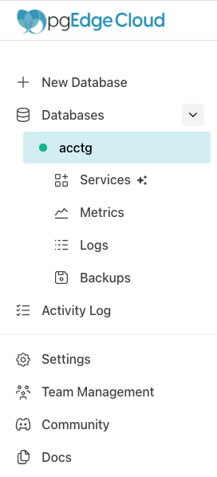
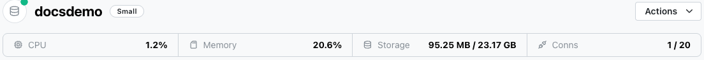
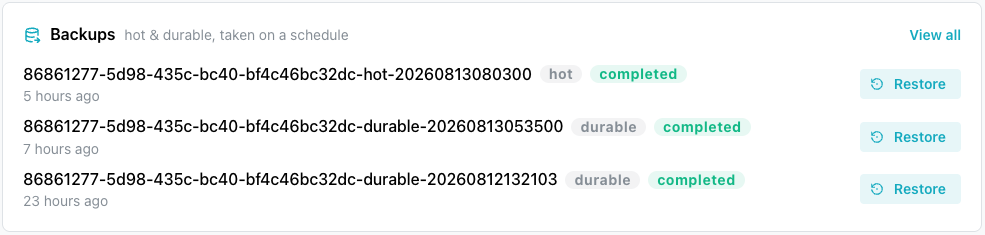
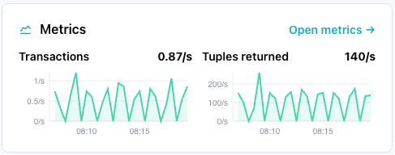

# Using the pgEdge Starfleet Console

Once a pgEdge Starfleet PostgreSQL database finishes deploying, the console
lists its name in the tree control on the left side of the screen.

Select the database name to navigate to the database management page of the
console.

## The Database Header

The database header sits at the top of the database's management page.

The database header displays:

* the name of the database, with a dot next to it indicating the database's
  status:
    * a green dot means the database is available for connections.
    * a blue dot means the database is being created.
    * a red dot means the database is not available.
* the CPU size of the database.
* the memory used by the database.
* the amount of storage allocated to the database.
* the number of connections allocated for the database.

## The Actions Context Menu

The `Actions` drop-down (on the right-hand side of the header) offers
management options for your database, including editing the display name,
upgrading the size tier, and enabling deletion protection.

For detailed information about options available through the `Actions` menu,
see [Accessing Management Options with the Actions Menu](managed_actions.md).

## The Connect Pane

Below the header, the console displays the `Connect` pane; the pane includes an
`Admin` tab with credentials for the `admin` user, and an `Application` tab
with credentials for the `app` user. Each tab displays:

* a ready-to-use `Connection string`.
* a ready-to-use `psql command`; the command opens a psql session for the
  selected `User` (`Admin` or `Application`) when invoked on the command line
  of a host with an installed psql client.
* the `Database name` and `Domain` (host name) of the database.
* the `User` connecting to the database, with a `Rotate credentials` control
  that generates a new password for that user.
* the `Password` for the user, with an eye icon that reveals it.

Select the copy icon next to any field to copy its value.

The `ALLOWED IP RANGES` list at the bottom of the pane shows the database
allowlist, and the badge at the top of the pane shows how many ranges are
allowed. When the allowlist has no range, the pane shows `No IP addresses
are allowed` above the connection details, and no client can connect with
the connection string. For more information, see
[Controlling Network Access](../using_database/managed_network_access.md).

The two users have different permissions on the database. Connect as `app`
to create tables and load data, and as `admin` to install an allowlisted
extension or for server-wide work.
[Managing Database Roles](../using_database/managed_roles.md) describes what
each one can do.

A database that is still being created may show a provisioning message
instead:

* `Couldn't load connection details. Please refresh and try again.` indicates
  that the server could not read the per-role credentials. Refresh the console
  to retry; any connection string you already hold remains valid for login.

* `Connection details are unavailable.` indicates that the pane has a record of
  the database but lacks the host, port, or database name required to build a
  connection string. A database in the `failed` status displays this message.
  Wait for the database to reach the `Available` status, then reload the page.

* `This database is <status> and is not available to connect right now.`
  indicates that the database is in a status the pane does not treat as
  connectable: `deleting`, `suspending`, `suspended`, `resuming`, or any status
  the console does not recognize. See
  [Database Statuses](../using_database/managed_database_details.md#database-statuses)
  for the meaning of each status.

See the following resources for more detail:

* [Connecting with psql](../connecting/managed_psql.md) covers installing the psql
  client and connecting to the database.
* The [Postgres documentation](https://www.postgresql.org/docs/18/sql-commands.html)
  covers Postgres SQL commands.

## The AI Services Pane

The `AI Services` pane lists the AI-related services available for your
database.

The `AI Services` pane displays icons you can use to deploy available services
on your Postgres database, including an MCP Server and a RAG Server. Select
`Enable MCP` or `Enable RAG` to add a service; once a service is deployed,
select its `Details` button to view connection details and manage it.

Each server has its own allowlist, shown on its card. A new server starts
with no ranges, and a running server's card reads `Running, but unreachable
— no ranges allowed.` until its allowlist has a range. For more information,
see
[Controlling Network Access](../using_database/managed_network_access.md).

For detailed information about enabling, configuring, and connecting to
these services, see
[Enabling and Using the MCP Server](../serving_ai_content/managed_mcp.md) or
[Enabling and Using the RAG Server](../serving_ai_content/managed_rag.md).

## The Backups Pane

The `Backups` pane displays a list of the backups taken of your database; each
backup is either a `hot` backup (the fastest to restore from) or a `durable`
backup (kept apart from the database's own storage and slower to restore).

To review a complete list of available backups, select `View All` from the
right side of the console, across from the `Backups` label.

Each backup entry displays:

* the backup ID.
* a tag indicating whether the backup is a `hot` or `durable` backup.
* the backup status (for example, `completed`).
* how long ago the backup was taken.

Select the `Restore` button, to the right of a backup, to restore that
backup; select `View All` (in the upper-right corner of the pane) to see the
complete list of backups.

For detailed information about the `Backups` page, see
[Restoring from Backup](managed_backups.md).

## The Metrics Pane

The `Metrics` pane displays live graphs of current database activity, including
`Transactions` (transactions per second) and `Tuples returned` (rows returned
per second).

Select `Open metrics` (in the upper-right corner of the `Metrics` pane) to see
detailed metrics for your database.

For detailed information about the `Metrics` page, see
[Monitoring System Metrics](managed_metrics.md).

## The Logs Pane

The `Logs` pane displays the most recent entries from your database's log file;
each entry shows the timestamp, log level (for example, `LOG`), and message.

Select `View logs` (in the upper-right corner of the pane) to see the complete,
searchable log for your database.

For detailed information about the `Logs` page, see
[Reviewing the Log Files](managed_logs.md).

## Branches

The `Branches` pane lists the branches of your database, and lets you
create one. See [Creating and Managing Branches](managed_branches.md).

## Summary Panes

The `Plan & billing` and `Details` panes display the size tier, billing status,
and configuration of your database.

### Plan and Billing

The `Plan & billing` pane displays the current size tier of your database
and what you will pay after any free trial ends. Select
`Upgrade size` to change the size of your database. For what each size
gives you, see
[Managing Database Details](../using_database/managed_database_details.md).

Two notifications can appear after you add a payment method.
`Payment saved, but we could not refresh billing status.` means the console
saved the card but could not re-read the billing state afterward, so
reload the page. `Still unable to load billing status.` means a retry of that
read failed again.

### Details

The `Details` pane displays identifying and configuration information about your
database.

| Field | Description |
|-------|--------------|
| Database ID | The unique identifier for the database. |
| Region | The region in which the database is deployed. |
| Postgres | The Postgres version running on the database. |
| Storage | The amount of storage allocated to the database. |
| Network | Whether the database is publicly or privately accessible, and whether TLS is enabled. |
| Created | How long ago the database was created. |

## When the Page Cannot Load

Two messages replace the whole page:

* `Couldn't load this database. Please try again shortly.` means the console
  could not read the database record. The `Metrics`, `Logs`, and `Backups`
  pages read the same way. Reload the page. If the error repeats, check
  the Databases list, because a deleted database reads this way from a
  bookmarked URL.

* `Database not found` means the read succeeded and returned no record for
  the database ID in the URL. Go back to the Databases list, and if you
  expected the database to exist, check that you are in the right account.

