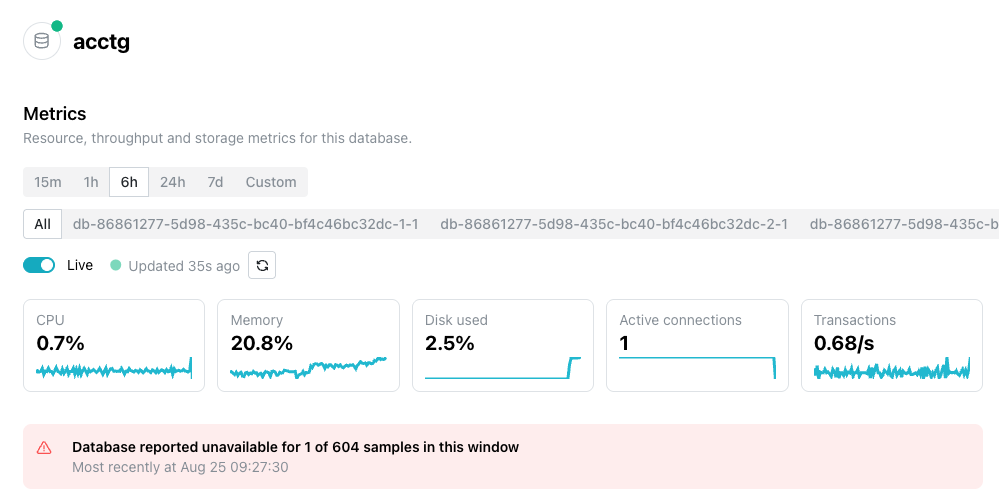

# Monitoring System Metrics

The `Metrics` pane on your database's management page displays live graphs of
current database activity, including `Transactions` (transactions per second)
and `Tuples returned` (rows returned per second).

The `Metrics` page displays five headline tiles and nineteen charts, grouped
into `Resources`, `Throughput`, and `Storage and WAL`. Select any chart to
expand it for a closer look.

## The Metrics Page Header

The header sits at the top of the `Metrics` page.

The header displays the name and status of the current database, followed by
controls for the charts displayed below:

* Use the time-range buttons (`15m`, `1h`, `6h`, `24h`, `7d`, or `Custom`) to
  change the period displayed. The console remembers the choice per database.

* Use the row of buttons below the time-range buttons to display metrics for
  `All` reporting instances, or select a single instance to display metrics for
  that one only. The console marks the primary, and the row appears only when
  more than one instance reports.

* Toggle `Live` to enable or disable automatic updates. `Live` is on by default
  and refreshes on a cadence set by the time range. Applying a `Custom` range
  disables the `Live` control. When `Live` is enabled, the header displays how
  long ago the charts were last updated. Select the refresh icon to update the
  charts immediately.

Below the header, a row of tiles summarizes the current `CPU`, `Memory`,
`Disk used`, `Active connections`, and `Transactions` values, each with a small
trend graph. The tiles read from the primary instance, falling back to
whichever instance reported first when no instance is yet marked primary.

If the database was unreachable for any samples in the selected time range, a
warning banner reports how many samples were affected and when the database was
most recently unavailable.

Live refresh runs at a different cadence for each time range; a wider range
averages the metrics to keep the graph legible. The following table shows
the refresh cadence and point count for each time range:

| Time range | Refresh | Points plotted |
|------------|---------|----------------|
| `15m` | Every 10 seconds | Every sample |
| `1h` | Every 30 seconds | Every sample |
| `6h` | Every 60 seconds | Averaged into 120 buckets |
| `24h` | Every 2 minutes | Averaged into 150 buckets |
| `7d` | Every 5 minutes | Averaged into 180 buckets |

## Understanding Metrics - Levels vs. Rates

Every chart plots metrics as either a level or a rate.

A **level** plots the value as the database reported it. A blank means the
database published no metrics for that sample.

A **rate** plots the change since the previous sample, divided by the number of
seconds between the two. The first point of any rate series is always blank,
because there is no previous sample to subtract, and a sample whose neighbor is
missing is also blank. A counter that restarts at zero, which happens when the
container restarts, produces a negative difference, which the console renders
as one gap rather than as a downward spike.

## Resource Charts - Reference

The `Resources` section displays charts that track the compute and connection
resources used by your database. The following table describes each chart:

| Chart | Description | Source Metric | Metric Form |
|-------|-------------|---------------|-------------|
| CPU | The percentage of CPU used by the database. The axis is capped at 100. | `cpu_seconds_total` as a rate, against `cpu_quota` divided by `cpu_period` | Rate |
| Memory | The percentage of memory used by the database. The axis is capped at 100. | `memory_used_bytes` over `memory_limit_bytes` | Level |
| Active connections | The number of active client connections to the database. | `pg_stat_activity_active`, with the axis topped by `pg_settings_max_connections` | Level |
| Idle connections | The number of idle (inactive) client connections to the database. | `pg_stat_activity_idle`, same axis top | Level |
| Waiting connections | The number of connections waiting for a lock or other resource to become available. | `pg_stat_activity_waiting`, same axis top | Level |

Active, idle, and waiting are three separate charts, each showing a single
value, not slices of a total. Read them together against the connection limit
the axis displays.

## Throughput Charts - Reference

The `Throughput` section displays charts that track the amount of database
activity, including transactions and row-level operations. The following
table describes each chart:

| Chart | Description | Source Metric | Metric Form |
|-------|-------------|---------------|-------------|
| Transactions | The number of transactions processed per second, counting commits and rollbacks together. | `pg_stat_database_xact_commit` and `pg_stat_database_xact_rollback`, each as a rate, added | Rate |
| Cache hit ratio | The percentage of reads served from the cache instead of disk. The axis is capped at 100 and its floor follows the data. | `pg_stat_database_blks_hit` and `pg_stat_database_blks_read` as rates, hits over the two added | Rate |
| Tuples returned | The number of rows returned by queries per second. | `pg_stat_database_tup_returned` | Rate |
| Tuples fetched | The number of rows fetched from the database per second. | `pg_stat_database_tup_fetched` | Rate |
| Tuples inserted | The number of rows inserted per second. | `pg_stat_database_tup_inserted` | Rate |
| Tuples updated | The number of rows updated per second. | `pg_stat_database_tup_updated` | Rate |
| Tuples deleted | The number of rows deleted per second. | `pg_stat_database_tup_deleted` | Rate |
| Network in | The amount of network traffic received by the database per second. | `network_receive_bytes_total` | Rate |
| Network out | The amount of network traffic sent by the database per second. | `network_transmit_bytes_total` | Rate |

`Cache hit ratio` is blank rather than zero when neither hits nor reads moved
between two samples, so an idle database shows gaps here rather than a flat
line.

## Storage and WAL Charts - Reference

The `Storage and WAL` section displays charts that track disk usage and
write-ahead log (WAL) activity for your database. The following table
describes each chart:

| Chart | Description | Source metric | Metric Form |
|-------|-------------|---------------|-------------|
| Disk used | The percentage of allocated disk storage currently used. The axis is capped at 100. | `storage_used_bytes` over used plus `storage_available_bytes` | Level |
| Database size | The total size of the database. | `pg_database_size_bytes` | Level |
| Tables | The number of tables in the database. | `pg_database_table_count` | Level |
| WAL size | The size of the write-ahead log (WAL). | `pg_wal_size_bytes` | Level |
| WAL segments | The number of WAL segments currently retained. | `pg_wal_segments` | Level |

`Disk used` expresses storage in use as a percentage of total storage; storage
in use plus storage still available.

## How Reporting Lag Affects Charts

The newest point on a chart lags 1 to 2 minutes behind actual time. This lag
varies within that range rather than remaining fixed at a single value. Samples
are collected into buckets every 30 seconds, aligned to the start and midpoint
of each minute.

A change made now does not appear on the chart immediately, so allow the lag to
elapse before concluding that a query, an index, or a restart had no effect.

!!! hint "Setting a Custom Time Range"

    A range shorter than the lag ends before any published sample exists, so it
    returns no data. Select a range of three minutes or more; a three-minute
    range returns a small number of samples, and a wider range returns more.

    The console's shortest time-range button is `15m`, so this limitation
    applies only to a `Custom` range. A custom range of two minutes or less
    ending at the current time returns empty, and the page displays `No metrics
    in this window`; this is the same message shown when a database has no
    metrics at all.

## Missing Metrics - Charts With No Data

A metric with no value anywhere in the time range is left out of the response
entirely rather than sent as blank. The console renders no chart for a metric
for which it received no sample, and nothing on the page marks the absence. A
narrow range therefore shows fewer charts than a wide range, with no error
noted.

!!! hint

    If a chart you expect is not on the page, widen the time range.

## Metrics During a Resize or Restore

A resize or a restore moves the database onto new infrastructure, and both
instances report metrics during the transition. During that handover, both
instances can publish a sample for the same timestamp.

The console groups the samples by instance before computing anything, so it
never computes a rate across the handover and never counts the overlap twice.

The instance filter appears above the charts, with one button per instance and
the primary marked, and each chart displays two lines with a legend. The
instance still starting up reports no samples until it is ready, so its line
has gaps at the start.

Outside a resize or a restore, each chart displays a single line.

## When the Page Shows a Message Instead of Charts

The page shows one of two messages in place of the charts:

* `Couldn't load metrics` means the read failed, and the panel displays a
  `Retry` button. Use it. If it keeps failing while the database is
  `Available`, the metrics store, not the database, is the failing component.

* `No metrics in this window` means the read succeeded and the time range held
  no samples. The hint under it names a database created moments ago, or an
  environment without observability, as the causes. Widen the time range. The
  newest sample runs 1 to 2 minutes behind the clock, so a custom range of
  two minutes or less ending at now is empty, as the "Setting a Custom Time
  Range" hint above describes.

The first is a failed request and the second is an empty range. A database that
cannot be read at all shows
`Couldn't load this database. Please try again shortly.` in place of the whole
page instead.

## Related Pages

The following pages cover related monitoring tasks:

* [Reviewing the Activity Log](managed_activity_log.md) describes the resize
  and the restore that put two instances on the charts.
* [Restoring from Backup](managed_backups.md) describes the restore itself.
