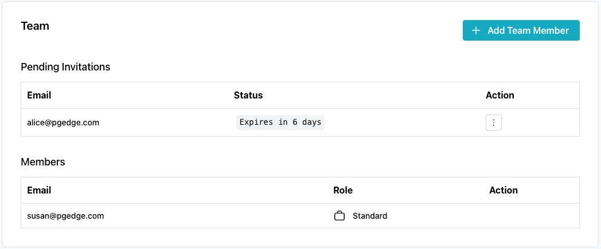
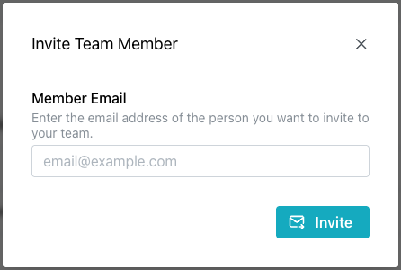

# Managing Team Members

Select `Team Management` in the navigation pane to open the `Team` page,
where you can view a list of team members, invite members to your team, and
manage pending or expired invitations.

The `Team` page displays two tables:

* the `Pending Invitations` table lists invitations that have not been
  accepted:
    * `Email` is the address to which an invitation was sent.
    * `Status` shows how long until the invitation expires (for example,
      `Expires in 6 days`).
    * `Action` opens a menu you can use to delete the invitation.
* the `Members` table lists the current members of your team:
    * `Email` is the member's address.
    * `Role` is the member's role (for example, `Standard`).
    * `Action` opens a menu you can use to remove the member from the team.

To invite a team member to join your team, select `Add Team Member` in the
upper-right corner of the `Team` page; the `Invite Team Member` popup
opens.

Enter the email address of the person you want to invite in the
`Member Email` field, and select `Invite` to send that address an
invitation to join your team.

When you invite a user, the pgEdge Starfleet welcome window opens and
prompts them for a password. After they provide a password, the console
adds the new team member and takes them to the main console page for your
team, which displays every database the team manages. The console removes
the entry from the `Pending Invitations` table and lists the new member in
the `Members` table.
