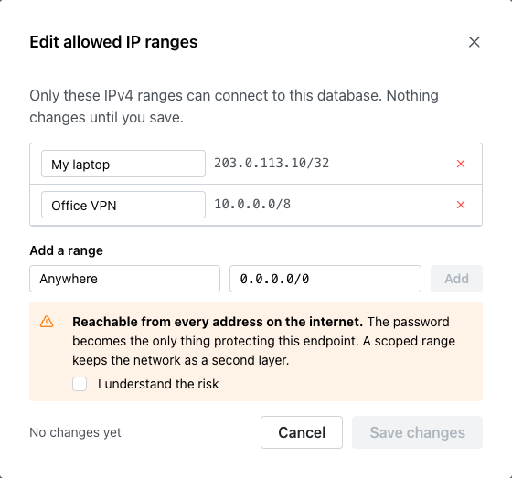
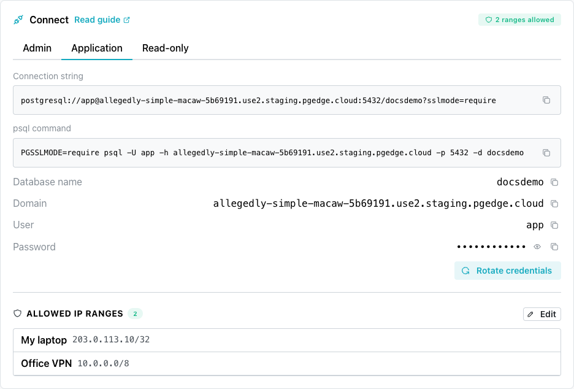
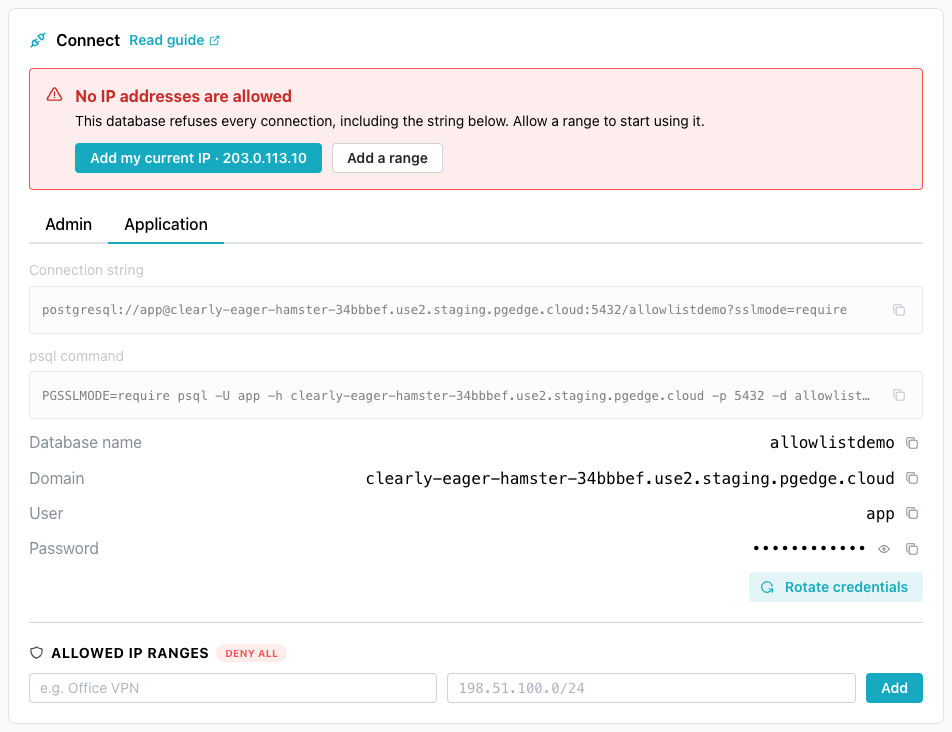
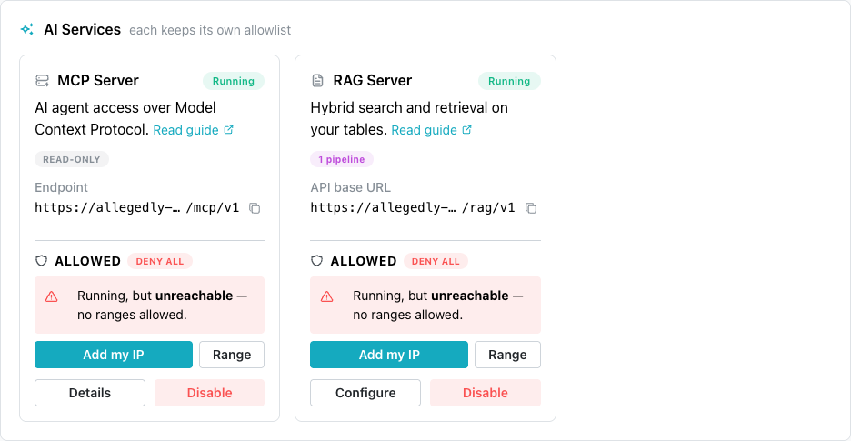

# Controlling Network Access

A pgEdge Starfleet Managed database accepts a connection only from an
address on its *allowlist*. An allowlist is a list of IP ranges
permitted to reach its endpoint; a range is a single IPv4 address or
a CIDR block, such as `198.51.100.0/24`. There are three such
allowlists, one for each endpoint:

- the database.
- the MCP server.
- the RAG server.

Each range can have a label (such as `Office VPN`), up to 64
characters in length, which is displayed only on the console. An
allowlist can contain up to 50 unique ranges.

## Understanding Allowlist States

An allowlist is in one of three states:

| State | Who can connect | What the console displays |
|---|---|---|
| Closed | Nobody | `DENY ALL`, or `No IP addresses are allowed` on the `Connect` pane |
| Limited | Only addresses inside the listed ranges | The number of ranges, such as `2 ranges allowed` |
| Open | Every address on the internet | An `Entire internet` badge on the range |

A range ending in `/0`, such as `0.0.0.0/0`, is open, admitting every
address on the internet. When you enter such a range, the form
displays a warning, and `Add` stays disabled until you select
`I understand the risk`.

A new database starts in a closed state, unless you allow a range in the
`Network access` step of the create wizard. A new MCP server or RAG
server also starts in a closed state, even when the database allows ranges.
A database created before allowlists defaulted to closed can still be
open, with the range `0.0.0.0/0`.

An open allowlist leaves the password as the only protection for the
endpoint. Add the ranges you connect from, and then remove the
`0.0.0.0/0` range.

## Understanding What Each Allowlist Does

Each allowlist corresponds to one endpoint:

- the database allowlist, limiting connections to Postgres from
  psql, pgAdmin, an application, or any other client.
- the MCP server allowlist, limiting connections to the MCP server.
- the RAG server allowlist, limiting connections to the RAG server.

Creating a branch sets its database allowlist, which cannot change
afterward.

## Adding a Range to an Allowlist

The database allowlist is managed with the `ALLOWED IP RANGES` fields
on the database's console page. To add a network address range:

1. Select the database name in the navigation pane, on the left of the
   console.

2. In the `ALLOWED IP RANGES` list on the `Connect` pane, select
   `Add range`.

    If the list has no defined range, the console displays the
    `Label` and `IP address or CIDR block` fields.

    

3. In the `Label` field, enter a name that describes the range.

    The label is optional, and is up to 64 characters.

4. In the `IP address or CIDR block` field, enter the address or
   range.

    The console saves a single address, such as `203.0.113.10`, in
    CIDR format as `203.0.113.10/32`.

5. Select `Add`.

While the console applies the change, the database status reads
`modifying` and you cannot change the list. The banner at the top of
the page reads `Network access update finished` when the change is
complete. The change affects new connections only, and connections
that are already open stay open until the connected session ends.

When the allowlist is closed, the `Connect` pane displays `Add my current
IP` with your detected IP address. Select `Add my current IP` to add
your current address as a range labeled `My laptop`.

Your detected IP address may differ from the address a server or CI
runner connects from. Add a separate range for every address that
needs to connect.

### Adding a Range for the MCP Server or RAG Server

The MCP server and RAG server allowlists are on the `Services` page,
and a summary is on each server's card in the `AI Services` pane. When
a server allowlist has no range, the card displays two controls:

- `Add my IP`, which adds your detected IP address as a range
  labeled `My IP`.
- `Range`, which opens the server's section of the `Services` page
  so you can select `Add a range`.

When the server allowlist has a range, select `Manage access` on the
card to open the `Services` page, where `Add range` works as it does
for the database.

A change to a server allowlist is complete when the banner at the top of
the page reads `Service update finished`.

## Understanding Allowlist Limits

An allowlist accepts ranges within these limits:

- IPv4 only.
- A prefix length from `/0` to `/32`.
- 50 ranges per allowlist.
- No duplicate ranges.

The console refuses an IPv6 address and compares ranges in their
saved form, so `10.0.0.1` and `10.0.0.1/32` count as the same range.
The console also saves a CIDR block at the start of its range:
`10.1.2.3/8` becomes `10.0.0.0/8`, which admits the same addresses.

## Editing or Removing a Range

Each row in the `ALLOWED IP RANGES` list has two controls:

- an edit control (a pencil at the right side of the line), which
  changes the label or the range when you select `Save`.
- a remove control (a red X at the right side of the line), which
  deletes the range.

The console removes the range without asking for confirmation. When
you remove the last range, the allowlist is closed and nothing can
connect to that endpoint.

## Troubleshooting

The platform refuses a connection from an address outside every
range, before it reaches Postgres or the service.

### psql Reports `SSL error: unexpected eof while reading`

The database allowlist has no range for the address you connect from.
Postgres never receives the connection, so it never checks a password. Add
a range for the address, and connect again after the banner reads
`Network access update finished`.

A message such as `password authentication failed` means the
connection reached Postgres. The allowlist is not the cause.

### An MCP Client or RAG Client Is Refused

When the database accepts connections but the MCP server or RAG server
refuses a client, the server allowlist has no range for the address the
client connects from. The database allowlist does not apply to the
server. Add a range for the address in the server's section of the
`Services` page.

### A Server Card Reads `Running, but unreachable - no ranges allowed.`

The server is running, and its allowlist is closed. Select `Add my IP`,
or select `Range` to add a range for another address.

### The Form Reports `IPv6 is not supported - this endpoint is reachable over IPv4 only`

The endpoint accepts IPv4 connections only. Enter the IPv4 address or
range you connect from. When your network uses IPv6 only, connect
through a network or VPN that has an IPv4 address.

### The Form Reports `Already allowed as <label>`

The range is already in the allowlist, under the label shown. The
console compares saved ranges, so a range written differently can
still match. Use the existing range, or edit it.

### The Form Reports `This list already holds the maximum of 50 ranges. Remove one to add another.`

The allowlist has 50 ranges. Remove a range, or replace several
single addresses with one CIDR block that covers them.

### The List Reads `Ranges can only be changed while the database is available`

The database is busy with another change, and the message names its
status at the end. Wait until the status reads `available`, then
make the change.
