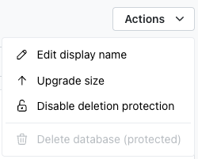
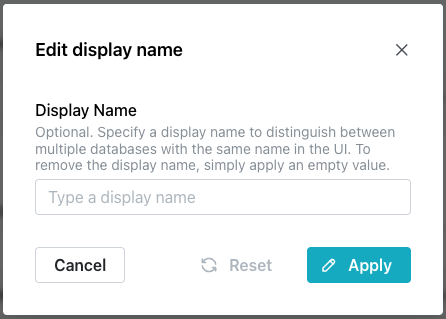

# Accessing Management Options with the Actions Menu

The `Actions` drop-down, on the right-hand side of your database's management
page header, offers management options for your database:

* `Edit display name`: set an optional display name for your database.
* `Upgrade size`: change the size tier of your database.
* `Enable deletion protection`/`Disable deletion protection`: toggle
  deletion protection for your database.
* `Delete database`: delete your database. This option is unavailable
  (protected) while deletion protection is enabled.

## Editing the Display Name

Select `Edit display name` from the `Actions` menu to open the
`Edit display name` popup.

The `Display Name` is optional, and is used to distinguish between multiple
databases that share the same database name in the console UI; it does not
change the database's actual name (shown in the `Database name` field of the
`Connect` pane). Enter a display name and select `Apply` to set it, or select
`Reset` to revert to the last applied value. To remove a display name, apply
an empty value; select `Cancel` to close the popup without making changes.

## Upgrading the Size Tier

Select `Upgrade size` from the `Actions` menu to change the size tier of your
database. The `Upgrade size` popup opens, showing your database's current
size and price, and the sizes you can upgrade to.

Select the size you want to upgrade to, then select `Upgrade size` to confirm,
or `Cancel` to close the popup without upgrading. Sizes only go up. You can
upgrade again later, but a database cannot be moved back to a smaller size.
CPU, memory, and storage grow in place; the database restarts while the new
size is applied, so expect a brief interruption.

For what each size gives you, see
[Managing Database Details](../using_database/database_details.md).

## Enabling and Disabling Deletion Protection

The `Enable deletion protection` option in the `Actions` drop-down works like a
toggle; select it once to enable protection, and a confirmation popup in the
lower-right corner of the window confirms that protection is enabled. To
disable deletion protection, select `Disable deletion protection` from the
menu.

While deletion protection is enabled, `Delete database` is unavailable
(protected); disable deletion protection before deleting the database.

## Deleting the Database

Select `Delete database` from the `Actions` menu to permanently delete your
database. This option is unavailable while deletion protection is enabled; see
[Enabling and Disabling Deletion Protection](#enabling-and-disabling-deletion-protection).

## Troubleshooting - When an Action Is Refused

The `Actions` menu displays a red notification when a request is refused.
If the API supplies a message of its own, the console displays that
instead of the literal text message below:

* `Could not resize the database.` is displayed when a resize is
  refused.

    A resize needs the database in an `Available` state, and sizes
    only go up.

* `Could not delete the database.` is displayed when a delete is
  refused.

    Deletion protection is the common cause; the menu item reads
    `Delete database (protected)` until you turn it off. The other
    cause is a database that was created seconds ago, or one still
    resizing, with an unfinished billing provision. Wait and try
    again.

* `Could not update the database.` is displayed when a display-name
  edit is refused.

    This edit takes no hold on the database and succeeds against a
    busy one, so a refusal here is not caused by a busy database.
    Check the name length against the field's limit.

* `Could not update deletion protection.` is displayed when the
  switch is refused.

    This one also takes no hold on the database, so retrying is
    reasonable. It stays changeable on a `Failed` database, because a
    protected failure has to be removable.
