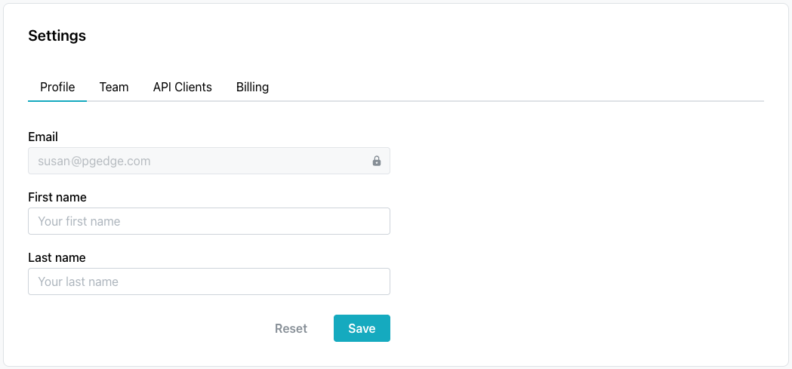
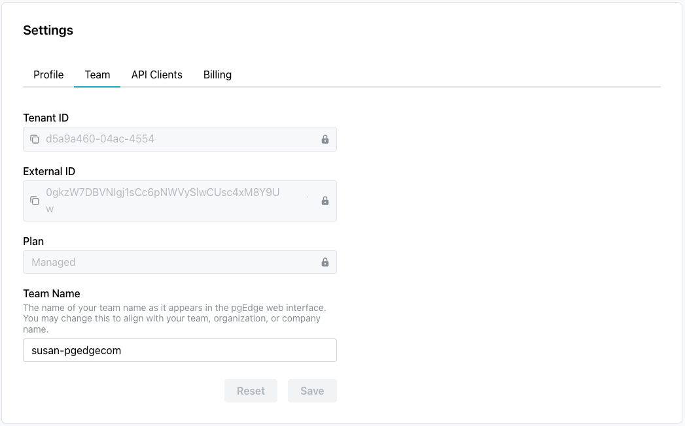
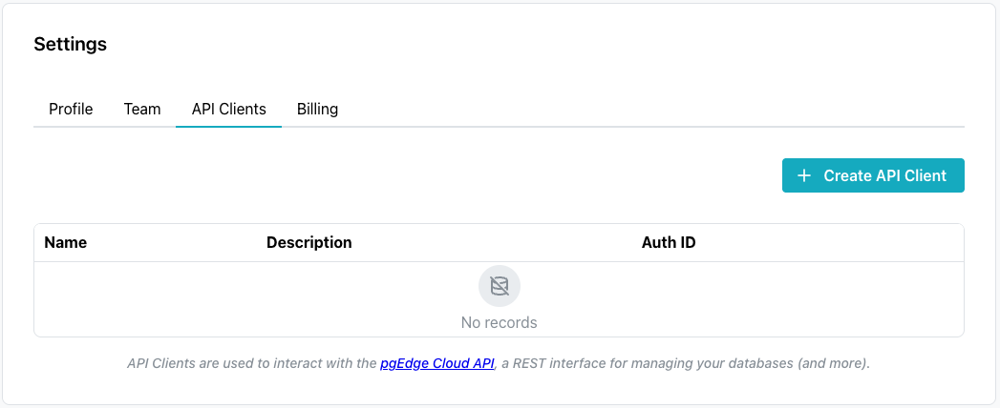
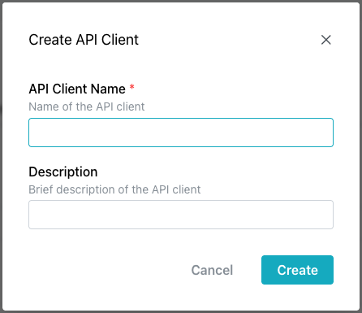
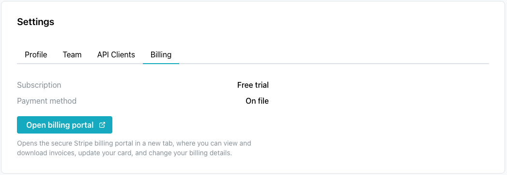

# Managing Account Settings

Select `Settings` in the navigation pane to open the `Settings` page, where
you can update your profile, review your team account, manage API clients,
and manage billing. The page has four tabs: `Profile`, `Team`,
`API Clients`, and `Billing`.

## The Profile Tab

Select the `Profile` tab to review and update your account details.

The `Profile` tab displays the email address associated with your account
(read-only), and lets you update the names associated with your account:

* the `First name` field.
* the `Last name` field.

When you have finished, select `Save` to update your account with the name
changes; select `Reset` to return the fields to their previous values.

## The Team Tab

Select the `Team` tab to review your account and manage team members.

The `Team` tab displays information about your account:

* the `Tenant ID` is a read-only identifier for your account; provide it
  when contacting pgEdge support (if needed for troubleshooting).
* the `External ID` is a read-only identifier value.
* the `Plan` field displays your current plan type (for example, `Managed`).
* the `Team Name` field displays the name of your team as it appears in the
  pgEdge web interface; you can change this to align with your team,
  organization, or company name. This name appears in invitation emails when
  you invite other people to join your account.

Select the copy icon next to the `Tenant ID` or `External ID` field to copy
its value. When you change the `Team Name`, select `Save` to apply the
change, or `Reset` to revert it.

For information about inviting and managing team members, see
[Managing Team Members](team_management.md).

## The API Clients Tab

Select the `API Clients` tab to manage the API clients on your account.

The `API Clients` tab lists the API clients on your account (`Name`,
`Description`, and `Auth ID` columns), and you use it to interact with the
REST API that manages your databases, backups, and other resources.

To add an API client, select `Create API Client` in the upper-right
corner of the tab; the `Create API Client` popup opens.

The popup collects:

* a descriptive name for the API client, in the `API Client Name` field
  (required).
* a brief description of the API client, in the `Description` field.

Select `Create` to add the client, or `Cancel` to close the popup without
saving it.

## The Billing Tab

Select the `Billing` tab to review your subscription and payment status.

The `Billing` tab displays your account-level subscription and payment
status:

* the `Subscription` field displays your current plan (for example,
  `Free trial`).
* the `Payment method` field indicates whether a payment method is on file.

Select `Open billing portal` to open the secure Stripe billing portal in a
new tab, where you can view and download invoices, update your card, and
change your billing details.

This account-level billing is separate from the size and price of an
individual database; for details about a specific database's size tier and
price, see [Plan and Billing](console_overview.md#plan-and-billing).
